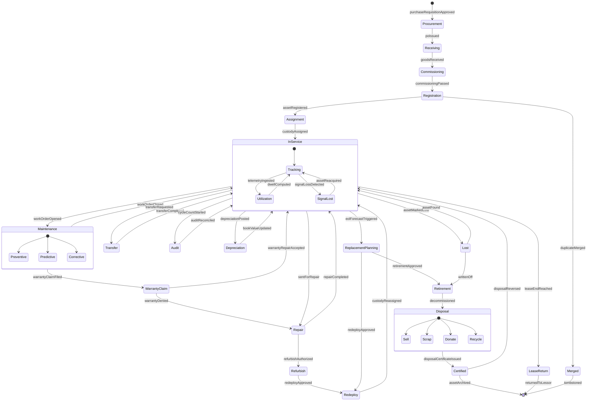
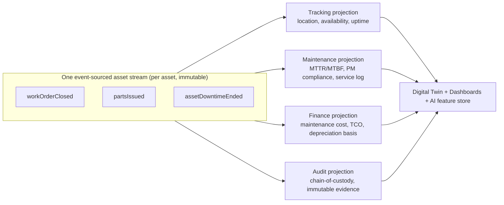

# 7. Asset Lifecycle (Cradle-to-Grave)

**Document type:** Product blueprint — lifecycle state machine, per-stage specification, event model
**Covers deliverable:** 7 (Asset Lifecycle) · **Module:** M7 Lifecycle & Disposal (with M1/M2/M4/M8/M11 cross-cuts)
**Owner:** Product Architecture · **Status:** Planning (pre-rebuild)

> The lifecycle is not a status dropdown. It is a **finite state machine over the event-sourced asset graph**:
> every transition is an *event*, appended once to the asset's immutable stream, and simultaneously **projected**
> into tracking, maintenance, finance, and audit read-models. There is no "sync job" between an asset's location,
> its work orders, and its depreciation line — because they are the **same object** reading the **same events**.
> This is the "one graph" thesis (→ [00-master-blueprint.md §0.4](./00-master-blueprint.md)) applied to time.

Siblings: [05-feature-matrix.md](./05-feature-matrix.md) (M7 features 104–113) · [10-asset-360-profile.md](./10-asset-360-profile.md) (the *Timeline* + *Ownership* + *Finance* tabs render this doc) · [08-ai-intelligence.md](./08-ai-intelligence.md) (EOL/RUL/replacement hooks) · [02-personas.md](./02-personas.md) (every role linked below) · [12-database-design.md](./12-database-design.md) (event/telemetry/history tables) · [16-security-compliance.md](./16-security-compliance.md) (SoD, break-glass, retention).

---

## 7.1 Lifecycle State Machine (Cradle-to-Grave)

Solid arrows are the **happy path**; dashed arrows are **re-entrant loops and edge cases** (§7.5). Every transition
name below is also an **event type** (§7.3). States are *stages*; substates carry *condition* (e.g. In-Service can be
Tracking-healthy or Signal-lost without leaving the stage).

**How to read it:** a well-behaved asset spends ~95% of its calendar life looping inside **In-Service** (Tracking ⇄
Utilization), dipping into **Maintenance** and **Transfer** and returning. The *linear* spine (Procurement →
Disposal) is traversed once; the *loops* are traversed thousands of times. Legacy EAM models the spine as a status
field and treats every loop as a separate sub-application (a CMMS work order, a separate RTLS console, a GL
sub-ledger). We model spine **and** loops as **one event stream on one object** (§7.4).

---

## 7.2 Stage Specifications

Each stage table follows the same schema: **Entry criteria · Exit criteria · Roles · Data captured · Events emitted ·
Automations / AI hooks · KPIs · Compliance / audit artifacts.** Roles link to [02-personas.md](./02-personas.md).
Event names are canonical and reused verbatim in [13-api-design.md](./13-api-design.md) webhooks and
[12-database-design.md](./12-database-design.md) `asset_events`.

### 7.2.1 Procurement / PO

| Facet | Specification |
|-------|---------------|
| **Entry criteria** | Approved purchase requisition; budget/cost-center confirmed; asset class + qty defined; SoD check (requester ≠ approver). |
| **Exit criteria** | PO issued to supplier with expected-asset lines; each expected asset gets a **provisional graph node** (placeholder ID, status `on-order`). |
| **Roles** | [Inventory Manager](./02-personas.md), [Finance/Controller](./02-personas.md) (capex approve), [Department Head](./02-personas.md) (requester), [Asset Manager](./02-personas.md) (class/taxonomy). |
| **Data captured** | Supplier, PO#, line items, class, unit cost, expected delivery, warranty terms, lease-vs-own flag, GL/cost-center, funding source, contract ref. |
| **Events emitted** | `purchaseRequisitionApproved`, `poIssued`, `expectedAssetNodeCreated`. |
| **Automations / AI hooks** | Lease-vs-buy analysis (feature 124 → [08](./08-ai-intelligence.md)); duplicate-spend detector (already own idle equivalent → suggest redeploy instead of buy); auto-populate warranty/lease terms from supplier contract. |
| **KPIs** | Requisition→PO cycle time, price variance vs. catalog, % spend deferred by redeploy-instead-of-buy. |
| **Compliance / audit artifacts** | Approval chain snapshot, SoD attestation, PO document, budget authorization. |

### 7.2.2 Receiving

| Facet | Specification |
|-------|---------------|
| **Entry criteria** | Physical goods arrive against an open PO line (or unexpected/blind receipt). |
| **Exit criteria** | Quantity + serials reconciled to PO; provisional node **promoted** to a real asset shell (`received`); discrepancies flagged. |
| **Roles** | [Receiving Clerk](./02-personas.md), [Inventory Manager](./02-personas.md), [Security Officer](./02-personas.md) (high-value/controlled items). |
| **Data captured** | Serial/lot, packing slip, condition-on-arrival photos, quantity received vs. ordered, damage notes, receiving dock/zone, receiver identity + timestamp. |
| **Events emitted** | `goodsReceived`, `serialCaptured`, `receivingDiscrepancyRaised` (short/over/damaged). |
| **Automations / AI hooks** | OCR/vision serial + model capture from label photo (feature 61/292); auto-match to PO line; damage-from-photo classifier opens a supplier claim; warranty clock **starts** here (event dated). |
| **KPIs** | Receipt accuracy %, dock-to-register time, damaged-on-arrival rate, PO match rate. |
| **Compliance / audit artifacts** | Signed goods-received note, condition photos, chain-of-custody **origin record** (first custody link), supplier discrepancy claim. |

### 7.2.3 Commissioning / Staging

| Facet | Specification |
|-------|---------------|
| **Entry criteria** | Asset received; requires configuration, testing, calibration, or safety sign-off before it may enter service. |
| **Exit criteria** | Functional/safety test passed; tag/sensor provisioned & bonded to node; staged in a ready location. |
| **Roles** | [Technician](./02-personas.md), [Maintenance Manager](./02-personas.md), [Asset Manager](./02-personas.md), [Vendor/Contractor](./02-personas.md) (OEM commissioning). |
| **Data captured** | Firmware/config baseline, calibration cert, safety checklist, bonded tag IDs (RFID/BLE/UWB/GPS → [09](./09-tracking-technologies.md)), baseline telemetry, staging zone. |
| **Events emitted** | `commissioningStarted`, `tagBonded`, `calibrationRecorded`, `commissioningPassed` / `commissioningFailed`. |
| **Automations / AI hooks** | Auto-generate the PM schedule from class template on pass; capture **baseline health fingerprint** for later anomaly/RUL models; auto-provision sensor onboarding + OTA firmware. |
| **KPIs** | Commissioning cycle time, first-pass yield, % assets tag-bonded before service. |
| **Compliance / audit artifacts** | Calibration certificate, safety sign-off, firmware attestation, sensor-bond record. |

### 7.2.4 Registration

| Facet | Specification |
|-------|---------------|
| **Entry criteria** | Commissioning passed; mandatory master-data fields for the class satisfiable. |
| **Exit criteria** | Global unique Asset ID + human tag minted; taxonomy, custom attributes, parent/child links, docs attached; data-quality score computed. |
| **Roles** | [Asset Manager](./02-personas.md) (owner), [Facility Manager](./02-personas.md) (location), [Inventory Manager](./02-personas.md). |
| **Data captured** | Asset ID, tag, class + attribute template values, components/BOM, manuals/CAD, acquisition cost basis, capitalization flag, warranty/lease record, initial location + owning org node. |
| **Events emitted** | `assetRegistered`, `masterDataSet`, `dataQualityScored`, `capitalized` (if applicable). |
| **Automations / AI hooks** | Duplicate/ghost detection before commit (feature 10/298); data-quality auto-repair suggestions (299); auto-classify from image (292); label/QR/RFID encoding job (feature 9). |
| **KPIs** | Data completeness %, duplicate-catch rate, time-to-register, % registered with all mandatory docs. |
| **Compliance / audit artifacts** | Registration record (immutable), capitalization entry, initial data-quality snapshot, label-print log. |

### 7.2.5 Assignment / Custody

| Facet | Specification |
|-------|---------------|
| **Entry criteria** | Asset registered and in a ready/staged state. |
| **Exit criteria** | Assigned to a custodian (person/dept/location) or reservation; custody link written to the immutable chain. |
| **Roles** | [Facility Manager](./02-personas.md), [Department Head](./02-personas.md), [Operator](./02-personas.md), [Technician](./02-personas.md), [Kiosk/Service Account](./02-personas.md) (self-serve check-out). |
| **Data captured** | Custodian, assignment reason, expected return/loan terms, home location, cost-center transfer, e-signature/scan. |
| **Events emitted** | `custodyAssigned`, `checkedOut`, `reservationCreated`, `custodyLinkAppended`. |
| **Automations / AI hooks** | Suggest optimal custodian/location from utilization balance (feature 48/280); auto-set return reminders for loans; conflict detection vs. reservations. |
| **KPIs** | % assets with a known custodian, assignment cycle time, custody-gap count, loan on-time-return %. |
| **Compliance / audit artifacts** | Chain-of-custody link (immutable), check-out receipt, e-signature, SoD (requester ≠ approver on cross-dept). |

### 7.2.6 In-Service — Tracking + Utilization

| Facet | Specification |
|-------|---------------|
| **Entry criteria** | Custody assigned; tag/sensor live (or manual-tracked). |
| **Exit criteria** | *None by default* — this is the steady state; leaves only to Maintenance/Transfer/Repair/Audit/Retirement or an edge-case (Lost/LeaseReturn). |
| **Roles** | [Operator](./02-personas.md), [Operations Manager](./02-personas.md), [Security Officer](./02-personas.md), [Facility Manager](./02-personas.md), [Executive](./02-personas.md) (aggregate). |
| **Data captured** | Continuous location/telemetry (position, dwell, zone, temp/shock/vibration/battery), usage meters/run-hours, occupancy, movement trails, condition readings. |
| **Events emitted** | `telemetryIngested`, `locationUpdated`, `zoneEntered`/`zoneExited`, `dwellComputed`, `meterReadingRecorded`, `geofenceBreached`, `signalLossDetected`, `assetReacquired`. |
| **Automations / AI hooks** | Health score (39), anomaly (42), idle/over-utilization (43/44), theft/tamper prediction (45), geofence/last-seen alerts (30/131), utilization rebalancing suggestions (280) — all → [08](./08-ai-intelligence.md). |
| **KPIs** | Utilization %, idle-asset count, availability/uptime, mean dwell, signal-coverage %, health-score distribution. |
| **Compliance / audit artifacts** | Immutable movement/telemetry history (retention-policied), geofence-breach evidence, environmental-excursion log (cold-chain/controlled). |

### 7.2.7 Maintenance (Preventive / Predictive / Corrective)

| Facet | Specification |
|-------|---------------|
| **Entry criteria** | PM due (time/meter), **AI failure prediction** crosses threshold, breakdown reported, or inspection defect. |
| **Exit criteria** | Work order closed with resolution; asset returned to In-Service (or escalated to Repair/Retirement). |
| **Roles** | [Maintenance Manager](./02-personas.md), [Technician](./02-personas.md), [Vendor/Contractor](./02-personas.md), [Inventory Manager](./02-personas.md) (parts). |
| **Data captured** | WO type, failure code (problem/cause/remedy), labor/time, parts/BOM consumed, downtime window, inspection checklist, before/after photos, cost. |
| **Events emitted** | `workOrderOpened`, `pmTriggered`, `predictiveWoGenerated`, `partsIssued`, `laborLogged`, `assetDowntimeStarted`/`Ended`, `workOrderClosed`. |
| **Automations / AI hooks** | Predictive WOs auto-generated from RUL/anomaly (feature 64 → [08](./08-ai-intelligence.md)); predictive parts pre-staging (293); warranty-aware routing (§7.5); technician load-balancing (67); MTTR/MTBF recompute on close. |
| **KPIs** | PM compliance %, MTTR, MTBF, % predictive-vs-reactive, first-time-fix, wrench-time, cost/WO. |
| **Compliance / audit artifacts** | WO record + closure sign-off, calibration/safety re-cert, parts-consumption ledger, LOTO/permit-to-work evidence. |

### 7.2.8 Transfer / Relocation

| Facet | Specification |
|-------|---------------|
| **Entry criteria** | Transfer request raised (intra- or inter-facility); SoD (requester ≠ approver). |
| **Exit criteria** | Asset physically + logically relocated; custody + location + cost-center updated; in-transit reconciled. |
| **Roles** | [Operations Manager](./02-personas.md), [Facility Manager](./02-personas.md) (approve), [Technician](./02-personas.md)/[Operator](./02-personas.md) (move), [Finance](./02-personas.md) (cross-entity cost). |
| **Data captured** | From/to location + org node, reason, approver, in-transit carrier, expected/actual arrival, cost-center reassignment, condition-at-handover. |
| **Events emitted** | `transferRequested`, `transferApproved`, `assetInTransit`, `transferCompleted`, `costCenterReassigned`. |
| **Automations / AI hooks** | Rebalancing recommendations that *generate* transfers (feature 48/280); in-transit signal-loss tolerance (suppress false theft alerts while `assetInTransit`); geofence hand-off. |
| **KPIs** | Transfer cycle time, in-transit dwell, % transfers auto-suggested by AI, mislocation rate post-transfer. |
| **Compliance / audit artifacts** | Approval chain, chain-of-custody continuity across sites, inter-entity cost-transfer record. |

### 7.2.9 Repair / Refurbish / Redeploy

| Facet | Specification |
|-------|---------------|
| **Entry criteria** | Asset beyond routine maintenance — sent to internal shop or external vendor; or EOL-review chose refurbish over retire. |
| **Exit criteria** | Repaired/refurbished asset re-commissioned & redeployed (→ In-Service) **or** deemed beyond economic repair (→ Retirement). |
| **Roles** | [Maintenance Manager](./02-personas.md), [Vendor/Contractor](./02-personas.md), [Asset Manager](./02-personas.md), [Finance](./02-personas.md) (capitalize refurb vs. expense). |
| **Data captured** | Repair scope, vendor, RMA#, cost, replaced components, refurb capex, warranty-on-repair, new baseline after refurb, redeploy target. |
| **Events emitted** | `sentForRepair`, `repairCompleted`, `refurbishAuthorized`, `componentReplaced`, `redeployApproved`, `custodyReassigned`. |
| **Automations / AI hooks** | Repair-vs-replace economics (feature 47/282); refurb resets RUL baseline & re-fingerprints health; capitalize-refurbishment suggestion to Finance. |
| **KPIs** | Repair turnaround, cost-of-repair vs. replacement, redeploy rate, post-refurb failure rate. |
| **Compliance / audit artifacts** | RMA + vendor service record, refurb capitalization entry, warranty-on-repair document, component-swap serial trail. |

### 7.2.10 Audit / Cycle-Count

| Facet | Specification |
|-------|---------------|
| **Entry criteria** | Scheduled cycle count, spot audit, regulatory audit, or reconciliation trigger (custody gap / discrepancy). |
| **Exit criteria** | Every in-scope asset verified (scan-to-confirm) or exception-flagged; book reconciled to physical; findings closed. |
| **Roles** | [Auditor/Compliance Officer](./02-personas.md), [Asset Manager](./02-personas.md), [Facility Manager](./02-personas.md), [Technician](./02-personas.md) (field scan). |
| **Data captured** | Audit scope, expected vs. found, scan evidence (QR/RFID/NFC), location-at-audit, exceptions (missing/extra/misplaced/mis-condition), auditor + timestamp. |
| **Events emitted** | `cycleCountStarted`, `assetVerified`, `auditExceptionRaised`, `auditReconciled`, `auditPackExported`. |
| **Automations / AI hooks** | AI audit-anomaly detection (feature 295); RTLS **pre-fills** expected locations so audits are confirm-not-hunt; auto-open Lost workflow for un-found high-value items. |
| **KPIs** | Audit accuracy %, custody completeness, findings-closed rate, count throughput (assets/hr), shrinkage detected. |
| **Compliance / audit artifacts** | One-click audit/evidence pack (feature 156), immutable audit log entries, exception disposition record, auditor attestation. |

### 7.2.11 Depreciation

| Facet | Specification |
|-------|---------------|
| **Entry criteria** | Asset capitalized; depreciation schedule active; period close (or event-driven revaluation). |
| **Exit criteria** | Period depreciation posted; net book value updated; impairment/write-down evaluated. |
| **Roles** | [Finance/Controller](./02-personas.md) (owner), [Asset Manager](./02-personas.md) (basis events), [Executive](./02-personas.md) (portfolio). |
| **Data captured** | Method (SL/DB/units-of-production), useful life, salvage, in-service date, accumulated depreciation, NBV, impairment, GL posting ref. |
| **Events emitted** | `depreciationScheduleSet`, `depreciationPosted`, `bookValueUpdated`, `impairmentRecognized`, `glSynced`. |
| **Automations / AI hooks** | **Usage-based depreciation fed by real telemetry** run-hours (units-of-production isn't an estimate — it's metered); capex-deferral finder (297); impairment suggestion when health/RUL collapses. |
| **KPIs** | Book vs. market value gap, depreciation accuracy, TCO/asset, capex deferred, impairment value. |
| **Compliance / audit artifacts** | Depreciation schedule + postings, GL reconciliation, impairment memo, capitalization/basis trail. |

### 7.2.12 Replacement Planning

| Facet | Specification |
|-------|---------------|
| **Entry criteria** | EOL forecast triggered by AI (RUL, rising maintenance cost, declining utilization, obsolescence) or policy age/meter threshold. |
| **Exit criteria** | Decision recorded — replace (→ Retirement + new Procurement), refurbish (→ Repair/Refurbish), or extend (defer). |
| **Roles** | [Asset Manager](./02-personas.md), [Finance](./02-personas.md), [Operations Manager](./02-personas.md), [Executive](./02-personas.md) (capex approve). |
| **Data captured** | EOL forecast + drivers/confidence, cumulative maintenance cost, utilization trend, replacement candidate, capex estimate, decision + rationale. |
| **Events emitted** | `eolForecastTriggered`, `replacementRecommended`, `retirementApproved` / `lifeExtended` / `redeployApproved`. |
| **Automations / AI hooks** | Lifecycle/EOL prediction (49/281), replacement recommender (50/282), capacity/demand forecast (51/283) → [08](./08-ai-intelligence.md); ties recommendation to a **$-impact** feed entry (289). |
| **KPIs** | EOL forecast accuracy, capex deferred via extension, % replacements planned (not emergency), fleet age curve. |
| **Compliance / audit artifacts** | Replacement business case, capex approval, EOL evidence (drivers + confidence snapshot — defensible to CFO). |

### 7.2.13 Retirement / Decommission

| Facet | Specification |
|-------|---------------|
| **Entry criteria** | Retirement approved (from Replacement Planning, write-off, or lease-end); SoD (requester ≠ approver). |
| **Exit criteria** | Asset taken out of service, sensors de-provisioned, custody closed, data sanitized; ready for disposal path. |
| **Roles** | [Asset Manager](./02-personas.md), [Finance](./02-personas.md) (write-off), [Security Officer](./02-personas.md) (controlled/data-bearing), [Facility Manager](./02-personas.md). |
| **Data captured** | Retirement reason, final NBV, gain/loss on retirement, data-wipe/sanitization cert, tag de-bond, decommission checklist. |
| **Events emitted** | `retirementApproved`, `sensorDeprovisioned`, `dataSanitized`, `decommissioned`, `writtenOff`. |
| **Automations / AI hooks** | Auto-suppress tracking alerts on decommission; sanitization checklist enforced for data-bearing classes; residual-value estimate for disposal routing. |
| **KPIs** | Retirement cycle time, gain/loss on disposal, % sanitized before disposal, emergency vs. planned retirement. |
| **Compliance / audit artifacts** | Write-off approval, data-sanitization certificate, decommission sign-off, chain-of-custody **closure** link. |

### 7.2.14 Disposal (Sell / Scrap / Donate / Recycle) + Certificate

| Facet | Specification |
|-------|---------------|
| **Entry criteria** | Asset decommissioned; disposal method selected; environmental/regulatory constraints resolved. |
| **Exit criteria** | Physical disposition complete; **disposal certificate issued**; asset **tombstoned** (archived, immutable, never hard-deleted). |
| **Roles** | [Asset Manager](./02-personas.md), [Finance](./02-personas.md) (proceeds/GL), [Compliance Officer](./02-personas.md), [Vendor/Contractor](./02-personas.md) (recycler/buyer). |
| **Data captured** | Method, buyer/recipient/recycler, proceeds, disposal cost, environmental (e-waste/hazmat) handling, certificate ID, final custody handover. |
| **Events emitted** | `disposalInitiated`, `disposalMethodSelected`, `proceedsRecorded`, `disposalCertificateIssued`, `assetArchived`. |
| **Automations / AI hooks** | Optimal-disposal-channel suggestion (resale vs. scrap value); auto-generate certificate PDF + regulatory manifest; ESG/recycling reporting rollup. |
| **KPIs** | Recovery value %, disposal cost, % certified disposals, e-waste compliance rate, resale-vs-scrap yield. |
| **Compliance / audit artifacts** | **Certificate of Disposal/Destruction**, e-waste/hazmat manifest, proceeds GL entry, final immutable custody record, retention-policy tombstone. |

---

## 7.3 The Event Catalog (canonical, event-sourced)

Every transition above appends an immutable event to the asset's stream. Events are **facts** (past tense), never
mutated, and carry `{tenant, scope, assetId, actor, timestamp, payload, causationId, correlationId}`. This catalog is
the contract shared by [12-database-design.md](./12-database-design.md) (`asset_events`), [13-api-design.md](./13-api-design.md)
(webhooks/streaming), and [10-asset-360-profile.md](./10-asset-360-profile.md) (Timeline tab).

| Stage | Representative events |
|-------|-----------------------|
| Procurement | `purchaseRequisitionApproved` · `poIssued` · `expectedAssetNodeCreated` |
| Receiving | `goodsReceived` · `serialCaptured` · `receivingDiscrepancyRaised` |
| Commissioning | `commissioningStarted` · `tagBonded` · `calibrationRecorded` · `commissioningPassed`/`Failed` |
| Registration | `assetRegistered` · `masterDataSet` · `dataQualityScored` · `capitalized` |
| Assignment | `custodyAssigned` · `checkedOut` · `reservationCreated` · `custodyLinkAppended` |
| In-Service | `telemetryIngested` · `locationUpdated` · `zoneEntered`/`Exited` · `dwellComputed` · `meterReadingRecorded` · `geofenceBreached` · `signalLossDetected` · `assetReacquired` |
| Maintenance | `workOrderOpened` · `pmTriggered` · `predictiveWoGenerated` · `partsIssued` · `laborLogged` · `assetDowntimeStarted`/`Ended` · `workOrderClosed` |
| Transfer | `transferRequested` · `transferApproved` · `assetInTransit` · `transferCompleted` · `costCenterReassigned` |
| Repair/Refurbish | `sentForRepair` · `repairCompleted` · `refurbishAuthorized` · `componentReplaced` · `redeployApproved` · `custodyReassigned` |
| Audit | `cycleCountStarted` · `assetVerified` · `auditExceptionRaised` · `auditReconciled` · `auditPackExported` |
| Depreciation | `depreciationScheduleSet` · `depreciationPosted` · `bookValueUpdated` · `impairmentRecognized` · `glSynced` |
| Replacement | `eolForecastTriggered` · `replacementRecommended` · `retirementApproved`/`lifeExtended` |
| Retirement | `sensorDeprovisioned` · `dataSanitized` · `decommissioned` · `writtenOff` |
| Disposal | `disposalInitiated` · `disposalMethodSelected` · `proceedsRecorded` · `disposalCertificateIssued` · `assetArchived` |
| Edge cases | `assetMarkedLost` · `assetFound` · `warrantyClaimFiled`/`Accepted`/`Denied` · `leaseEndReached` · `returnedToLessor` · `assetSoftDeleted`/`Restored` · `duplicateMerged` · `assetTombstoned` |

---

## 7.4 One Stream, Four Read-Models — the "one graph" thesis

The differentiating claim (→ [00 §0.4](./00-master-blueprint.md), [01 §1.7](./01-product-vision.md)) is that a
**single append to the event stream fans out to every consumer at once.** No ETL, no nightly reconciliation, no
"which system is right?" The read-models are *projections* — deterministic folds over the same events.

**Worked example — one `workOrderClosed` event, four consequences, zero sync:**

| Consumer | What it derives from the *same* event | Legacy equivalent |
|----------|----------------------------------------|-------------------|
| **Tracking / Ops** | Asset flips available → uptime & utilization recompute; twin state updates live. | Separate RTLS console, manually correlated by asset tag. |
| **Maintenance** | MTTR/MTBF recompute; service log appended; next PM rescheduled. | CMMS record — the system of record for *this* fact only. |
| **Finance** | Labor + parts cost roll into TCO; if refurb, depreciation basis adjusts. | GL sub-ledger, reconciled at period close via export/import. |
| **Audit** | Immutable custody + action evidence appended; auditor sees who/what/when. | Audit log in yet another tool, stitched at audit time. |

### 7.4.1 Contrast with IBM Maximo / SAP EAM

| Dimension | IBM Maximo | SAP EAM (PM/EAM/S4) | **Access Genie AI** |
|-----------|------------|---------------------|---------------------|
| **Lifecycle representation** | `status` field + workflow engine per object; history via change-tracking tables. | Status + status profiles; lifecycle spread across PM/FI-AA/MM modules. | **Event-sourced FSM on one node**; state is a *fold*, history is the source of truth. |
| **Location / RTLS** | Not native — integrate Zebra/RTLS separately; location is an attribute pushed in. | Not native — external tracking, batch sync. | **Same object** carries live telemetry; tracking is a projection, not an integration. |
| **Finance ↔ maintenance link** | WO cost posts to GL via integration/interface; asset accounting is separate (Maximo vs. ERP FI-AA). | FI-AA (asset accounting) and PM (maintenance) are **different modules**, reconciled. | Depreciation basis, TCO, and WO cost are **projections of one stream** — reconciled by construction. |
| **Audit trail** | Configurable change-tracking / audit tables per object. | Change documents per module. | **Every fact is an immutable event**; audit is a read-model, not an add-on — one-click evidence pack. |
| **AI / prediction** | Add-on (Maximo Predict / Watson), separate data pipeline. | Add-on (SAP APM / Leonardo), separate. | **Feature store fed directly by the stream**; scores are explainable columns on the same node. |
| **"Source of truth" problem** | Multiple sub-systems; integration layer decides truth. | Multi-module master data governance. | **No integration layer between an asset's facets — there is one asset.** |

The wedge restated for lifecycle: *in Maximo/SAP the tracking dot, the work order, and the depreciation line live in
three subsystems joined by interfaces; in Access Genie they are three views of one event stream on one object.*

---

## 7.5 Lifecycle Edge Cases

Real fleets don't move down a tidy spine. These re-entrant paths are **first-class**, each modeled as events (not
status hacks), so tracking, finance, and audit stay consistent through the mess.

### 7.5.1 Lost → Found

| Facet | Handling |
|-------|----------|
| **Trigger** | `assetMarkedLost` (audit un-found, prolonged signal loss, custody dispute, theft alert). |
| **Path** | In-Service → **Lost** (loop). If located: `assetFound` → resume In-Service, custody + location reconciled, full trail intact. If not, after policy window: `writtenOff` → Retirement (finance impairment, insurance claim). |
| **Consistency** | Book value, tracking state, and open WOs all react to the *same* two events — no orphaned records. Movement history explains *where it was last seen* and *who last held custody* (chain-of-custody). |
| **AI** | Theft/loss prediction (45) raises risk *before* loss; last-seen + trajectory narrows search; recovery feeds the model (HITL, 291). |

### 7.5.2 Warranty Claim vs. Repair

| Facet | Handling |
|-------|----------|
| **Trigger** | Failure during Maintenance on an asset with an **active warranty/lease** term (captured at Receiving/Registration). |
| **Path** | `warrantyClaimFiled` → **WarrantyClaim**. If accepted: `warrantyRepairAccepted` → vendor bears cost, back to In-Service (WO cost = $0 to owner, tracked as recovery). If denied: `warrantyDenied` → **Repair** at owner cost. |
| **Consistency** | Finance sees warranty-recovered vs. owner-paid cost split on the *same* WO; TCO reflects true out-of-pocket. |
| **AI** | Contract/warranty-claim recommender (304): flags "this failure is claimable — don't self-repair." Prevents paying for covered work — a hard-dollar win. |

### 7.5.3 Lease vs. Owned Return

| Facet | Handling |
|-------|----------|
| **Trigger** | `leaseEndReached` on a **leased** asset (owned assets never enter this path). |
| **Path** | In-Service → **LeaseReturn** → condition assessment + end-of-lease charges → `returnedToLessor` → tombstoned (not disposed — ownership was never ours). |
| **Consistency** | No depreciation/disposal path (leased ≠ capitalized the same way); lease liability closes; custody chain ends at lessor handover with condition evidence. |
| **AI** | Lease-vs-buy analysis (124/296) informed by *actual* utilization tells you at renewal whether to buy, extend, or return. |

### 7.5.4 Soft-Delete / Restore

| Facet | Handling |
|-------|----------|
| **Trigger** | Erroneous registration, cancelled procurement, temporary removal — `assetSoftDeleted`. |
| **Path** | Node hidden from active views but **never hard-deleted**; `assetRestored` reverses it, full history intact. |
| **Consistency** | Event-sourcing makes this trivial: soft-delete is just another event; the stream and all projections replay identically on restore. Audit sees who deleted/restored and why. |
| **Governance** | Hard-delete is reserved for GDPR/CCPA erasure (→ [16](./16-security-compliance.md)) and is itself an audited, approval-gated event — the tombstone remains. |

### 7.5.5 Merge Duplicates

| Facet | Handling |
|-------|----------|
| **Trigger** | Duplicate/ghost detection (10/298) or manual identification of two nodes for one physical asset. |
| **Path** | `duplicateMerged`: a **survivor** node absorbs the loser's events (history union, deterministic conflict rules); loser becomes a **tombstone** redirect (`mergedInto`) so old links/QR scans still resolve. |
| **Consistency** | Both streams fold into one timeline — WOs, custody, telemetry, and cost all consolidate; no data loss, no dangling references. |
| **Governance** | Merge is reversible-by-audit (the pre-merge streams are preserved), SoD-gated, and fully logged — you can always prove what was combined. |

### 7.5.6 Other re-entrant realities (summary)

| Case | Modeled as | Note |
|------|-----------|------|
| **Cannibalization** | `componentReplaced` (donor `sentForRepair`/`writtenOff`) | Component serials move between parent nodes; BOM + custody follow. |
| **Emergency deploy before commissioning** | `commissioningPassed` back-dated w/ exception flag | Allowed but flagged for audit; never silently skipped. |
| **Reinstate a disposed asset** | `disposalReversed` (Certified → In-Service) | Rare (certificate voided), heavily audited — proves the cert lifecycle is itself event-sourced. |
| **Split a kit/bundle into individual assets** | `kitSplit` → child `assetRegistered` | Inverse of kitting; cost basis allocated across children. |

---

## 7.6 Where this renders in the product

| Surface | What it shows | Doc |
|---------|---------------|-----|
| **Lifecycle stage board** (`/lifecycle`) | Kanban of assets by stage; drag = transition (permission-gated) | [06](./06-page-catalog.md) |
| **Asset 360° — Timeline tab** | The asset's own event stream, human-narrated (AI, 300) | [10](./10-asset-360-profile.md) |
| **Asset 360° — Ownership / Finance / Audit tabs** | Custody chain · depreciation & TCO · immutable evidence | [10](./10-asset-360-profile.md) |
| **Asset Dashboard** | Lifecycle funnel, upcoming-EOL, data-quality | [04](./04-dashboards.md) |
| **Disposal center** (`/disposal`) | Retirement queue → disposal method → certificate | [06](./06-page-catalog.md) |
| **Compliance / Audit** (`/audit`, `/custody`) | Cycle-count, chain-of-custody, evidence packs | [16](./16-security-compliance.md) |

---

### Architect's note

The single most consequential decision in this document is that **stage is derived, not stored.** If we ever
represent lifecycle as a mutable `status` column "for convenience," we reintroduce the exact reconciliation problem
that Maximo and SAP EAM suffer from — and every edge case in §7.5 becomes a special-case bug instead of just another
event. The event stream is the asset; everything else is a projection.
