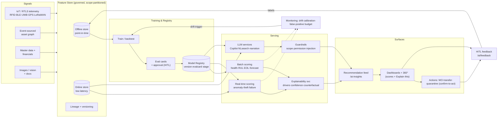

# 8. AI & Intelligence Modules

**Document type:** Product blueprint — flagship differentiator specification
**Covers deliverable:** 8 (AI Features) · **Module:** M3 (features 39–61) + AI-native sales list (271–304)
**Siblings:** [00-master-blueprint.md](./00-master-blueprint.md) · [04-dashboards.md](./04-dashboards.md) · [05-feature-matrix.md](./05-feature-matrix.md) · [07-asset-lifecycle.md](./07-asset-lifecycle.md) · [10-asset-360-profile.md](./10-asset-360-profile.md) · [11-technical-architecture.md](./11-technical-architecture.md) · [12-database-design.md](./12-database-design.md) · [16-security-compliance.md](./16-security-compliance.md) · [17-reporting-bi.md](./17-reporting-bi.md)

> **Thesis.** In Access Genie, AI is not a feature you switch on — it is a **set of first-class columns on the asset graph**. Health, risk, RUL, and utilization live *next to* serial number and book value, are computed by governed models over one event-sourced feature store, and **every score ships with its drivers, confidence, and a counterfactual**. Incumbents bolt an "AI insights" tab onto a CRUD registry; we make the score defensible to a **CFO in a capex review and an auditor in a chain-of-custody dispute**. Explainable, governed, native — not a bolt-on.

---

## 8.1 Principles — what makes this AI different

| # | Principle | What it means concretely | Contrast with incumbents |
|---|-----------|--------------------------|--------------------------|
| 1 | **Native, not a plugin** | Predictions are projections over the same event stream as BI/twin/audit — one feature store, no ETL to a side system. → [11](./11-technical-architecture.md), [12](./12-database-design.md) | Maximo/SAP surface a scored list from a separate module with stale data. |
| 2 | **Explainable by contract** | No score renders without `{drivers[], confidence, counterfactual}`. The UI physically cannot show a bare number. | ServiceNow "predictive intelligence" gives a class + probability, rarely drivers. |
| 3 | **Governed from day one** | Every model has a registry entry, version, training set hash, eval card, drift monitor, and HITL feedback channel. | Bolt-ons ship a black box with no version, no drift signal. |
| 4 | **Human-in-the-loop, not autonomous by default** | AI *proposes* (WO, transfer, write-off); a human *disposes* — except in explicitly allow-listed low-risk automations. | — |
| 5 | **$-quantified** | Every recommendation carries an estimated financial impact and a confidence band, so it can be ranked and defended. | Insights without dollar impact are noise to a CFO. |
| 6 | **Scope-secure** | Models train and score **within tenant + scope**; explanations never leak cross-tenant features. → [16](./16-security-compliance.md) | — |
| 7 | **Degrades gracefully** | Cold-start assets fall back to class priors / rules and are labelled "low-confidence — learning"; never a false precision. | — |

---

## 8.2 The module catalog (at a glance)

Legend — **Family:** 🩺 Health/Predict · 🔍 Anomaly/Security · ⚖️ Risk/Optimize · 🔄 Lifecycle/Plan · 🤖 Generative/Agentic · 🧹 Data-Intelligence. **Method:** STAT statistical · ML machine-learning · DL deep-learning · LLM large-language-model · SIM simulation.

| # | Module | Fam | Method | Primary output | UI surface (page) | Phase |
|---|--------|:--:|:--:|----------------|-------------------|:--:|
| 39 | Asset Health Score | 🩺 | ML+STAT | 0–100 + band | `/ai/health`, 360° Health tab | P3 |
| 40 | Predictive Maintenance / Failure Prediction | 🩺 | ML/DL | P(failure≤H) + horizon | `/ai/predictive`, `/predictive`, Maint dash | P3 |
| 41 | Remaining Useful Life (RUL) | 🩺 | ML/DL | days/cycles + interval | 360° Health tab, `/ai/predictive` | P3 |
| 42 | Anomaly Detection | 🔍 | ML/DL | anomaly score + type | `/ai/anomaly`, telemetry explorer | P3 |
| 43 | Idle / Underutilization | 🔍 | STAT/ML | idle class + $ waste | `/ai/utilization`, Ops dash | P3 |
| 44 | Overutilization / Overload | 🔍 | STAT/ML | overload class + wear cost | `/ai/utilization`, Ops dash | P3 |
| 45 | Theft / Loss / Tamper | 🔍 | ML+rules | risk + evidence trail | `/ai/theft`, Security dash | P3 |
| 46 | Composite Risk Score | ⚖️ | ML ensemble | 0–100 + driver mix | `/ai-insights`, Exec/Asset dash, 360° Risk tab | P3 |
| 47 | Cost Optimization | ⚖️ | ML+optim | ranked $-savings actions | Financial dash, `/ai-insights` | P3 |
| 48 | Utilization Rebalancing | ⚖️ | optim | move/pool suggestions | Ops dash, `/ai/utilization` | P3 |
| 49 | Lifecycle / EOL Prediction | 🔄 | ML/STAT | EOL date + interval | `/lifecycle`, Asset dash, 360° | P3 |
| 50 | Replacement Recommender | 🔄 | ML+rules | repair-vs-replace + when | Asset/Financial dash, 360° | P3 |
| 51 | Capacity / Demand Forecast | 🔄 | STAT/ML | demand curve + PI | `/ai/forecasting`, Inventory dash | P4 |
| 52 | Digital-Twin Simulation | 🔄 | SIM | scenario KPIs | `/twin`, `/dashboards/executive` (what-if) | P4 |
| 53 | AI Copilot (agentic) | 🤖 | LLM+tools | actions + answers | `/copilot`, ⌘K everywhere | P4 |
| 54 | NL / Semantic Search | 🤖 | LLM+embed | ranked entities/answers | Top-bar search, `/copilot` | P3 |
| 55 | Generative Reports & Narration | 🤖 | LLM | narrative + report | every dashboard "Explain this", `/reports` | P4 |
| 56 | Per-Asset AI Chat | 🤖 | LLM+RAG | grounded answers | 360° AI tab | P4 |
| 57 | Recommendation Feed | 🤖 | ML rank | ranked $-actions | `/ai-insights`, AI dash | P3 |
| 61 | Auto-classification / Vision | 🧹 | DL(CV) | class + attributes | `/assets/new`, mobile capture | P5 |
| — | Smart Alert Correlation | 🔍 | ML+graph | incident clusters | `/alerts`, Security/Ops dash | P3 |
| — | Duplicate / Ghost Detection | 🧹 | ML+ER | match/ghost pairs | Asset dash, `/assets` | P3 |
| — | Data-Quality Auto-Repair | 🧹 | ML+rules | repair suggestions | `/assets`, Asset dash | P2 |

Model-registry / explainability / feedback plumbing (features 58–60) is **infrastructure**, specified in §8.10–8.16, not a user module.

---

## 8.3 The spec anatomy (every module follows this)

Each module below is documented on the same seven axes so it is comparable, reviewable, and buildable:

1. **Purpose** — the decision it improves and who makes it.
2. **Inputs / features** — signals drawn from the feature store (telemetry, events, master data, financials).
3. **Method (conceptual)** — the statistical / ML / LLM approach *as an idea*, not code.
4. **Outputs** — the score/object emitted, with type and range.
5. **Explainability** — **drivers** (what pushed the number), **confidence** (how sure), **counterfactual** (what would change it).
6. **Governance** — registry entry, versioning, drift signal, HITL feedback path.
7. **UI surface** — the page/component where a human meets it. → [04](./04-dashboards.md), [10](./10-asset-360-profile.md).

---

## 8.4 Family 🩺 — Health & Prediction

### 8.4.1 Asset Health Score (feature 39)
| Axis | Specification |
|------|---------------|
| **Purpose** | A single 0–100 condition index per asset so operators triage by health, not gut. Feeds risk (46), replacement (50), EOL (49). |
| **Inputs / features** | Telemetry aggregates (vibration/temp/current RMS, trend slopes), fault-code frequency, WO/failure history, PM compliance, age vs class MTBF, duty cycle, environment (shock/humidity), warranty state. → [12](./12-database-design.md) telemetry + history tables. |
| **Method** | Gradient-boosted regression on engineered condition features, blended with a rules floor (open critical fault caps the score). Per-**asset-class** models; hierarchical priors for cold-start. Calibrated to a monotone 0–100. |
| **Outputs** | `health` 0–100 · band {Critical <40, At-Risk 40–70, Healthy >70} · trend arrow · per-subsystem sub-scores. |
| **Explainability** | **Drivers:** SHAP-style attribution ranks top ± contributors ("vibration trend +18↓, overdue PM −9"). **Confidence:** function of data completeness + model calibration; low-data assets flagged "learning". **Counterfactual:** "Close the 2 overdue PMs → projected 71 (+13)." |
| **Governance** | Registry: `health-score@class:vX`. Drift: PSI on input distributions + calibration error vs realized failures. HITL: technician "score looks wrong" → labelled event feeds retrain. |
| **UI** | 360° **Health tab** gauge + driver bars + sub-score radar; `/ai/health` portfolio heatmap; column in `/assets`. |

### 8.4.2 Predictive Maintenance / Failure Prediction (feature 40, 64)
| Axis | Specification |
|------|---------------|
| **Purpose** | Predict failure *before* it happens and auto-draft the work order — the "70% of WOs AI-generated pre-failure" goal (→ [01](./01-product-vision.md) §1.3). |
| **Inputs / features** | Same condition features as health + failure-mode-specific signals (bearing bands, thermal drift), usage meters, similar-asset failure curves, recent anomaly hits (42). |
| **Method** | Survival / time-to-event models (gradient-boosted hazard) producing **P(failure within horizon H)** for H ∈ {7,30,90d}; per-failure-mode classifiers where labelled history exists; DL sequence models on high-rate telemetry for rich assets. |
| **Outputs** | `p_failure[H]` + most-likely failure mode + recommended action + parts list (→ pre-staging, feature 293). One-click → predictive WO (→ [07](./07-asset-lifecycle.md), `/predictive`). |
| **Explainability** | **Drivers:** ranked telemetry/usage contributors + nearest historical failure analogues. **Confidence:** prediction interval + label-support indicator. **Counterfactual:** "Replace bearing now → P(fail 30d) 62%→8%." |
| **Governance** | Registry per class+failure-mode; evaluated on precision@lead-time and false-alarm cost. Drift: alarm-rate & realized-failure calibration. HITL: WO close-out (real cause vs predicted) is the gold label. |
| **UI** | Maintenance dashboard "Predicted failures (30d)" with confidence + $-downtime; `/ai/predictive`; 360° Health tab. |

### 8.4.3 Remaining Useful Life — RUL (feature 41)
| Axis | Specification |
|------|---------------|
| **Purpose** | Estimate time/cycles to end-of-service so maintenance, capex, and replacement (50) can be scheduled, not surprised. |
| **Inputs / features** | Degradation trajectories (health trend, cumulative usage/meter, duty cycle), failure-threshold priors per class, environment stress, overload exposure (44). |
| **Method** | Degradation modelling — fit condition trajectory to a class failure threshold; particle-filter / regression RUL on rich assets, similarity-based RUL (match to historical run-to-failure curves) on sparse ones. |
| **Outputs** | `rul` in days **and** cycles/hours · prediction interval (P10/P50/P90) · confidence band. |
| **Explainability** | **Drivers:** dominant degradation signal + usage rate. **Confidence:** interval width + trajectory fit quality. **Counterfactual:** "Cut duty cycle 20% → RUL P50 140d→190d." |
| **Governance** | Registry per class; eval on α-λ accuracy over historical run-to-failure sets. Drift: trajectory residuals. HITL: actual retirement/failure dates close the loop. |
| **UI** | 360° Health tab RUL band; feeds `/lifecycle` and Financial capex forecast. |

---

## 8.5 Family 🔍 — Anomaly, Utilization & Security

### 8.5.1 Anomaly Detection (feature 42)
| Axis | Specification |
|------|---------------|
| **Purpose** | Catch "this asset is behaving unlike itself / its peers" — the early-warning net feeding maintenance, security, and data-quality. |
| **Inputs / features** | Multivariate telemetry streams, movement/dwell patterns, usage rhythm, event cadence; per-asset baseline + peer-cohort baseline. |
| **Method** | Unsupervised residual models — seasonal decomposition + robust z-scores for univariate; isolation-forest / autoencoder reconstruction error for multivariate; change-point detection on regime shifts. Scored against **self** and **cohort**. |
| **Outputs** | `anomaly_score` + type {telemetry, behavioral, movement, silence} + affected signal + severity. Routes to alerts (correlation §8.8.1). |
| **Explainability** | **Drivers:** which signal(s) deviated and by how many σ, vs expected band (shown as a shaded telemetry chart). **Confidence:** baseline stability + persistence of deviation. **Counterfactual:** implicit — "return signal to band → clears." |
| **Governance** | Registry per signal family; threshold auto-tuned to target false-positive budget. Drift: anomaly-rate monitoring, seasonality re-fit. HITL: analyst "false alarm / real" tuning. |
| **UI** | `/ai/anomaly` timeline; telemetry explorer band overlay; anomaly chip on 360°. |

### 8.5.2 Idle / Underutilization (feature 43) · 8.5.3 Overutilization / Overload (feature 44)
| Axis | Idle / Underutilization | Overutilization / Overload |
|------|-------------------------|----------------------------|
| **Purpose** | Find capital sitting idle → redeploy, pool, or shed (feeds rebalancing 48, cost 47). | Find assets run beyond healthy duty → wear cost, safety, accelerated EOL. |
| **Inputs** | Active vs powered hours, movement/scan frequency, reservation vs actual use, location dwell, revenue/output per asset. | Duty cycle vs rated capacity, load telemetry, back-to-back usage, temperature/current sustained peaks. |
| **Method** | Utilization ratio vs class benchmark + peer percentile; clustering to label idle/seasonal/redundant; $-waste = carrying cost × idle fraction. | Threshold + trend vs rated envelope; cumulative-damage model estimating extra wear/RUL loss and $ wear cost. |
| **Outputs** | Idle class + idle % + $ waste + redeploy candidate. | Overload class + wear-cost $ + RUL-impact + throttle/rotate suggestion. |
| **Explainability** | **Drivers:** utilization percentile, idle streak length. **Confidence:** data coverage. **Counterfactual:** "Pool 4 idle units → free 1 for redeploy." | **Drivers:** hours over rated, peak exposure. **Confidence:** telemetry completeness. **Counterfactual:** "Rotate load → RUL loss −60%." |
| **Governance** | Benchmarks versioned per class/industry pack; HITL: manager confirms genuinely idle vs standby. | Registry per class; HITL: ops confirms overload vs mis-rated spec. |
| **UI** | `/ai/utilization`, Ops dash rebalancing panel. | `/ai/utilization`, Ops dash, safety flag on 360°. |

### 8.5.4 Theft / Loss / Tamper Prediction (feature 45)
| Axis | Specification |
|------|---------------|
| **Purpose** | Predict and detect asset loss, unauthorized movement, and tamper — core to Security, Police/Public-Safety, Retail shrinkage. → [01](./01-product-vision.md) §1.6. |
| **Inputs / features** | Geofence breaches, after-hours/off-route movement, custody gaps, signal-loss patterns, tag-tamper/detach events, tag battery drop-then-silence, asset value, historical loss hotspots. |
| **Method** | Rules layer (hard breaches) + ML risk model over movement/custody behavior (sequence/graph features); pattern-match to known theft signatures (e.g. tag removed near exit). Fuses tracking signals → [09](./09-tracking-technologies.md). |
| **Outputs** | `theft_risk` 0–100 + event type {breach, tamper, silence, custody-gap} + **evidence trail** (timestamped location/custody chain). |
| **Explainability** | **Drivers:** triggering events in plain language + map trail. **Confidence:** sensor reliability + corroborating signals. **Counterfactual:** "In-zone at authorized hours → risk clears." Evidence trail is court-defensible (chain-of-custody → [16](./16-security-compliance.md)). |
| **Governance** | Registry; tuned to minimize false lockdowns; drift on breach-rate. HITL: security dispositions (real theft / authorized / false) train the model. |
| **UI** | `/ai/theft`, Security dashboard live map + incident table + quarantine/lock action. |

---

## 8.6 Family ⚖️ — Risk & Optimization

### 8.6.1 Composite Risk Score (feature 46)
| Axis | Specification |
|------|---------------|
| **Purpose** | One executive-grade 0–100 risk index per asset/facility fusing condition, security, compliance, and financial exposure — the Exec/Asset dashboard headline. |
| **Inputs / features** | Health (39), failure P (40), RUL (41), theft risk (45), compliance state (cert/calibration expiry, audit exceptions), criticality/business-impact weight, financial exposure (book value, downtime cost). |
| **Method** | Weighted ensemble / learned aggregation of sub-scores with **criticality weighting**; configurable per industry pack (a police weapon weights security; a hospital ventilator weights compliance+health). |
| **Outputs** | `risk` 0–100 + band + **driver mix** (condition/security/compliance/financial %) + trend. |
| **Explainability** | **Drivers:** contribution of each sub-domain (stacked bar). **Confidence:** min-confidence propagation from inputs. **Counterfactual:** "Renew calibration + close PM → risk 78→45." |
| **Governance** | Weight config is versioned & auditable (who changed the risk policy, when). Drift inherited from sub-models. HITL: risk-officer override with reason (logged). |
| **UI** | Exec/Asset dashboards Risk Index KPI + top-risk table; 360° **Risk tab**; `/ai-insights`. |

### 8.6.2 Cost Optimization (feature 47) · 8.6.3 Utilization Rebalancing (feature 48)
| Axis | Cost Optimization | Utilization Rebalancing |
|------|-------------------|-------------------------|
| **Purpose** | Rank the highest-$ savings actions across the portfolio (capex deferral, contract, energy, maintenance-strategy). Feeds Financial dash. | Recommend moving/pooling assets from over- to under-served zones/facilities to lift utilization +25% (→ [01](./01-product-vision.md)). |
| **Inputs** | TCO rollups, maintenance spend, energy telemetry, warranty/lease state, idle/overuse, RUL, replacement economics. | Idle (43) + overuse (44) by zone/facility, demand forecast (51), transfer cost/feasibility, reservation conflicts. |
| **Method** | Opportunity-mining ML + optimization: rank candidate actions by expected $ saved × feasibility; lease-vs-buy & repair-vs-replace economics (features 296, 124). | Assignment/optimization (min imbalance s.t. transfer cost/constraints); surfaces concrete "move X from A→B". |
| **Outputs** | Ranked action list, each: action, $ saved (band), effort, owner, deep-link to execute. | Move/pool suggestions with projected utilization gain + transfer cost + one-click transfer draft. |
| **Explainability** | **Drivers:** cost components behind each opportunity. **Confidence:** estimate band. **Counterfactual:** "Defer replacement 12mo → $Y capex deferred, +Z% failure risk." | **Drivers:** imbalance metrics. **Confidence:** demand-forecast confidence. **Counterfactual:** "Move 2 units → both zones in target band." |
| **Governance** | Savings claims tracked realized-vs-predicted (credibility over time). HITL: finance approves before action. | HITL: ops approves transfer (SoD → [16](./16-security-compliance.md)). |
| **UI** | Financial dash "Capex deferral / cost-opt ranking"; `/ai-insights`. | Ops dash rebalancing panel; `/operations/transfers` draft. |

---

## 8.7 Family 🔄 — Lifecycle & Planning

### 8.7.1 Lifecycle / EOL Prediction (feature 49)
| Axis | Specification |
|------|---------------|
| **Purpose** | Forecast end-of-life/economic-life date per asset to drive replacement planning and capex forecasting. → [07](./07-asset-lifecycle.md). |
| **Inputs / features** | RUL (41), age vs class service-life, maintenance-cost trend (rising = uneconomic), health trajectory, obsolescence/support-end, warranty/lease end. |
| **Method** | Survival + economic-life modelling: EOL = min(technical-life from RUL, economic-life where cumulative cost > replacement value, support-end). |
| **Outputs** | `eol_date` + interval + reason {worn, uneconomic, obsolete} + confidence. |
| **Explainability** | **Drivers:** binding constraint (which life ended first). **Confidence:** interval. **Counterfactual:** "Refurbish → EOL +18mo (cost $C)." |
| **Governance** | Registry per class/industry pack; HITL: asset manager confirms/adjusts service-life assumptions. |
| **UI** | `/lifecycle` board, Asset dash "EOL within 90d", 360°. |

### 8.7.2 Replacement Recommender (feature 50)
| Axis | Specification |
|------|---------------|
| **Purpose** | Answer repair-vs-replace-vs-refurbish and *when*, with the economics attached — for Asset & Finance managers. |
| **Inputs / features** | EOL (49), RUL (41), TCO-to-date & forward cost, failure risk, replacement price/availability, energy-efficiency delta of new model, downtime cost. |
| **Method** | Cost-benefit / NPV comparison across repair vs replace vs refurbish scenarios + ML on outcomes of similar past decisions; recommends option + optimal timing window. |
| **Outputs** | Recommendation {repair / replace / refurbish / redeploy} + timing + projected $ + suggested replacement model. |
| **Explainability** | **Drivers:** cost curves compared. **Confidence:** estimate band. **Counterfactual:** "Wait 6mo → +$X maintenance, −$Y capex timing." |
| **Governance** | Realized-vs-recommended tracked; HITL: capex approval workflow (→ [07](./07-asset-lifecycle.md), Financials). |
| **UI** | Asset/Financial dash "Replacement recommendations"; 360°; ties to capex tie-in (feature 111). |

### 8.7.3 Capacity / Demand Forecast (feature 51)
| Axis | Specification |
|------|---------------|
| **Purpose** | Forecast future asset/parts demand & capacity so inventory pre-stages and ops plans headcount/fleet. Feeds Inventory dash + parts pre-staging (293). |
| **Inputs / features** | Historical consumption/usage, seasonality, WO pipeline, predicted failures (40), reservations, business calendar, external drivers (production plan). |
| **Method** | Time-series forecasting (seasonal decomposition, gradient-boosted or ETS/ARIMA-class) with **prediction intervals**; ties failure-prediction to parts demand. |
| **Outputs** | Demand/capacity curve + P10/P50/P90 intervals + reorder-point recommendation. |
| **Explainability** | **Drivers:** seasonality/trend/event contributions. **Confidence:** interval width + backtest error. **Counterfactual:** "If production +15% → stock gap in week 6." |
| **Governance** | Backtested (MAPE/pinball loss) each retrain; drift on forecast error. HITL: planner overrides with reason. |
| **UI** | `/ai/forecasting`, Inventory dash demand-forecast + optimal reorder. |

### 8.7.4 Digital-Twin Simulation & What-If (feature 52)
| Axis | Specification |
|------|---------------|
| **Purpose** | Let planners run scenarios on the live twin — "what if we defer this capex / add a line / lose facility B" — before committing. → [18](./18-roadmap.md). |
| **Inputs / features** | Live twin state (asset states, layout, flows), model outputs (health, RUL, demand), scenario parameters set by the user. |
| **Method** | Discrete-event / Monte-Carlo simulation over the twin using model-derived distributions (failure, demand, RUL); not a predictive model but a **composition** of them. |
| **Outputs** | Scenario KPIs (throughput, downtime, cost, risk) with distributions + side-by-side vs baseline. |
| **Explainability** | **Drivers:** which assumptions moved which KPI (tornado chart). **Confidence:** distribution spread from underlying model uncertainty. **Counterfactual:** the scenario *is* the counterfactual. |
| **Governance** | Scenarios saved, versioned, shareable; assumptions logged for audit. HITL by definition (human authors scenarios). |
| **UI** | `/twin` scenario panel; Exec dashboard "Scenario / what-if" action. |

---

## 8.8 Family 🤖 — Generative & Agentic

### 8.8.1 Smart Alert Correlation (feature 133; sales 294)
| Axis | Specification |
|------|---------------|
| **Purpose** | Collapse alert storms into **incidents** — group related alerts (same asset/zone/root cause) so responders see 1 problem, not 40 symptoms. |
| **Inputs / features** | Alert stream (type, asset, zone, time), asset graph relationships (parent/child, co-located), temporal proximity, historical co-occurrence. |
| **Method** | Graph + temporal clustering; correlation rules + learned co-occurrence; root-cause candidate ranking via the asset graph (a gateway-down explains N tag-silence alerts). Dedup (feature 133). |
| **Outputs** | Incident cluster + probable root cause + member alerts + suggested single action. |
| **Explainability** | **Drivers:** why alerts grouped (shared asset/zone/time). **Confidence:** cluster cohesion. **Counterfactual:** "Fix gateway G → clears 18 alerts." |
| **Governance** | HITL: responder confirms/splits clusters → trains correlation. Drift on cluster quality. |
| **UI** | `/alerts` grouped view; Security/Ops dashboards. |

### 8.8.2 AI Copilot — agentic actions (feature 53)
| Axis | Specification |
|------|---------------|
| **Purpose** | The ⌘K natural-language command bar that can **navigate, filter, create, explain, and act** across every module — the differentiator UX (→ [00](./00-master-blueprint.md) §0.10). |
| **Inputs / features** | User intent (NL), current scope/context, tool catalog (search, create-WO, transfer, run-report, explain-score), RAG over asset graph + docs, user permissions. |
| **Method** | LLM orchestrator with **tool-calling** (agentic): plan → call governed tools → observe → respond. Retrieval grounds answers in tenant data. **Every write goes through the same permission + workflow layer as the UI** (the Copilot has no privileged path). |
| **Outputs** | Answers (grounded, cited), proposed actions (preview → confirm), executed actions (audit-logged). |
| **Explainability** | Shows its **plan and the tools it used**; every fact is cited to a record; every action previews the exact change. **Confidence:** flags uncertainty, asks to confirm on ambiguity. |
| **Governance** | **Guardrails (§8.14):** scoped to caller's RBAC/ABAC, tenant-isolated retrieval, destructive actions require confirm + honor SoD/approvals, prompt-injection defenses, PII redaction, full action audit. HITL: confirm-before-act default. |
| **UI** | `/copilot` full page + ⌘K overlay everywhere. |

### 8.8.3 Natural-Language / Semantic Search (feature 54, 220)
| Axis | Specification |
|------|---------------|
| **Purpose** | "Show me high-value idle forklifts in Dallas not scanned in 30 days" → results, no filter-building. |
| **Inputs / features** | NL query, embeddings of assets/WOs/docs/people, structured filter schema, scope/permissions. |
| **Method** | Hybrid retrieval: LLM parses intent → structured filters **+** vector/semantic search over embeddings; re-ranked; can answer directly or hand off to Copilot to act. |
| **Outputs** | Ranked entities / direct answer + the **interpreted filters** (editable chips) for transparency. |
| **Explainability** | Shows the parsed query → filter translation so the user sees *how* it understood them; relevance-scored. |
| **Governance** | Retrieval is scope-filtered pre-ranking (no cross-tenant leakage). Query logs for quality tuning. |
| **UI** | Top-bar global search; `/copilot`. |

### 8.8.4 Generative Reports & Dashboard Narration (feature 55, 140; sales 300)
| Axis | Specification |
|------|---------------|
| **Purpose** | "Explain this" on any dashboard → board-ready narrative of *what changed and why*; auto-generate exec/board reports. |
| **Inputs / features** | Dashboard/report data slice, deltas vs prior period, model drivers, scope, audience/persona. |
| **Method** | LLM narration **grounded strictly in the queried numbers** (numbers computed by the platform, never by the LLM); templated structure per report type; cites every figure. |
| **Outputs** | Narrative summary, "3 things needing attention", generated report (PDF/board deck → [17](./17-reporting-bi.md)). |
| **Explainability** | Every stated number links to its source query/record; drivers come from the underlying models, not invented. |
| **Governance** | **Numbers are never generated by the LLM** — it only phrases computed values (anti-hallucination guardrail §8.14). Generated reports labelled AI-authored + reviewer sign-off. |
| **UI** | "Explain this" button (every dashboard, → [04](./04-dashboards.md) §4.9); `/reports` generator. |

### 8.8.5 Per-Asset AI Chat (feature 56, 288)
| Axis | Specification |
|------|---------------|
| **Purpose** | Ask a single asset anything — "why is your health 54? when were you last serviced? what parts fit you?" |
| **Inputs / features** | RAG over that asset's full 360° record: history, telemetry, manuals/attachments, health/risk drivers, WOs, custody. |
| **Method** | Retrieval-augmented LLM scoped to one asset (+ its class docs); grounded, cited, refuses beyond-record questions. |
| **Outputs** | Grounded answers with citations to the asset's records/manuals; can hand to Copilot to act. |
| **Explainability** | Citations to exact records/manual pages; surfaces model drivers for any score it quotes. |
| **Governance** | Strict scope to the asset + caller permissions; no cross-asset/tenant leakage; logged. |
| **UI** | 360° **AI tab** chat. → [10](./10-asset-360-profile.md). |

### 8.8.6 Recommendation Feed (feature 57, 289)
| Axis | Specification |
|------|---------------|
| **Purpose** | One ranked, explainable, $-quantified stream of "what to do next" across all models — the AI dashboard's spine. |
| **Inputs / features** | Outputs of all modules (failure, idle, cost, risk, replacement, rebalancing…), each with $-impact + confidence + persona relevance. |
| **Method** | Learn-to-rank over candidate insights by expected value × confidence × persona fit; dedup vs alert correlation; feedback-aware (dismissed types demoted). |
| **Outputs** | Ranked cards: insight + drivers + confidence + $ impact + **Act / Explain / Dismiss**. |
| **Explainability** | Each card carries its source model's drivers/confidence/counterfactual inline. |
| **Governance** | Thumbs / act / dismiss = HITL signal feeding both ranking and source models (§8.13). |
| **UI** | `/ai-insights`, AI dashboard feed (→ [04](./04-dashboards.md) §4.5). |

---

## 8.9 Family 🧹 — Data Intelligence

### 8.9.1 Auto-classification from Images / Vision (feature 61, 37; sales 292)
| Axis | Specification |
|------|---------------|
| **Purpose** | Snap a photo → asset is classified and attributes pre-filled; speeds onboarding & audits, reads nameplates. |
| **Inputs / features** | Photo(s) from mobile/camera, nameplate OCR, class taxonomy, visual embeddings. |
| **Method** | Computer-vision classifier (fine-tuned per taxonomy) + OCR for make/model/serial; matches against catalog/embeddings; confidence-gated. |
| **Outputs** | Predicted class + attributes + serial/nameplate text, all as **editable suggestions** (never silent commit). |
| **Explainability** | Shows detected regions + per-field confidence; low-confidence fields flagged for human entry. |
| **Governance** | Human confirms before save (HITL); corrections retrain. Registry per taxonomy version. |
| **UI** | `/assets/new` camera capture; mobile scan (→ [14](./14-mobile-apps.md)). |

### 8.9.2 Duplicate / Ghost Detection (feature 10; sales 298)
| Axis | Specification |
|------|---------------|
| **Purpose** | Find duplicate records (same physical asset entered twice) and **ghosts** (records with no real-world signal) — cleans the graph, corrects counts/finance. |
| **Inputs / features** | Master-data fields (serial, tag, name, location), tracking activity/last-seen, scan/event history. |
| **Method** | Entity-resolution: fuzzy/blocked matching + ML match scoring for duplicates; ghost = asset with no telemetry/scan/event over threshold vs expectation. |
| **Outputs** | Duplicate pairs (match score + merge suggestion → feature 16) · ghost candidates (confidence + investigate/retire). |
| **Explainability** | **Drivers:** which fields matched / which signals are absent. **Confidence:** match/ghost score. **Counterfactual:** "One scan clears ghost status." |
| **Governance** | HITL: user confirms merge/retire (never auto-destructive); decisions train matcher. |
| **UI** | Asset dashboard "duplicate/ghost detection"; `/assets` review queue. |

### 8.9.3 Data-Quality Auto-Repair (feature 11; sales 299)
| Axis | Specification |
|------|---------------|
| **Purpose** | Raise data-completeness/quality by suggesting fixes — missing fields, wrong units, out-of-range values, inconsistent taxonomy. |
| **Inputs / features** | Field completeness, validation rules, cross-field consistency, peer/class distributions, source lineage. |
| **Method** | Rules + ML: outlier/typo detection vs class distribution, missing-field imputation *as suggestion*, unit-mismatch detection, dedup ties. |
| **Outputs** | Data-quality score per asset + ranked **repair suggestions** (apply/dismiss). |
| **Explainability** | Each suggestion states the rule/peer basis + confidence; imputations clearly marked "suggested". |
| **Governance** | **Suggestions, not silent writes** (HITL); applied fixes audited with source; bulk-apply gated. |
| **UI** | Asset dashboard data-quality gauge (→ [04](./04-dashboards.md) §4.4); inline prompts on `/assets/[id]`. |

---

## 8.10 Explainability framework (the contract, in depth)

Explainability is a **platform service** every model calls, not a per-model afterthought. It renders a consistent trio on every score, surfaced via the universal **"Explain this"** affordance (→ [00](./00-master-blueprint.md) §0.7).

| Element | Definition | How it's produced | How it's shown |
|---------|-----------|-------------------|----------------|
| **Drivers** | The features that pushed the score up/down, ranked & signed | SHAP/attribution for ML; rule-hit list for rules; deviation-σ for anomaly; cost-components for optimizers | Ranked ± bar chart + plain-language sentence ("overdue PM −9") |
| **Confidence** | How much to trust this number | Model calibration + data completeness + prediction-interval width; propagated (min) through composites | Confidence band / chip; "learning" label on cold-start |
| **Counterfactual** | The smallest change that would move the score | Nearest-decision-boundary search / scenario eval | "Do X → score goes A→B" actionable line |
| **Provenance** | Which model version, on what data, when | Registry lookup on the prediction record | "Scored by health@v7 · 2h ago · [details]" |

**Design rule:** the UI component that renders any AI number **requires** the explanation object — a bare score is a build-time impossibility. This is what makes a score **defensible to a CFO (drivers + $) and an auditor (provenance + immutable log)**.

---

## 8.11 MLOps & Governance — overview

The five pillars below are **core infra** (→ [00](./00-master-blueprint.md) §0.10, [01](./01-product-vision.md) §1.9), not future work. All live inside the tenant/scope boundary (→ [16](./16-security-compliance.md)).

| Pillar | Purpose | Key artifacts |
|--------|---------|---------------|
| **Feature Store** (§8.12) | One governed source of features for train & serve — no skew | Feature definitions, online+offline stores, point-in-time joins, lineage |
| **Model Registry** (§8.13) | Version, stage, and audit every model | Version, training-set hash, eval card, stage {dev→shadow→prod}, owner, approver |
| **Evaluation & Monitoring** (§8.13) | Prove models work and keep working | Eval cards, live metrics, calibration, alerting |
| **Drift & Retraining** (§8.13) | Detect decay, retrain safely | PSI/feature drift, concept drift, retrain triggers, shadow→canary→promote |
| **Guardrails & HITL** (§8.14–8.15) | Keep the LLM/agents safe; keep humans in the loop | Scoping, injection defense, confirm-to-act, feedback capture |

## 8.12 Feature Store

- **Single definition, dual serving.** Each feature (e.g. `vibration_rms_7d_trend`) is defined once and served **online** (low-latency for real-time scoring) and **offline** (historical for training) from the same logic — eliminating train/serve skew.
- **Point-in-time correctness.** Training joins use as-of timestamps so a model never trains on data it couldn't have known — critical for survival/failure models and for **audit defensibility**.
- **Lineage & versioning.** Every feature carries source events, transformation, and version; a prediction can be traced back to the exact feature values (→ explainability provenance).
- **Scope-partitioned.** Features are tenant/scope-partitioned; no cross-tenant feature can enter a model (→ [16](./16-security-compliance.md)).
- Backed by the event-sourced core + telemetry tables → [11](./11-technical-architecture.md), [12](./12-database-design.md).

## 8.13 Model Registry, Evaluation, Drift & Retraining

- **Registry entry per model:** id, version, class/scope, training-set hash, feature list, hyper-summary, **eval card**, stage, owner, approver, promotion date, linked drift monitor. Exposed at `/ai/models`, `/ai/models/[id]`.
- **Stages:** `dev → shadow (scores live traffic, not shown) → canary → prod → retired`. Promotion requires eval thresholds met **and** human approval (logged).
- **Evaluation:** task-appropriate metrics — precision@lead-time & false-alarm cost (failure), α-λ accuracy (RUL), calibration/PSI (scores), MAPE/pinball (forecast), match precision/recall (dedup). Each model ships a signed **eval card**.
- **Monitoring (live):** prediction distributions, feature drift (PSI/KL), calibration vs realized outcomes, latency, coverage, false-positive budgets. Surfaced on the AI dashboard "models needing retraining (drift)" (→ [04](./04-dashboards.md) §4.5).
- **Drift & retraining:** feature drift + concept drift (realized outcomes diverge) trigger retraining; new model enters **shadow → canary → promote** only on eval pass. Rollback is one registry action. Retrains are versioned & auditable.

## 8.14 Guardrails & Safety for the LLM Copilot

The Copilot (§8.8.2), NL search, narration, and chat share one guardrail layer:

| Guardrail | Mechanism |
|-----------|-----------|
| **Permission-bound** | Every tool call runs as the caller under RBAC/ABAC + row/field security — the LLM has **no privileged path** (→ [16](./16-security-compliance.md)). |
| **Tenant/scope isolation** | Retrieval and tools are scope-filtered *before* the model sees anything — no cross-tenant leakage. |
| **No fabricated numbers** | Metrics are computed by the platform; the LLM only *phrases* them and must cite; ungrounded claims are blocked. |
| **Confirm-to-act** | Create/transfer/write-off/dispose actions preview the exact change and require human confirm; honor SoD & approval workflows. |
| **Prompt-injection defense** | Retrieved content and asset text are treated as **untrusted data, never instructions**; tool allow-listing; system-prompt isolation. |
| **PII / sensitivity** | Redaction + field-level security applied to retrieval and output. |
| **Full auditability** | Every question, plan, tool call, and action is logged to the immutable audit log (→ [16](./16-security-compliance.md)). |
| **Rate & blast-radius limits** | Bulk/destructive operations gated, rate-limited, reversible where possible. |

> LLM model selection, provider, and prompt-engineering details live in [11-technical-architecture.md](./11-technical-architecture.md); this document governs *behavior and safety*, not the model vendor.

## 8.15 Human-in-the-Loop (HITL)

- **Propose, not dispose (default).** AI drafts WOs, transfers, merges, repairs, write-offs; a permitted human confirms. Auto-execution is opt-in per automation and allow-listed to low-risk actions.
- **Feedback is a first-class event.** Thumbs up/down, act/dismiss, "score looks wrong", WO close-out cause, security disposition, merge/retire confirmations → all captured as labelled events (→ [04](./04-dashboards.md) §4.5, `/ai/feedback`).
- **Closed loop.** Feedback feeds the feature store as labels → retraining → registry promotion → measured improvement. The loop is visible: models show "improved from your feedback".

## 8.16 Explainability for auditors & CFOs

The same explanation object serves two hard audiences:

- **CFO / Finance:** every recommendation carries **$-impact + confidence band + drivers**, and savings are tracked **realized-vs-predicted** so AI credibility is itself measured. Capex-deferral, replacement, and lease-vs-buy outputs export to the Financial dashboard & reports (→ [04](./04-dashboards.md) §4.8, [17](./17-reporting-bi.md)) with full driver breakdowns — defensible in a board capex review.
- **Auditor / Compliance:** every prediction record stores **model version + feature provenance + timestamp**; every AI-influenced action (WO, transfer, quarantine, write-off) is in the **immutable audit log** with the explanation attached; theft/tamper evidence trails are chain-of-custody grade (→ [16](./16-security-compliance.md)). One-click audit packs include the AI provenance (→ [17](./17-reporting-bi.md)).

---

## 8.17 AI serving & feature pipeline (architecture)

---

## 8.18 Why this beats the bolt-on (positioning)

| Dimension | Incumbent "AI insights" bolt-on | **Access Genie native AI** |
|-----------|-------------------------------|----------------------------|
| **Data** | Separate module, batch-copied, stale | Same event-sourced graph + feature store, live |
| **Explainability** | Score/probability, drivers rare | Drivers + confidence + counterfactual **by contract** |
| **Governance** | Opaque; no version/drift surfaced | Registry, eval cards, drift monitors, `/ai/models` |
| **Agency** | Read-only insight tab | Copilot acts through the *same* permission/workflow layer |
| **Finance defensibility** | Number without $ | $-impact + realized-vs-predicted tracking, CFO-ready |
| **Audit defensibility** | No provenance | Version + feature lineage + immutable log, auditor-ready |
| **Safety** | N/A or bolted LLM | Scoped, injection-hardened, confirm-to-act, no fabricated numbers |
| **Learning** | Static model | Closed HITL loop, visible improvement |

> **One line:** competitors *add AI to an asset database*; Access Genie *makes the asset graph intelligent* — where health, risk, and the recommendation to act are native, explainable columns, governed like financial data and safe enough to let act.

---

### Summary (3 sentences)

Access Genie's AI is a set of native, explainable columns on one event-sourced asset graph: 24 modules — spanning health, failure/RUL prediction, anomaly and theft detection, risk and cost optimization, lifecycle and demand forecasting, twin simulation, an agentic Copilot with NL search and generative narration, and data-quality/vision intelligence — each specified with the same purpose→inputs→method→outputs→**explainability**→governance→UI contract. Every score ships with drivers, confidence, and a counterfactual, and rides on core MLOps infrastructure (feature store, model registry, drift monitoring, guardrails, and a human-in-the-loop feedback loop) so predictions are defensible to a CFO in a capex review and an auditor in a custody dispute. This is the flagship differentiator: where incumbents bolt a read-only insights tab onto a CRUD registry, Access Genie makes the graph itself intelligent — explainable, governed, and native, not a bolt-on.
