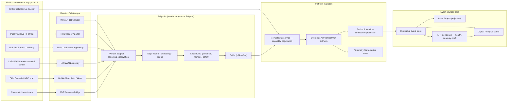

# 9. Tracking Technologies

**Document type:** Blueprint section — sensing & location-technology reference and selection guide
**Covers deliverable:** 9 (Tracking Technologies) · **Feature module:** [M2 · Tracking, RTLS & IoT](./05-feature-matrix.md)
**Reads with:** [11-technical-architecture.md](./11-technical-architecture.md) (IoT gateway, ingestion, event bus) · [10-asset-360-profile.md](./10-asset-360-profile.md) (Tracking & Sensors tabs surface everything specced here)

> **Thesis (from [00 §0.10](./00-master-blueprint.md) & [01 §1.9](./01-product-vision.md)):** *tracking hardware is a
> commodity; the abstraction is the product.* Access Genie is **not** a tag vendor. We ingest **any sensor through one
> vendor-neutral IoT gateway/adapter layer**, resolve every reading into a **location + confidence** on the single
> event-sourced asset graph, and never couple our data model to a Zebra tag, an Impinj reader, or a Samsara gateway
> SKU. This document is the menu of physical technologies that abstraction must speak — how each works, what it costs,
> where it fits, and where it breaks — plus the fusion and gateway design that makes them one product.

---

## 9.1 How to read this section

Every technology below is specced on a fixed rubric so they are directly comparable:

**How it works · Range / accuracy · Cost & tag price · Battery / power · Indoor / outdoor · Throughput / density ·
Best-fit use cases · Best-fit industries · Limitations.**

Cost bands are indicative per-tag/per-endpoint hardware only (2026 enterprise volumes), excluding readers, gateways,
install, and software: **¢** = cents, **$** = single dollars, **$$** = tens, **$$$** = hundreds. Accuracy is typical
achievable, not lab-best. Industries map to [01 §1.6](./01-product-vision.md).

---

## 9.2 The technologies

### 9.2.1 Passive RFID (UHF / HF)

| Dimension | Detail |
|-----------|--------|
| **How it works** | Battery-less tag; reader RF energizes the chip (backscatter). UHF (860–960 MHz) for range/inventory, HF (13.56 MHz) for short-range item-level. Portals, handhelds, and fixed readers capture reads. |
| **Range / accuracy** | UHF 1–12 m read range; **presence/zone-level**, not coordinates (portal = "passed here"). HF <1 m. |
| **Cost / tag price** | **¢** — $0.05–0.20 per label; the cheapest trackable identity at scale. |
| **Battery / power** | None (passive). Tag lifetime = physical label life. |
| **Indoor / outdoor** | Indoor-first; outdoor OK on portals/gates. |
| **Throughput / density** | **Extreme** — 100s–1,000s of tags/second through a portal; the density king. |
| **Best-fit use cases** | Bulk inventory counts, receiving/shipping portals, item-level retail, tool cribs, cycle counts, chain-of-custody gates. |
| **Best-fit industries** | **Retail** (inventory/shrinkage), **Warehouses/Logistics** (receiving/picking), **Healthcare** (supply/consumables), **Manufacturing** (WIP/tool cribs). |
| **Limitations** | Read-point (not continuous) location; RF hostile to metal/liquid; no real-time position between portals; reader infra + antenna tuning cost; privacy optics in retail. |

### 9.2.2 Active RFID

| Dimension | Detail |
|-----------|--------|
| **How it works** | Battery-powered tag beacons its ID periodically (typically 433 MHz / 2.4 GHz) to fixed readers; longer-lived cousin of BLE beaconing. |
| **Range / accuracy** | 30–150 m; **zone/area-level** (few-meter with RSSI trilateration). |
| **Cost / tag price** | **$$** — $10–50 per tag. |
| **Battery / power** | 2–7 years (duty-cycle dependent). |
| **Indoor / outdoor** | Both; strong for large yards/warehouses. |
| **Throughput / density** | High; 100s of tags per reader, continuous beaconing. |
| **Best-fit use cases** | Yard/container tracking, large-asset presence over wide areas, gate automation, high-value tools. |
| **Best-fit industries** | **Warehouses/Logistics**, **Utilities/Energy** (yards), **Airports** (GSE staging), **Manufacturing**. |
| **Limitations** | Higher tag cost/size than BLE; coarser than UWB; proprietary reader ecosystems (exactly what our adapter layer normalizes away). |

### 9.2.3 BLE Beacons

| Dimension | Detail |
|-----------|--------|
| **How it works** | Bluetooth Low Energy tag advertises periodically; fixed gateways (or phones) hear it and estimate proximity/zone from RSSI. The workhorse of hospital/enterprise RTLS. |
| **Range / accuracy** | 10–80 m; **room/zone-level 3–10 m** (RSSI). Better with dense gateways + fingerprinting. |
| **Cost / tag price** | **$** — $2–15 per beacon; phones/tablets act as free receivers. |
| **Battery / power** | 1–5 years coin-cell; rechargeable/wearable variants. |
| **Indoor / outdoor** | Indoor-first; short-range outdoor. |
| **Throughput / density** | High; thousands per facility, gateway-bounded. |
| **Best-fit use cases** | Find-my-asset, room-level equipment location, staff/patient wearables, proximity/contact tracing, self-service check-out proximity. |
| **Best-fit industries** | **Healthcare** (mobile medical equipment — the flagship BLE case), **Education** (AV/IT across campuses), **Warehouses**, **Retail** (associate/asset proximity). |
| **Limitations** | Coarse without dense infra; RSSI noisy/multipath; not for sub-meter tool control; battery swaps at fleet scale. |

### 9.2.4 UWB (Ultra-Wideband)

| Dimension | Detail |
|-----------|--------|
| **How it works** | Wide-band impulse radio; **Time-of-Flight / TDoA** between tag and fixed anchors yields true coordinates. The precision RTLS standard. |
| **Range / accuracy** | 10–50 m to anchor; **10–30 cm real-time (x,y,z)**. |
| **Cost / tag price** | **$$–$$$** — $15–80 tag; **anchor infrastructure is the real cost** ($$$/anchor, dense grid). |
| **Battery / power** | Months–years by update rate (high-rate tool tags drain faster). |
| **Indoor / outdoor** | Indoor-precise; outdoor short-range. |
| **Throughput / density** | High but **anchor-bandwidth bounded**; update-rate × tag-count trade-off. |
| **Best-fit use cases** | Sub-meter tool control, safety geofencing (worker-vehicle), precise WIP tracking, airside tool/FOD accountability, evidence-room precision. |
| **Best-fit industries** | **Airports** (airside tool control, GSE precision — the flagship UWB case), **Manufacturing** (line-side WIP/safety), **Police/Public Safety** (evidence/weapon precision), **Warehouses** (forklift safety). |
| **Limitations** | **Highest infra cost & install complexity**; anchor cabling/power/survey; overkill for presence-only needs; the tech Zebra MotionWorks over-commits to (see §9.9). |

### 9.2.5 GPS / GNSS

| Dimension | Detail |
|-----------|--------|
| **How it works** | Device trilaterates from satellite constellations (GPS/GLONASS/Galileo/BeiDou); RTK/dGPS for cm-grade. |
| **Range / accuracy** | Global; **2.5–5 m** typical, **<10 cm** with RTK. |
| **Cost / tag price** | **$$–$$$** — $20–150 per tracker (module + cellular backhaul + battery). |
| **Battery / power** | Days (high-rate) to years (low-rate/solar/vehicle-powered). |
| **Indoor / outdoor** | **Outdoor only** (no indoor fix). |
| **Throughput / density** | Unlimited endpoints (each device self-locates); backhaul-bounded. |
| **Best-fit use cases** | Fleet/vehicle, heavy equipment, trailers/containers, field crews, outdoor yards, geofence entry/exit, theft recovery. |
| **Best-fit industries** | **Airports** (GSE on the apron), **Utilities/Energy** (distributed field assets), **Government/Smart Cities** (public fleet/GIS), **Logistics** (over-the-road), **Police** (fleet). |
| **Limitations** | No indoor/urban-canyon reliability; power for high-rate fixes; needs a backhaul (cellular/LoRa/satellite); the lock-in surface Samsara exploits (see §9.9). |

### 9.2.6 QR Code

| Dimension | Detail |
|-----------|--------|
| **How it works** | 2D matrix printed on a label; any phone camera decodes an asset URL/ID → scan-to-open the 360° profile. |
| **Range / accuracy** | Contact/line-of-sight; **manual event-level** location (scan = "seen here, now, by whom"). |
| **Cost / tag price** | **¢** — effectively free (print). |
| **Battery / power** | None. |
| **Indoor / outdoor** | Both (durable/weatherproof stock outdoor). |
| **Throughput / density** | Manual; one scan at a time. |
| **Best-fit use cases** | Check-in/out, audits/cycle counts, WO execution, kiosk self-service, onboarding/labeling, any BYOD-camera workflow. |
| **Best-fit industries** | **Education**, **Government**, **Healthcare** (biomed labels), **all** — the universal low-cost baseline. |
| **Limitations** | No automation/real-time; requires human + line-of-sight; labels wear/tamper; only as current as the last scan. |

### 9.2.7 Barcode (1D / 2D)

| Dimension | Detail |
|-----------|--------|
| **How it works** | 1D linear (Code128/UPC) or 2D (DataMatrix/PDF417) scanned by laser/imager or phone; DataMatrix survives tiny/harsh marking. |
| **Range / accuracy** | Contact/short; **event-level** location. |
| **Cost / tag price** | **¢** — print/etch cost. |
| **Battery / power** | None. |
| **Indoor / outdoor** | Both; DataMatrix for direct-part-marking on tools/instruments. |
| **Throughput / density** | Manual/semi-auto (conveyor scanners batch). |
| **Best-fit use cases** | Legacy/ERP interop, receiving, parts/inventory, small-item direct marking, WO parts issue. |
| **Best-fit industries** | **Warehouses/Logistics**, **Manufacturing** (part marking), **Retail**, **Healthcare** (instrument/specimen). |
| **Limitations** | Line-of-sight, manual, single-read; damage-sensitive (1D worse than 2D); no real-time. Retained for universality/interop, not tracking. |

### 9.2.8 NFC

| Dimension | Detail |
|-----------|--------|
| **How it works** | HF RFID at 13.56 MHz, **tap-range**; phone or reader powers a passive tag. Tap-to-authenticate/verify. |
| **Range / accuracy** | **<4 cm**; deliberate-touch presence. |
| **Cost / tag price** | **¢–$** — $0.10–1.00 per tag. |
| **Battery / power** | None (passive tag). |
| **Indoor / outdoor** | Both. |
| **Throughput / density** | One tap at a time. |
| **Best-fit use cases** | Tamper-evident custody handoff, inspection/round proof-of-presence, secure check-in/out, calibration verification, patrol checkpoints. |
| **Best-fit industries** | **Police/Public Safety** (evidence/weapon custody taps), **Healthcare** (biomed verify/calibration), **Utilities** (inspection rounds), **Government** (accountability). |
| **Limitations** | No range/automation; deliberate tap only; not for locating — for **proving a specific human touched a specific asset**. |

### 9.2.9 LoRaWAN

| Dimension | Detail |
|-----------|--------|
| **How it works** | Long-range, low-power sub-GHz WAN; sensor sends tiny payloads (often temp/GPS/shock) to gateways over kilometers. Ideal telemetry backhaul for slow-moving/wide-area assets. |
| **Range / accuracy** | **2–15 km**; location coarse via TDoA (~100s m) — used mainly as **condition + coarse-position backhaul**. |
| **Cost / tag price** | **$–$$** — $5–40 sensor; one gateway covers a whole site/city. |
| **Battery / power** | **5–10 years** coin/AA — the endurance champion. |
| **Indoor / outdoor** | Both; excels over large campuses/outdoors. |
| **Throughput / density** | Thousands of low-rate nodes per gateway; **low bandwidth** (duty-cycle limited). |
| **Best-fit use cases** | **Cold-chain temperature**, environmental/condition monitoring at scale, distributed field sensors, tank/meter telemetry, low-cost wide-area presence. |
| **Best-fit industries** | **Warehouses/Logistics** (cold chain — flagship LoRaWAN case), **Utilities/Energy** (distributed field), **Government/Smart Cities** (city-wide sensing), **Healthcare** (pharma/vaccine cold storage). |
| **Limitations** | Low bandwidth/latency; not real-time positioning; duty-cycle caps message rate; not for precise location. |

### 9.2.10 WiFi (RTT / RSSI)

| Dimension | Detail |
|-----------|--------|
| **How it works** | Locate via existing APs — **RSSI/fingerprinting** (coarse) or **802.11mc FTM Round-Trip-Time** (ranging). Leverages infra you already own. |
| **Range / accuracy** | AP coverage; **RSSI 5–15 m**, **RTT 1–3 m**. |
| **Cost / tag price** | **$–$$** for WiFi tags; **often $0 net infra** (reuse APs); or client-based (device self-reports). |
| **Battery / power** | Weeks–months for tags (WiFi is power-hungrier than BLE); mains for client devices. |
| **Indoor / outdoor** | Indoor (campus outdoor where APs reach). |
| **Throughput / density** | AP-capacity bounded; good for device-dense environments. |
| **Best-fit use cases** | Locate WiFi-native gear (laptops/tablets/carts/medical devices), zone presence reusing existing WLAN, opportunistic coverage. |
| **Best-fit industries** | **Healthcare** (WiFi medical carts), **Education** (campus WLAN reuse), **Warehouses**, **Retail** (existing AP grids). |
| **Limitations** | RSSI accuracy varies with AP density/interference; RTT needs 802.11mc-capable APs+clients; higher tag power draw; best as a **fusion input**, not sole source. |

### 9.2.11 Cellular / 5G

| Dimension | Detail |
|-----------|--------|
| **How it works** | Device backhauls over LTE/NB-IoT/LTE-M/5G; positions via GPS-assist, cell-ID/OTDOA, or (5G) network-based precise positioning. Private 5G enables campus-grade indoor+outdoor. |
| **Range / accuracy** | Wide-area; **cell-ID 100s m–km**, **5G positioning target sub-m** (private/mmWave). |
| **Cost / tag price** | **$$–$$$** — module + SIM/data plan per device. |
| **Battery / power** | NB-IoT/LTE-M years (low-rate); full 5G power-hungry. |
| **Indoor / outdoor** | Both (private 5G indoor; public wide-area outdoor). |
| **Throughput / density** | Massive (NB-IoT: huge low-rate device counts; 5G: high bandwidth). |
| **Best-fit use cases** | Anywhere-connectivity assets with no gateway infra, mobile/remote field gear, private-5G campuses, high-bandwidth (video/edge) backhaul. |
| **Best-fit industries** | **Utilities/Energy** (remote field), **Logistics** (in-transit), **Airports/Manufacturing** (private 5G campuses), **Government** (city-wide). |
| **Limitations** | Recurring connectivity cost; carrier/coverage dependence; 5G positioning still maturing; power for full 5G — a lock-in vector we deliberately abstract (Samsara, §9.9). |

### 9.2.12 Environmental IoT Sensors (temp / humidity / shock / vibration)

| Dimension | Detail |
|-----------|--------|
| **How it works** | Condition sensors report physical state (temperature, humidity, shock/impact, vibration/FFT, pressure, tilt) over BLE/LoRa/WiFi/cellular. **Condition, not location** — the feed for health/predictive AI. |
| **Range / accuracy** | Sensor-grade (e.g. ±0.3 °C, mg-shock, vibration spectra); range = whatever radio carries it. |
| **Cost / tag price** | **$–$$** — $5–60 per node by sensor mix. |
| **Battery / power** | Months–years (LoRa/BLE variants). |
| **Indoor / outdoor** | Both; ruggedized/IP-rated for field & cold storage. |
| **Throughput / density** | Backhaul-bounded; vibration/FFT is higher-rate than temp. |
| **Best-fit use cases** | Cold-chain excursions, machine vibration → predictive maintenance, shock/drop on high-value transit, humidity for sensitive stock, feed to Health Score & anomaly AI ([08](./08-ai-intelligence.md)). |
| **Best-fit industries** | **Manufacturing** (vibration/predictive — flagship), **Healthcare/Logistics** (cold chain/shock), **Utilities/Energy** (equipment condition), **Warehouses**. |
| **Limitations** | Not a locating tech — **must pair** with a location source; calibration/drift; higher-rate streams stress low-power backhauls. |

### 9.2.13 Bluetooth / BLE-AoA (Angle-of-Arrival)

| Dimension | Detail |
|-----------|--------|
| **How it works** | BLE 5.1 direction-finding: multi-antenna locators measure the **angle** of a tag's signal; angles from locators triangulate position. BLE economics approaching UWB-class accuracy. |
| **Range / accuracy** | 10–50 m to locator; **0.5–2 m** with dense, well-surveyed arrays. |
| **Cost / tag price** | **$** tag (standard BLE, cheap); cost shifts to **AoA locator arrays** ($$–$$$). |
| **Battery / power** | 1–5 years (standard BLE tag). |
| **Indoor / outdoor** | Indoor-precise. |
| **Throughput / density** | High; locator-processing bounded. |
| **Best-fit use cases** | Sub-2 m location at BLE tag prices — the **UWB middle ground**: high-accuracy find-my-asset, patient/staff flow, zone-precise safety without UWB per-tag cost. |
| **Best-fit industries** | **Healthcare** (precise equipment/patient flow), **Manufacturing**, **Warehouses**, **Retail**. |
| **Limitations** | Locator infra + antenna survey/calibration; multipath-sensitive; less mature/precise than UWB but far cheaper per tag — a key **cost-vs-accuracy pivot** in §9.4. |

### 9.2.14 Edge AI

| Dimension | Detail |
|-----------|--------|
| **How it works** | **Not a sensor — a processing tier.** Compute at gateway/on-device: filter/smooth signals, run fusion, evaluate rules, detect anomalies, and act **locally** (offline-first, [00 §0.4.5](./00-master-blueprint.md)) before/without cloud. |
| **Range / accuracy** | N/A — **improves** every source's effective accuracy via local fusion/smoothing and cuts latency to milliseconds. |
| **Cost / tag price** | **$$–$$$** per gateway/edge node; amortized across many tags. |
| **Battery / power** | Mains/PoE-powered nodes. |
| **Indoor / outdoor** | Both (ruggedized edge). |
| **Throughput / density** | Scales ingestion by pre-aggregating at the edge; slashes cloud bandwidth. |
| **Best-fit use cases** | Local geofence/tamper alerting when WAN is down, camera-vision inference at source, sensor fusion & de-dup, latency-critical safety rules, bandwidth reduction. |
| **Best-fit industries** | **Airports/Manufacturing** (safety-critical low latency), **Utilities** (remote/intermittent link), **all** offline-first field sites. |
| **Limitations** | Edge hardware fleet to manage/update (OTA); model deployment/governance ([08](./08-ai-intelligence.md)); consistency between edge and cloud rules. |

### 9.2.15 Camera Vision / Video Analytics

| Dimension | Detail |
|-----------|--------|
| **How it works** | Cameras + CV/ML detect, classify, count, read (OCR/ANPR), and track assets in frame; can localize via known camera geometry. Turns existing CCTV into a sensor. |
| **Range / accuracy** | Field-of-view; **presence + in-frame position**; accuracy depends on optics/lighting/model. |
| **Cost / tag price** | **$$–$$$** camera + compute; **$0 per-asset tag** (tagless). |
| **Battery / power** | Mains/PoE. |
| **Indoor / outdoor** | Both. |
| **Throughput / density** | High per camera; compute-bound (pairs with Edge AI §9.2.14). |
| **Best-fit use cases** | **Tagless** detection/counting, license-plate gate automation (ANPR), FOD detection, PPE/safety compliance, dock/yard occupancy, loss/theft behavior, auto-classification ([05 #61](./05-feature-matrix.md)). |
| **Best-fit industries** | **Airports** (FOD, apron, ANPR gates), **Retail** (loss/shelf), **Manufacturing** (safety/QA), **Government/Smart Cities** (public spaces), **Logistics** (yard/dock). |
| **Limitations** | Privacy/consent & governance; lighting/occlusion/angle sensitivity; compute cost; identity ambiguity (sees "a forklift", not *which* — **fuse** with a tag ID); model bias/drift management. |

---

## 9.3 Decision matrix (technology × dimension)

Legend: accuracy **⌖** coarser → finer · cost **$** per-endpoint · power ★ (more = longer life) · **RT** real-time.

| Technology | Accuracy ⌖ | Continuous / RT | Indoor | Outdoor | Endpoint cost | Power ★ | Density | Tagless | Primary role |
|------------|:---------:|:---------:|:---:|:---:|:---:|:---:|:---:|:---:|--------------|
| Passive RFID | Zone/portal | ✗ (read-point) | ●●● | ● | ¢ | ∞ (none) | ●●●● | ✗ | Bulk identity/inventory |
| Active RFID | Area 3–10 m | ✓ | ●● | ●● | $$ | ★★★ | ●●● | ✗ | Wide-area presence |
| BLE beacons | Room 3–10 m | ✓ | ●●● | ● | $ | ★★★★ | ●●● | ✗ | Enterprise RTLS workhorse |
| **UWB** | **10–30 cm** | ✓ | ●●● | ● | $$–$$$ | ★★ | ●●● | ✗ | Precision/safety RTLS |
| GPS/GNSS | 2.5–5 m | ✓ | ✗ | ●●● | $$–$$$ | ★★★ | ∞ | ✗ | Outdoor/fleet |
| QR code | Event/manual | ✗ | ●●● | ●● | ¢ | ∞ | manual | ✗ | Scan-to-act baseline |
| Barcode 1D/2D | Event/manual | ✗ | ●●● | ●● | ¢ | ∞ | manual | ✗ | Interop/parts |
| NFC | Tap (<4 cm) | ✗ | ●●● | ●● | ¢–$ | ∞ | manual | ✗ | Proof-of-touch custody |
| LoRaWAN | Coarse (100s m) | ✓ (low-rate) | ●● | ●●● | $–$$ | ★★★★★ | ●●●● | ✗ | Long-life condition backhaul |
| WiFi RTT/RSSI | 1–15 m | ✓ | ●●● | ● | $–$$ (reuse) | ★★ | ●●● | ✗ | Infra-reuse zone locate |
| Cellular/5G | 100s m → sub-m | ✓ | ●● | ●●● | $$–$$$ | ★★★ | ●●●● | ✗ | Anywhere backhaul |
| Environmental IoT | N/A (condition) | ✓ | ●●● | ●●● | $–$$ | ★★★★ | ●●● | ✗ | Condition → AI feed |
| BLE-AoA | 0.5–2 m | ✓ | ●●● | ● | $ tag / $$$ infra | ★★★★ | ●●● | ✗ | Cheap-tag precision |
| Edge AI | (enhances all) | ✓ | ●●● | ●●● | $$–$$$/node | mains | scales ↑ | — | Local fusion/act |
| Camera Vision | In-frame | ✓ | ●●● | ●●● | $$–$$$/cam | mains | ●●● | **✓** | Tagless detect/count |

### "Which tech for which problem" — canonical mappings

| Problem / scenario | Recommended stack | Why |
|--------------------|-------------------|-----|
| **Tool control, airside** | **UWB** (+ GPS on apron, + Edge AI safety) | Sub-30 cm accountability & worker-vehicle geofencing; airport flagship. |
| **Cold chain** | **LoRaWAN + temp/humidity/shock sensors** | 5–10 yr battery, km range, excursion telemetry over the whole route. |
| **Hospital mobile equipment** | **BLE beacons** (+ BLE-AoA where precision needed, + WiFi reuse) | Room-level find-my-asset at cheap tag prices; the canonical BLE case. |
| **Outdoor fleet / heavy equipment** | **GPS/GNSS + Cellular backhaul** | Global outdoor position + anywhere connectivity + geofence. |
| **Retail inventory / shrinkage** | **Passive UHF RFID** (+ Camera Vision for loss) | 1,000s of item reads/sec at ¢/label; density king. |
| **Evidence / weapon custody** | **NFC tap + QR** (+ UWB in high-security rooms) | Proof a specific human touched a specific item; immutable custody. |
| **Predictive maintenance on machines** | **Vibration/environmental sensors + Edge AI** | Condition spectra → Health Score & failure prediction ([08](./08-ai-intelligence.md)). |
| **Distributed utility field assets** | **LoRaWAN / Cellular NB-IoT + GPS** | Km-scale, multi-year battery, sparse coverage. |
| **Campus AV/IT (schools)** | **QR + BLE + WiFi reuse** | Low cost, check-in/out, reuse existing WLAN. |
| **FOD / apron safety / gate ANPR** | **Camera Vision + Edge AI** (+ UWB fuse) | Tagless detection; ANPR gate automation. |
| **Private-5G smart factory** | **Private 5G + UWB + vision** | Campus-grade indoor+outdoor + precision + tagless QA. |
| **Universal baseline everywhere** | **QR + Barcode** | Free identity + scan-to-open the [10 · 360° profile](./10-asset-360-profile.md); the floor under every deployment. |

---

## 9.4 Sensor fusion & location confidence

No single technology is authoritative everywhere; **fusion is how presence-level signals become a trustworthy
position with an honest confidence.** This directly implements [M2 #31 "Location confidence & sensor-fusion accuracy"](./05-feature-matrix.md)
and surfaces on the [10 · Tracking tab](./10-asset-360-profile.md).

**Principles**

1. **Every observation carries a confidence, not just a point.** A reading is `{assetId, position|zone, accuracy_radius,
   source, timestamp, rssi/quality}`. We never store "location = X"; we store "location = X ± r, from source S, at time T".
2. **Fuse, weighting by source accuracy + recency + agreement.** A UWB fix (±0.2 m, 1 s old) dominates an RSSI estimate
   (±8 m, 1 s old); a fresh BLE zone-read overrides a stale GPS fix indoors. Kalman/particle-style smoothing runs at
   the **Edge (§9.2.14)** for low latency, reconciled in cloud.
3. **Corroboration raises confidence; contradiction lowers it and can fire an anomaly.** Camera-Vision "a forklift at
   dock 3" + UWB "tag 8842 at dock 3" → high-confidence *identified* asset. Vision sees an asset a tag says is elsewhere →
   confidence drops + **theft/anomaly signal** to [08](./08-ai-intelligence.md).
4. **Confidence is a first-class, explainable field** (mirrors [00 §0.4.2](./00-master-blueprint.md) "AI is native, explainable").
   The UI shows *why* — which sources agreed, how fresh, how precise — never a bare dot.
5. **Degrade gracefully.** As signals age or thin out, confidence decays and the asset flows toward **last-seen /
   signal-loss** ([M2 #30](./05-feature-matrix.md)) rather than reporting false precision.

**Location-confidence tiers (normalized across all sources)**

| Tier | Confidence | Typical basis | UI treatment |
|------|-----------|---------------|--------------|
| **Pinpoint** | ≥ 0.9, ≤ 0.5 m | UWB, BLE-AoA, RTK-GPS, corroborated | Solid dot, exact coords |
| **Zone** | 0.6–0.9, room/area | BLE/WiFi RSSI, active RFID, WiFi-RTT | Zone highlight |
| **Area / coarse** | 0.4–0.6 | LoRa TDoA, cell-ID, single weak read | Area shading |
| **Last-seen** | < 0.4 / stale | Last portal/scan, decayed fix | Ghost dot + "last seen" timestamp |
| **Lost / signal-loss** | expired | No reads past threshold | Alert → [M2 #30](./05-feature-matrix.md) |

Fusion is a **projection over the event stream** ([00 §0.4.1](./00-master-blueprint.md)): every raw reading is an immutable event; the
current position and its confidence are derived views the twin, map, and AI all read from the same source of truth.

---

## 9.5 The vendor-neutral IoT gateway / adapter abstraction — *the abstraction is the product*

This is the non-negotiable from [00 §0.4.4 / §0.10.2](./00-master-blueprint.md) and [01 §1.9.2](./01-product-vision.md), and the strategic wedge against
Zebra and Samsara (§9.9). **We never model a Zebra tag, an Impinj reader, or a Samsara gateway in the domain.** We model
a **normalized observation**, and per-vendor adapters translate into it.

**Design**

- **Adapter SDK ([M13 #174](./05-feature-matrix.md)).** Each vendor/protocol (Impinj/Zebra readers, Kontakt/Estimote BLE, Sewio/Ubudu UWB,
  ChirpStack/TTN LoRaWAN, Cisco/Aruba WiFi, u-blox/Quectel GPS/cellular, Milesight/Disruptive sensors, ONVIF/RTSP cameras)
  ships an adapter that maps its native frames onto **one canonical observation schema**.
- **Canonical observation contract.** `{tenantId, deviceId, assetId?, kind: location|condition|presence|event,
  value, unit, accuracy, confidence, source, protocol, ts}` — the *only* thing the platform above the gateway ever sees.
- **Capability negotiation, not SKU coupling.** The platform asks an adapter *what it can do* (locate? at what accuracy?
  measure temp? OTA? geofence at edge?) — features bind to **capabilities**, not part numbers. Swap Impinj for Zebra and
  nothing above the adapter changes.
- **Edge-resident, offline-first.** Gateways buffer, fuse, and apply rules locally (§9.2.14), syncing on reconnect
  ([00 §0.4.5](./00-master-blueprint.md)). Firmware/OTA & fleet config are managed centrally ([M2 #33–34](./05-feature-matrix.md)).
- **Everything becomes an event.** Adapters emit onto the same event bus that feeds the asset graph, twin, and AI
  ([11-technical-architecture.md](./11-technical-architecture.md)) — one ingestion path (§9.6), any hardware.

**Why this is the product, not plumbing**

| Because… | Outcome |
|----------|---------|
| Hardware is a commodity ([00 §0.10.2](./00-master-blueprint.md)) | Margin & moat live in the graph + AI, not the tag. |
| Customers own mixed, legacy, multi-vendor fleets | We ingest what they *have*; no rip-and-replace to adopt us. |
| Tech mix evolves (BLE→BLE-AoA→UWB→5G) | Add an adapter, not a migration; the data model is stable for a decade. |
| Buyers fear lock-in (the exact Zebra/Samsara pain) | "Any sensor, one graph" ([01 §1.8.4](./01-product-vision.md)) is a *sales* differentiator, not just architecture. |

---

## 9.6 Ingestion path (tag/sensor → asset graph / twin)

*One path, any hardware:* raw signal → reader/gateway → **vendor adapter normalizes to a canonical observation** →
edge fusion/rules/buffer → IoT Gateway service → event bus → fusion/confidence → **immutable event store**, from which
the asset graph, twin, and AI are all projections. Full service topology → [11-technical-architecture.md](./11-technical-architecture.md).

---

## 9.7 What each source feeds downstream

| Source class | Feeds | Consumed by |
|--------------|-------|-------------|
| Location (UWB/BLE/GPS/WiFi/AoA/cellular) | position + confidence | Live map, twin, geofence/dwell, movement history ([M2](./05-feature-matrix.md)), [10 Tracking tab](./10-asset-360-profile.md) |
| Presence/identity (RFID/QR/Barcode/NFC) | seen-here events, custody | Inventory, cycle-count, chain-of-custody, check-in/out |
| Condition (temp/humidity/shock/vibration) | telemetry series | Health Score, predictive/anomaly AI ([08](./08-ai-intelligence.md)), [10 Sensors tab](./10-asset-360-profile.md) |
| Vision | detections/counts/OCR | Tagless tracking, safety/loss, auto-classification, fusion corroboration |
| Edge AI | filtered/fused signals, local alerts | Everything above, at low latency, offline |

---

## 9.8 Architect's recommendations (challenging the brief)

1. **Default to BLE, reserve UWB for where centimeters pay.** UWB anchor infra is the cost trap that locked Zebra
   MotionWorks in. Lead with BLE beacons; step up to **BLE-AoA** for sub-2 m at BLE tag prices; escalate to **UWB only**
   for tool-control/safety cases (airside, line-side) where <30 cm has a hard ROI.
2. **Treat QR/Barcode as the universal floor, never the ceiling.** Every asset gets a scannable identity on day one
   (near-zero cost, instant [360° profile](./10-asset-360-profile.md) access); layer automated RTLS only where continuous location earns it.
3. **Fusion + confidence is a product surface, not hidden math.** Show *why* we believe a location — corroborating
   sources, freshness, precision — mirroring the explainable-AI stance ([00 §0.4.2](./00-master-blueprint.md)). It defeats "how do you know?" in
   regulated buys (health/gov/police).
4. **Push intelligence to the edge from day one.** Offline-first geofence/tamper/safety at the gateway ([00 §0.4.5](./00-master-blueprint.md)) is
   both a resilience and a latency win, and slashes cloud ingest cost.
5. **Camera Vision is an accelerant, not a replacement — always fuse for identity.** Vision sees *a* forklift; a tag
   says *which*. The two together beat either alone and unlock tagless coverage of un-tagged assets.

---

## 9.9 Positioning vs. incumbents

| | **Zebra MotionWorks** | **Samsara** | **Access Genie AI** |
|---|---|---|---|
| **Coupling** | **UWB-locked** — precision RTLS wed to Zebra tags/anchors/readers | **Hardware-locked** — value tied to Samsara gateways/cameras/SIMs | **Abstraction-first** — any sensor via vendor-neutral adapters ([§9.5](./09-tracking-technologies.md)) |
| **Tech breadth** | Deep UWB/RFID; weak outdoor & condition breadth | Strong outdoor GPS/telematics/video; weak indoor precision RTLS | RFID→BLE→BLE-AoA→UWB→GPS→LoRa→WiFi→5G→vision→condition, unified |
| **Data model** | Tracking silo | Telematics silo | **One event-sourced asset graph** — the dot = the WO = the depreciation line ([00 §0.1](./00-master-blueprint.md), [01 §1.7](./01-product-vision.md)) |
| **AI** | Bolt-on analytics | Bolt-on safety/video AI | **Native, explainable** health/predictive/theft with confidence ([08](./08-ai-intelligence.md)) |
| **Lock-in** | Rip-and-replace to their stack | Their hardware or nothing | **Ingest what you own**; add an adapter, not a migration |
| **Where they win** | Sub-30 cm on a Zebra-only floor | Turnkey outdoor fleet if you buy their boxes | **Multi-vendor, multi-tech, indoor+outdoor, on one graph with AI** |

**The wedge:** Zebra makes you buy their tags; Samsara makes you buy their hardware. Access Genie makes the
*hardware irrelevant* — mix any vendor, any technology, and see it as one intelligent asset. **The abstraction is
the product.**

---

## 9.10 Summary

Access Genie treats all fourteen tracking technologies — from ¢-per-label passive RFID and universal QR/barcode up
through BLE/BLE-AoA, centimeter UWB, GPS/5G, LoRaWAN condition sensing, WiFi, NFC custody, environmental IoT, Edge
AI, and camera vision — as interchangeable inputs to **one vendor-neutral IoT gateway abstraction**, chosen per
problem by the decision matrix (UWB airside, LoRa+temp cold chain, BLE hospital, GPS fleet, RFID retail) rather than
by any hardware brand. Every reading is normalized to a canonical observation, fused into a **location + explainable
confidence**, and written as an immutable event from which the asset graph, digital twin, and native AI are all
projections. This is precisely how we out-flank **Zebra MotionWorks' UWB lock-in** and **Samsara's hardware lock-in**:
we make the sensor a commodity and the abstraction the product.
