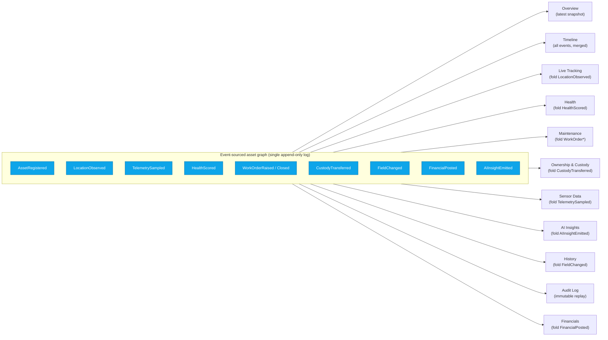

# 10. Asset 360° Profile

**Document type:** UX / Page specification — the flagship object page
**Version:** 1.0 · **Status:** Planning (pre-rebuild) · **Owner:** Product / UX Architecture
**Audience:** Design, Engineering (FE + API), PM, QA
**Route:** `/assets/[id]` · **Sidebar:** Assets ▸ Asset 360° Profile · **Body pattern:** *Detail* (tabbed object page → 00§0.7)

> The Asset 360° Profile is the **single object page** every other module deep-links into. It is the human-readable
> face of the event-sourced asset graph: the tracking dot, the work order, the depreciation line, and the health
> score are **the same asset**, shown through **projections** (tabs). One asset, one URL, one truth — every tab is a
> read model over the same event stream (→ 00§0.4, [11-technical-architecture.md](./11-technical-architecture.md)).
> The existing demo renders a 5-tab slice (Overview · Telemetry · Maintenance · Financials · Activity); this doc is
> the **full 16-tab spec** it grows into.

Related: [06-page-catalog.md](./06-page-catalog.md) (page-state contract) · [08-ai-intelligence.md](./08-ai-intelligence.md)
(AI modules that feed the AI tabs) · [09-tracking-technologies.md](./09-tracking-technologies.md) (sensing layer that
feeds Live Tracking / Sensor Data) · [02-personas.md](./02-personas.md) (RBAC) · [07-asset-lifecycle.md](./07-asset-lifecycle.md)
(state machine behind the header status) · [16-security-compliance.md](./16-security-compliance.md) (field-level security).

---

## 10.1 The page as a projection of the event stream

Every tab is a **read model** derived from the one append-only event log for the asset. Nothing on this page is a
free-standing table the UI writes to directly; the UI dispatches *commands* (create WO, transfer, check-out), the core
appends *events*, and the tabs *re-project*. This is why History and Audit can be immutable while Overview is a live
snapshot — they are the same events, folded differently.

**Implications for the UI:** (a) tabs are **lazy** — each projection loads on demand; (b) a *stale* projection can be
detected and shown with a freshness chip; (c) History/Audit never disagree with Overview because they replay the same
log; (d) any tab can be rebuilt from zero, so a corrupt read model is never a data-loss event.

---

## 10.2 Deep-linkability & URL contract

Every view state is in the URL — shareable, bookmarkable, back-button-safe (→ 00§0.7, 03§3.5 "deep-linkable").

| Pattern | Resolves to |
|---------|-------------|
| `/assets/[id]` | Profile, default tab (Overview) |
| `/assets/[id]?tab=health` | Deep-link straight to a tab |
| `/assets/[id]?tab=maintenance&wo=WO-5107` | Tab + selected row (opens WO inspector) |
| `/assets/[id]?tab=sensors&channel=vibration&range=7d` | Tab + sub-filters (channel, time range) |
| `/assets/[id]?tab=timeline&type=Custody` | Tab + event-type filter |
| `/assets/[id]/edit` | Edit form (separate route, `asset:update`) |
| `/a/[shortId]` | QR/RFID scan-to-open shortlink → 301 to canonical |

- **Copilot & alerts deep-link here:** an AI insight or a geofence alert links to `?tab=...` with the relevant
  driver highlighted; "Explain this" anywhere resolves to `?tab=ai`.
- **Scope-persistent:** the global scope chip context follows the deep link (03§3.5).
- **Share (scoped link):** produces an expiring, watermarked link honoring the recipient's field-level security.

---

## 10.3 Header / identity anatomy

The header is scope-aware and **role-adaptive**: chips and quick actions render only where the viewer's role + scope
grant the underlying permission (menu-hiding is cosmetic; the data layer still enforces — 02§2.3).

| Zone | Element | Detail / source |
|------|---------|-----------------|
| **Breadcrumb** | `Registry / Facility ▸ Building ▸ Floor ▸ Zone / [Asset ID]` | Full tenancy path (03§3.1); each node is a scoped link |
| **Identity block** | Category glyph · **Asset Name** · human tag · Global Asset ID (mono) · Serial No. | ID + tag from M1; serial masked for external/guest |
| **Status chip** | `Active · Maintenance · Missing · Staging · End_Of_Life` | Lifecycle state machine (07); color-tokenized |
| **Health chip** | `Good / Warning / Critical · <score>` with dot | Health projection (08 · Health Score) |
| **Risk chip** | `Risk <0–100>` band (Low→Critical) | Composite risk (08 · Risk Scoring) |
| **Category / Class** | Taxonomy class + subclass | M1 taxonomy |
| **Criticality** | `Low / Medium / High / Critical` | Business-criticality attribute; drives SLA & alert routing |
| **Custodian** | Person/dept avatar + name | Current custody projection (Ownership tab) |
| **Location breadcrumb** | Live `Facility ▸ Building ▸ Floor ▸ Zone` + "last seen" chip | Tracking projection (09); links to Live Tracking tab |
| **Freshness** | Live pulse dot + `last ping <rel time>` | Telemetry recency; greys to "stale" past threshold |
| **Watch / Favorite / Share** | Subscribe, pin, scoped-share | Cross-cutting (05 #216, #267, #269) |

### Quick actions (primary action bar)

Each is command → event; each is permission-gated and, where noted, **SoD-guarded** (requester ≠ approver — 02§2.3).

| Action | Command | Permission | Notes |
|--------|---------|------------|-------|
| **Create Work Order** | `workorder:create` | `workorder:create` (scope) | Pre-fills asset; AI can draft from health drivers |
| **Locate on Map** | open `/tracking?asset=[id]` | `tracking:read` | Falls back to last-seen if no live fix |
| **Transfer** | `asset:transfer` (draft) | `asset:transfer` + SoD approval | Inter-facility routes to approver |
| **Check-in / Check-out** | `custody:checkout` / `custody:checkin` | `custody:write` | Kiosk/mobile equivalent; writes custody event |
| **Print Label** | render QR/RFID/NFC label | `asset:label` | Encodes Global ID; batch from Registry (M1 #9) |
| **Retire / Dispose** | `asset:retire` | `lifecycle:transition` + SoD | Opens disposal workflow (07); write-off ties to Finance |
| **Edit** | `/assets/[id]/edit` | `asset:update` | Field-level: masked fields not editable |
| **⋯ More** | Reserve · Clone · Merge · Add component · Add to group/kit · Soft-delete | per-action | Overflow menu (M1 #6, #12, #16) |

**Left rail (persistent, all tabs):** Health ring (score) · Risk / Criticality tiles · Utilization bar · Identity card
(manufacturer, model, serial, custodian, location, tracking tech, lifecycle stage) · Live telemetry snapshot · Tags.
The rail is the "always-true" summary; tabs are the drill-downs.

---

## 10.4 Field-level security (who sees what)

Row-level security scopes *which assets* a role can open; **field-level security masks columns within an asset the
role may otherwise view** (02§2.3, 16). Masked fields render as `•••• (restricted)` — never blank, so absence is
explicit. Deep links and scoped-shares inherit the recipient's mask, not the sharer's.

| Field / tab region | Technician | Operator | Security | Auditor | Finance | Facility Mgr | Executive |
|--------------------|:-:|:-:|:-:|:-:|:-:|:-:|:-:|
| Identity, location, health | ✓ | ✓ | ✓ | ✓ | ✓ | ✓ | ✓ |
| **Financials tab (cost, book value, TCO, depreciation)** | ✗ masked | ✗ | ✗ | read | ✓ | read | read (aggregate) |
| Warranty & contract *terms/rates* | read | ✗ | ✗ | read | ✓ | read | read |
| Live GPS/RTLS precise coords | ✓ | ✗ | ✓ | read | ✗ | ✓ | ✗ |
| Custody chain (person-level PII) | own only | own only | ✓ | ✓ | ✗ | ✓ | ✗ |
| Sensor raw telemetry | ✓ | ✗ | ✓ | read | ✗ | ✓ | ✗ |
| AI drivers / counterfactuals | read | ✗ | read | read | read | ✓ | read |
| Audit Log (immutable) | ✗ | ✗ | read | ✓ | read | read | ✗ |
| Documents flagged *confidential* | ✗ | ✗ | ✗ | ✓ | ✓ | ✓ | ✗ |

> Canonical example: **cost is hidden from technicians.** A tech opening this asset sees health, location, WO, and
> sensor data in full, but the Financials tab is present-yet-masked and the cost columns elsewhere read `•••• (restricted)`.

---

## 10.5 Tab specifications

Sixteen tabs. The **canonical 14** (00§0.6) are Overview · Timeline · Live Tracking · Health · Maintenance · Warranty
& Contracts · Ownership & Custody · Documents · Sensor Data · AI Insights · History · Audit · Risk · Financials;
**Images/Media** and **Utilization** ship as first-class tabs but collapse into Documents and Health respectively on
narrow viewports. Tab order is fixed; unavailable tabs (no permission / no data-source for this class) are hidden, not
disabled. Every tab honors the **standard states** (00§0.7): Loading (skeleton) · Empty (illustration + CTA) · Error
(retry + trace id + support) · Permission-denied (403 + request-access) · Offline (cached banner) · No-results (clear filters).

**Per-tab legend:** *Purpose · Data · Components · Key actions · Permissions · Empty/Loading/Error · Feed (AI/tracking module).*

---

### 10.5.1 Overview

- **Purpose:** The 10-second answer — is this asset healthy, where, worth what, and what needs attention.
- **Data:** Key attributes (category, status, criticality, location, purchase date); health trend sparkline; top 2–3
  AI insights; open WO count; utilization; next PM date; warranty state.
- **Components:** Attribute grid (`KV` pairs) · health-trend sparkline · AI-insight cards (driver bullets + confidence
  bar + $-impact + CTA) · mini WO list · quick-stat tiles.
- **Key actions:** Act on insight (→ WO/transfer), Explain this, jump to any tab.
- **Permissions:** `asset:read` (any viewer with row access); masked fields per 10.4.
- **States:** *Loading* skeleton grid; *Empty* rare (new asset) → "Complete asset setup" CTA; *Error* retry.
- **Feed:** Aggregates from Health (08), AI Insights (08 · Recommendation feed), Tracking (09).

### 10.5.2 Timeline (activity / event stream)

- **Purpose:** The unified, human-readable story of everything that happened to this asset, newest first.
- **Data:** Merged event stream — Movement, Maintenance, Custody, Alert, Registration, Telemetry-milestone, Audit,
  AI-insight, Financial-posting — each with actor, timestamp, source module.
- **Components:** Vertical timeline (type-colored nodes + emoji) · type/date/actor filters · "load older" pagination ·
  per-event expandable detail · export.
- **Key actions:** Filter by type, jump to source record, add a comment/@mention, subscribe.
- **Permissions:** `asset:read`; events the viewer can't see (e.g. financial postings for a technician) are omitted, not masked-in-place.
- **States:** *Loading* shimmer rows; *Empty* "No recorded activity" (📭); *Error* retry; *No-results* clear-filters.
- **Feed:** Direct render of the event log — the most literal projection (10.1); no model, pure fold.

### 10.5.3 Live Tracking (map + last-seen + movement)

- **Purpose:** Where is it *now*, how sure are we, and how did it move.
- **Data:** Live position on facility floor-plan / outdoor map; last-seen time + location-confidence %; sensing tech
  (RFID/BLE/UWB/GPS/LoRaWAN/WiFi); recent movement trail; current zone + geofence status; tag battery.
- **Components:** Embedded map/twin canvas + inspector · confidence meter · movement trail replay (scrubber) ·
  geofence badge · "open in full Live Map / Digital Twin" · locate/ping-tag action.
- **Key actions:** Ping/locate, replay movement, set/attach geofence, flag out-of-bounds → Security.
- **Permissions:** `tracking:read`; precise coordinates field-masked from Finance/Operator/Executive (10.4).
- **States:** *Loading* map skeleton; *Empty* "No tracking device attached" → attach-tag CTA; *Error* "Sensor feed
  unavailable" + last-known fix + retry; *Offline* shows last cached fix with staleness banner.
- **Feed:** [09-tracking-technologies.md](./09-tracking-technologies.md) — sensor-fusion + gateway abstraction; last-seen/signal-loss (M2 #30).

### 10.5.4 Health (score + drivers + trend)

- **Purpose:** Explain the health score defensibly — not just the number, but *why* and *where it's heading*.
- **Data:** 0–100 health score + Good/Warning/Critical band; ranked **drivers** with weight/direction; health trend
  over time; contributing sub-signals (vibration, temp, error rate, age, service history); RUL estimate.
- **Components:** Health ring · driver bar-list (signed contributions) · trend chart · RUL callout · "recompute"/
  "explain" · threshold annotations.
- **Key actions:** Explain (counterfactual: "what would raise this to Good"), create predictive WO, provide feedback (👍/👎 → learning loop).
- **Permissions:** `asset:read` for score; drivers require `ai:read`.
- **States:** *Loading* ring + bars skeleton; *Empty* "Not enough data to score" (needs telemetry/history) + what's-missing hint; *Error* "Model unavailable, showing last score" + timestamp.
- **Feed:** [08-ai-intelligence.md](./08-ai-intelligence.md) — Health Score + RUL + Explainability (M3 #39, #41, #58).

### 10.5.5 Maintenance (WO history + PM)

- **Purpose:** Everything wrench-related — open work, history, preventive schedule, warranty-aware repair decisions.
- **Data:** Open + historical work orders (status, priority, type, assignee, due, labor/parts); PM schedule (next due,
  compliance); failure codes; MTTR/MTBF for this asset; parts/BOM consumed; linked inspections.
- **Components:** WO list (status/priority pills) + inspector · PM schedule card · reliability mini-stats · parts/BOM
  table · "warranty vs repair" hint (cross-refs Warranty tab).
- **Key actions:** Create WO, schedule PM, dispatch technician, log parts/time, close/escalate, open in Maintenance board.
- **Permissions:** `workorder:read`; create/close need `workorder:create` / `workorder:close`; cost of parts masked per 10.4.
- **States:** *Loading* row skeletons; *Empty* "No work orders" (🧰) + Create-WO CTA; *Error* retry.
- **Feed:** EAM module (M4); **predictive WOs** auto-drafted by [08](./08-ai-intelligence.md) (M3 #40, M4 #64).

### 10.5.6 Warranty & Contracts

- **Purpose:** Coverage awareness — is this under warranty/lease/service contract, and what does that entitle.
- **Data:** Warranty (start/expiry, terms, provider); service contracts / SLAs; lease terms; extended-warranty options;
  recall notices; claim history; days-to-expiry countdown.
- **Components:** Coverage cards with expiry countdown · SLA badges · claim/renewal history table · document links
  (to Documents tab) · "file a claim" / "renew" actions.
- **Key actions:** File warranty claim, initiate renewal, attach contract doc, set expiry reminder.
- **Permissions:** `asset:read` for coverage status; contract *rates/terms* need `finance:read` (masked otherwise, 10.4).
- **States:** *Loading* card skeletons; *Empty* "No warranty/contract on file" + add CTA; *Error* retry; expired coverage rendered in critical token.
- **Feed:** Lifecycle & Financials (M7 #113, M8); AI **contract/warranty-claim recommender** (08, M-AI #304).

### 10.5.7 Ownership & Custody (chain of custody)

- **Purpose:** Who is accountable now and the unbroken, immutable chain of who held it before.
- **Data:** Current custodian + department/cost-center; assignment history; check-in/out log; transfer records
  (from → to, approver, reason, SoD trail); custody gaps/exceptions; reservation holds.
- **Components:** Chain-of-custody timeline (immutable) · current-custody card · transfer/reservation history table ·
  custody-gap flags · check-in/out + transfer actions.
- **Key actions:** Check-in/out, initiate transfer (SoD-approved), reassign custodian, resolve custody dispute, file exception.
- **Permissions:** `custody:read`; transfer needs `asset:transfer` + approver; PII of holders masked for Finance/Executive (10.4).
- **States:** *Loading* timeline skeleton; *Empty* "No custody events — unassigned" + assign CTA; *Error* retry.
- **Feed:** Operations & Custody (M6 #94, #96, #98); immutable log guarantees (10.1, M11 #149).

### 10.5.8 Documents

- **Purpose:** The asset's file cabinet — manuals, certificates, contracts, CAD, compliance evidence.
- **Data:** Attached files (name, type, size, version, uploader, date, confidentiality flag); categorized (manual /
  cert / contract / drawing / photo-report / compliance).
- **Components:** Document table/grid · category filter · version history · preview pane · drag-drop upload · confidentiality badge.
- **Key actions:** Upload, version, preview, download, categorize, set confidentiality, delete (soft).
- **Permissions:** `asset:read` for non-confidential; documents flagged *confidential* require elevated role (10.4).
- **States:** *Loading* grid skeleton; *Empty* "No documents yet" + upload CTA; *Error* retry; *Offline* cached list, upload disabled.
- **Feed:** Registry attachments (M1 #14); certification/calibration expiry surfaces to Compliance (M11 #151).

### 10.5.9 Images / Media

- **Purpose:** Visual record — nameplate, condition photos, inspection captures, annotated damage.
- **Data:** Image gallery + video; capture date, source (mobile/inspection/drone), annotations; AI auto-tags.
- **Components:** Masonry gallery + lightbox · annotation overlay · capture-source badge · "capture via mobile" ·
  AI auto-classification chips.
- **Key actions:** Upload/capture, annotate, set primary image, compare (before/after), delete.
- **Permissions:** `asset:read`; capture write needs `asset:update` / mobile `field:capture`.
- **States:** *Loading* thumbnail skeleton; *Empty* "No media" + capture CTA; *Error* retry.
- **Feed:** Mobile camera capture (M14 #189); AI **auto-tagging/classification from images** (08, M3 #61, #292).

### 10.5.10 Sensor Data (telemetry charts)

- **Purpose:** The raw and rolled-up IoT signal — the evidence under the health score.
- **Data:** Time-series per channel (temperature, humidity, vibration, shock, battery, custom); thresholds/limits;
  sampling rate; anomalies flagged inline; environmental exceptions.
- **Components:** Multi-channel time-series charts · channel selector · time-range picker (1h/24h/7d/30d/custom) ·
  threshold bands · anomaly markers · current-reading tiles · export CSV.
- **Key actions:** Select channels, change range, set threshold alert rule, export, correlate with events (overlay Timeline markers).
- **Permissions:** `tracking:read` / `telemetry:read`; raw telemetry masked from Finance/Operator/Executive (10.4).
- **States:** *Loading* chart skeleton; *Empty* "No sensors reporting" (no channels) + attach-sensor CTA; *Error*
  "Telemetry service unavailable" + retry; *No-results* for a range → widen-range hint.
- **Feed:** [09](./09-tracking-technologies.md) telemetry + environmental monitoring (M2 #35, #38); anomalies from [08](./08-ai-intelligence.md) (M3 #42).

### 10.5.11 AI Insights (explainable)

- **Purpose:** Every AI conclusion about this asset, ranked, explainable, and actionable — a per-asset AI command center.
- **Data:** Ranked insights (predictive failure, anomaly, theft/loss, cost optimization, utilization, lifecycle/EOL);
  each with severity, **drivers**, confidence, $-impact, recommended action, model + version; per-asset AI chat.
- **Components:** Insight cards (driver bullets + confidence meter + $-impact + CTA) · severity/type filter · model &
  confidence badges · "Explain" (drivers + counterfactual) · thumbs feedback · per-asset chat box.
- **Key actions:** Act (→ WO/transfer/reorder), Explain, ask Copilot about this asset, dismiss/snooze, feedback (HITL loop).
- **Permissions:** `ai:read`; acting requires the target permission (e.g. `workorder:create`).
- **States:** *Loading* card skeleton; *Empty* "No AI insights — asset is nominal" (✅); *Error* "AI service degraded" + last insights + timestamp.
- **Feed:** The whole of [08-ai-intelligence.md](./08-ai-intelligence.md) — recommendation feed, explainability, model registry, per-asset chat (M3 #56–#60).

### 10.5.12 History (field-level changes)

- **Purpose:** What master-data field changed, from what, to what, by whom, and when — the data-provenance view.
- **Data:** Field-level change log (field, old value → new value, actor, timestamp, source: UI/import/API/rule);
  filterable by field; diff view; bulk-import batch attribution.
- **Components:** Change table with old→new diff · field/actor/date filters · source badge · "revert to value" (permissioned) · export.
- **Key actions:** Filter, view diff, revert a field (if `asset:update` + not immutable), export change log.
- **Permissions:** `asset:read`; changes to masked fields (e.g. cost) hidden from roles without that field's read (10.4).
- **States:** *Loading* rows skeleton; *Empty* "No changes since registration"; *Error* retry; *No-results* clear-filters.
- **Feed:** History table over `FieldChanged` events (10.1); DB history/CDC (12). Distinct from Audit: History = *data
  values*; Audit = *system actions/access*.

### 10.5.13 Audit Log (immutable)

- **Purpose:** The tamper-evident, compliance-grade record of every action and access on this asset.
- **Data:** Immutable log — who did/viewed what, when, from where (IP/device), result; access events (including
  masked-field access attempts), permission checks, break-glass, exports, share-link creation.
- **Components:** Read-only audit table (no edit/delete) · actor/action/date filters · integrity/hash indicator ·
  export evidence-pack · "part of audit #" links to Compliance.
- **Key actions:** Filter, export evidence pack, open in Audit Center — **no mutation possible** (read-only by design).
- **Permissions:** `audit:read` (Auditor, Compliance, Security, Admin); most operational roles cannot see it (10.4).
- **States:** *Loading* rows skeleton; *Empty* only for a brand-new asset ("Registration is the first entry"); *Error* retry.
- **Feed:** Immutable audit log (M11 #150); replay from the event log guarantees completeness (10.1); SoD & break-glass surfaced (16).

### 10.5.14 Risk Score

- **Purpose:** The composite risk view — a defensible, explainable roll-up of what could go wrong.
- **Data:** Composite risk 0–100 + band; contributing dimensions (failure probability, criticality, security/theft
  exposure, compliance/warranty gaps, financial exposure) with weights; risk trend; peer/class benchmark.
- **Components:** Risk gauge · dimension breakdown (radar/stacked bar) · driver list · trend chart · benchmark chip ·
  mitigation recommendations.
- **Key actions:** Explain, act on top mitigation (→ WO / security escalation / renewal), accept/annotate risk, feedback.
- **Permissions:** `ai:read`; some drivers (financial exposure) inherit field masks (10.4).
- **States:** *Loading* gauge skeleton; *Empty* "Insufficient data for risk model"; *Error* "showing last computed" + timestamp.
- **Feed:** [08](./08-ai-intelligence.md) — composite risk scoring + drivers (M3 #46); fuses Health, Security/theft, Financial, Compliance signals.

### 10.5.15 Utilization

- **Purpose:** How hard is this asset working — and is that too little, too much, or just right.
- **Data:** Utilization % (of capacity/hours); usage trend; idle vs active hours; over/under-utilization flags;
  cost-per-operating-hour; peer/class benchmark; rebalancing suggestion.
- **Components:** Utilization gauge + trend · idle/active split · benchmark chip · cost-per-hour tile · rebalancing recommendation card.
- **Key actions:** Act on rebalancing (→ transfer/reallocate), view usage detail, export.
- **Permissions:** `asset:read` for utilization; cost-per-hour requires `finance:read` (masked otherwise, 10.4).
- **States:** *Loading* gauge skeleton; *Empty* "No usage signal (no meter/telemetry)"; *Error* retry.
- **Feed:** [08](./08-ai-intelligence.md) — utilization analytics, idle/over-use detection, rebalancing (M3 #43, #44, #48).

### 10.5.16 Financials (purchase / book value / depreciation / TCO)

- **Purpose:** The money view — what it cost, what it's worth, how it depreciates, and total cost to own.
- **Data:** Purchase price + date; book value + retained %; depreciation method + schedule projection; accumulated
  depreciation; **TCO** roll-up (acquisition + maintenance + parts + downtime + energy); cost center / GL mapping;
  capex/opex; insurance/valuation; write-off/impairment status.
- **Components:** Value tiles (purchase / book / age) · value-retained bar · depreciation schedule chart · TCO
  breakdown (stacked) · cost-center/GL card · warranty-cost-exposure link.
- **Key actions:** Adjust depreciation, approve write-off (SoD), export to GL/ERP, run TCO report, view lease-vs-buy (AI).
- **Permissions:** **`finance:read`** — this entire tab is the canonical **cost-hidden-from-technicians** boundary
  (10.4); present-yet-masked for roles without finance read; write-offs need `finance:writeoff` + approver.
- **States:** *Loading* tile skeleton; *Empty* "No financial record" (uncapitalized) + capitalize CTA; *Error* retry;
  *Permission-denied* renders masked tab with "request finance access".
- **Feed:** Financials module (M8); AI **capex-deferral / lease-vs-buy / cost-optimization** (08, M3 #47, M8 #124, M-AI #296–297).

---

## 10.6 Cross-cutting behaviors on every tab

Consistent with the global entity contract (00§0.7, 05 cross-cutting #241–270):

- **Comments & @mentions**, watch/subscribe, favorite, scoped-share, export, print-friendly view.
- **"Explain this" (AI)** button contextual to the active tab → routes to AI Insights with the relevant driver.
- **Full keyboard navigation** (tab switch via `[` `]`, ⌘K Copilot from anywhere), **deep-linkable state** (10.2).
- **Optimistic UI + undo** on writes; **live updates** — a new event re-projects the open tab without a full reload.
- **Dark/light + WCAG 2.1 AA**; responsive reflow (left rail stacks above tabs; Images/Media folds into Documents,
  Utilization folds into Health on narrow viewports — 10.5).
- **Offline (mobile/field):** cached snapshot + queued writes; staleness banner; sync-on-reconnect (14).

---

## 10.7 Build note

The demo's current 5 tabs (Overview · Telemetry · Maintenance · Financials · Activity) map cleanly onto this spec:
**Telemetry → Sensor Data + Live Tracking**, **Activity → Timeline**, and the remaining 11 tabs are additive. Build
order follows 00§0.8 Track-1 step 2 (Asset core): ship Overview/Timeline/Health/Maintenance/Financials first (they
cover the highest-frequency personas), then Tracking/Sensor/AI/Risk/Utilization, then Ownership/Warranty/Documents/
Media/History/Audit. No tab is "done" until all six standard states render.

---

### Summary

The Asset 360° Profile is Access Genie's flagship object page — one asset, one URL, sixteen deep-linkable tabs, each a
**projection of the same event-sourced graph** so that the tracking dot, the work order, the custody chain, and the
depreciation line are demonstrably the same asset. A scope-aware header carries identity, status/health/risk chips,
custodian, a live location breadcrumb, and permission-gated quick actions (create WO, locate, transfer, check-in/out,
print label, retire), while **field-level security** masks sensitive data in place — the canonical case being cost
hidden from technicians on a present-yet-masked Financials tab. Every tab declares its purpose, data, components,
actions, required permissions, the full empty/loading/error state set, and which AI ([08](./08-ai-intelligence.md)) or
tracking ([09](./09-tracking-technologies.md)) module feeds it, so the page can be built projection-by-projection and
audited against the coverage matrix in [06-page-catalog.md](./06-page-catalog.md).
