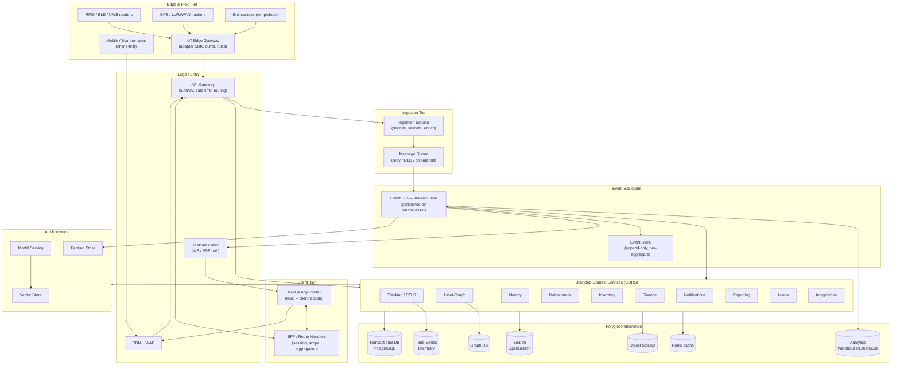
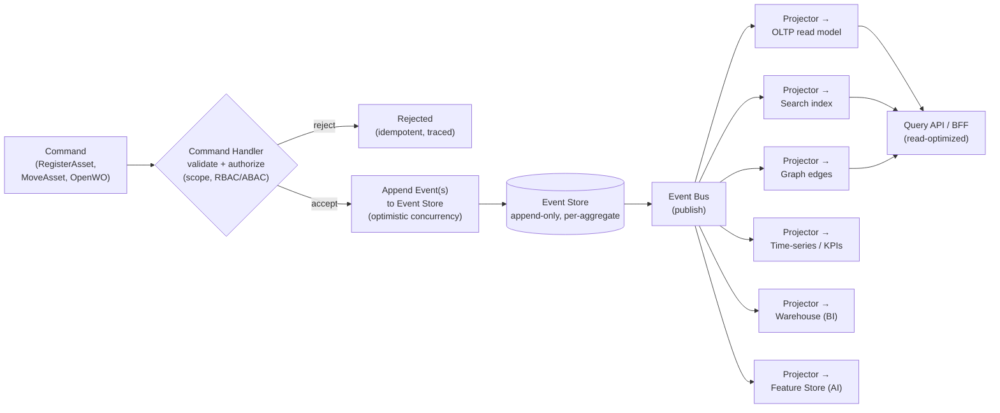
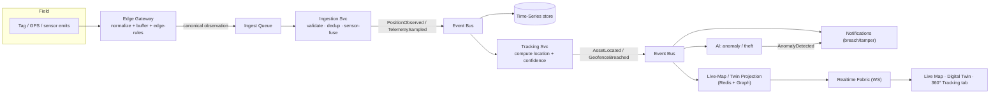

# 11. Enterprise Technical Architecture

**Document type:** Solution Architecture — system design, service topology, data platform, scale & resilience
**Version:** 1.0 · **Status:** Planning (pre-rebuild) · **Owner:** Product Architecture
**Audience:** Architecture, Backend/Platform Eng, SRE, Security, Data/ML Eng, Technical Sales

> The engineering realization of Master Blueprint §0.4 principle #1 — **one asset graph, one event stream**.
> Every module in this platform (registry, twin, BI, audit, AI) is a **projection** over a single
> event-sourced core. This document defines the frontend, the bounded-context microservices, the event
> backbone, the IoT/edge ingestion tier, the AI serving stack, the polyglot data platform, and the
> multi-tenant scale/HA/DR posture that delivers **10M+ assets/tenant, 100k events/sec, <200ms P95 reads**.
> Cross-links: [12-database-design.md](./12-database-design.md) · [13-api-design.md](./13-api-design.md) ·
> [16-security-compliance.md](./16-security-compliance.md) · [08-ai-intelligence.md](./08-ai-intelligence.md).

---

## 11.1 Architecture principles (what constrains every decision)

| # | Principle | Consequence in this architecture |
|---|-----------|----------------------------------|
| A1 | **Event-sourced core, CQRS everywhere** | The event log is the system of record; every read model is a disposable, rebuildable projection. → §11.6 |
| A2 | **One graph, many projections** | No module owns "the asset"; the asset-graph context emits canonical events all others project. → §11.4 |
| A3 | **Async by default, sync at the edge** | Writes are commands over an async bus; only reads and gateway acks are request/response. → §11.5 |
| A4 | **Polyglot persistence, right store per job** | OLTP ≠ telemetry ≠ search ≠ graph ≠ blob; each projection lands in its optimal engine. → §11.9 |
| A5 | **Tenant isolation to the data layer** | Cell + shard + row/field-level security, never menu-hiding. → §11.10, [16](./16-security-compliance.md) |
| A6 | **Vendor-neutral sensing** | The IoT adapter SDK is the product; no coupling to Zebra/Impinj/Samsara SKUs. → §11.8 |
| A7 | **Everything is an API + event + webhook** | The BFF and public API are thin views over the same commands/projections. → [13](./13-api-design.md) |
| A8 | **Fail static, degrade gracefully** | Cell isolation, read replicas, and cached projections keep reads alive during partial outage. → §11.13 |

---

## 11.2 High-level system diagram

---

## 11.3 Frontend architecture

**Framework:** Next.js (App Router) — **Read the in-repo guide `node_modules/next/dist/docs/` before writing
any code; this build has breaking changes vs. public Next.js** (per AGENTS.md). React Server Components render
the data-dense shell; interactive surfaces (live map, twin, WO board, Copilot) are client islands.

| Concern | Approach | Rationale |
|---------|----------|-----------|
| **Rendering** | RSC for shell/lists/detail scaffolds; client components for maps, charts, drag-drop, Copilot | Ship less JS; keep 150-page IA fast; stream server data for <200ms perceived reads |
| **BFF layer** | Route Handlers as a **Backend-for-Frontend**: session/scope resolution, response shaping, fan-out aggregation, projection reads | UI never talks raw microservices; one place to enforce scope chips → row-level filters |
| **Design system** | Tokenized component library (→ [15-design-system.md](./15-design-system.md)); one shell, one page skeleton, standard states (loading/empty/error/403/offline) | Master §0.7 — the 150 pages must feel like one system |
| **State/data** | Server data via RSC + a client query cache with optimistic UI + undo; deep-linkable filter state in URL | Cross-cutting features 245/262; snappy field/desk parity |
| **Real-time** | **SSE** for one-way live feeds (alert bell, insight ticker, KPI refresh); **WebSocket** for bidirectional (live map positions, twin sync, Copilot streaming, collaborative presence) | Match transport to interaction; SSE cheaper for the common case |
| **Micro-frontend stance** | **Modular monolith frontend, not runtime MFE** for P0–P3: module-federation-style route boundaries and independent build ownership per module, but one deployable shell. Revisit runtime MFE only if org-scale team boundaries demand it | Avoids MFE integration tax while the product is one coherent app; keeps bundle + a11y + theming consistent |
| **Scan/offline** | Mobile & scanner clients are offline-first with local queue + sync/reconcile (→ [14-mobile-apps.md](./14-mobile-apps.md)) | Master §0.4 #5 |

**Real-time delivery path:** event bus → Realtime Fabric (WS/SSE hub, tenant/scope-scoped topics) → client
islands. The hub subscribes to projection-update events, not raw telemetry, so the browser receives
map-ready position deltas rather than firehose sensor frames.

---

## 11.4 Backend microservices — bounded contexts

Services are drawn on **DDD bounded contexts**, each owning its commands, its slice of the event stream, and
its projections. No service reaches into another's store; they collaborate **only via events** (choreography)
and, where a synchronous answer is required, via the API gateway over versioned contracts ([13](./13-api-design.md)).

| Service (context) | Owns (write model) | Emits (key events) | Reads/Projects into | Notes |
|-------------------|--------------------|--------------------|---------------------|-------|
| **Identity & Access** | Users, orgs, roles, RBAC/ABAC policy, sessions, SSO/SCIM | `UserProvisioned`, `RoleGranted`, `SessionOpened` | OLTP; policy cache in Redis | Issues scoped JWTs; source for row/field-level security → [16](./16-security-compliance.md) |
| **Asset-Graph (core)** | The canonical asset object, taxonomy, parent/child/component edges, custody links | `AssetRegistered`, `AssetMoved`, `ComponentAttached`, `CustodyChanged` | Graph DB + OLTP + Search | **The heart** — every other context projects from its stream (§11.6) |
| **Ingestion** | Nothing durable (stateless) — decode/validate/enrich sensor frames | `PositionObserved`, `TelemetrySampled`, `SignalLost` | → Event bus, Time-series | Sensor-fusion pre-processing; back-pressure aware (§11.8) |
| **Tracking / RTLS** | Location state, geofences, dwell, movement trails, sensor/gateway fleet | `AssetLocated`, `GeofenceBreached`, `DwellExceeded` | Time-series + Graph + Redis (live positions) | Fuses multi-tech signals → single location with confidence |
| **Maintenance (EAM)** | Work orders, PM schedules, inspections, failure codes, labor | `WorkOrderOpened`, `PMTriggered`, `WOClosed` | OLTP + Search | Consumes AI predictive events → auto-WOs |
| **Inventory & Parts** | Stock, bins, reorder rules, POs, consumption | `StockAdjusted`, `ReorderTriggered`, `PartIssued` | OLTP + Search | Links parts↔WO via events |
| **Finance** | Capitalization, depreciation, TCO, cost centers, GL mapping | `AssetCapitalized`, `DepreciationPosted`, `Impaired` | OLTP + Warehouse | ERP/GL sync via Integrations; strong consistency for ledgers |
| **AI / Inference** | Scores, predictions, recommendations, model registry refs | `HealthScored`, `FailurePredicted`, `AnomalyDetected` | Feature Store + Vector + OLTP | Serving/registry/feature store detail → [08](./08-ai-intelligence.md) |
| **Notifications** | Alert rules, alerts, escalations, delivery, preferences | `AlertRaised`, `AlertEscalated`, `Notified` | OLTP + Redis | Fan-out to email/SMS/push/Slack/Teams; dedup + correlation |
| **Reporting & BI** | Report defs, schedules, saved views, BI models | `ReportScheduled`, `ExportReady` | Warehouse + OLTP | Reads projections + warehouse; never blocks OLTP |
| **Admin & Config** | Org/facility/zone tree, workflows, feature flags, branding, localization | `FacilityCreated`, `FlagToggled`, `WorkflowPublished` | OLTP + Redis | No-code rules/automation engine |
| **Integrations & Platform** | Connectors, webhooks, API keys, ERP/ITSM/IdP adapters, marketplace | `WebhookDispatched`, `ConnectorSynced` | OLTP + object storage | Anti-corruption layer to external systems (SAP/ServiceNow/Okta) |

**Collaboration example (event choreography):** `TelemetrySampled` (Ingestion) → AI computes → `FailurePredicted`
→ Maintenance opens a WO (`WorkOrderOpened`) → Notifications raises an alert (`AlertRaised`) → Reporting updates
the reliability projection. No service called another synchronously; each reacted to an event.

---

## 11.5 API gateway & edge

| Layer | Responsibility |
|-------|----------------|
| **CDN + WAF** | Static assets, TLS termination at edge, DDoS/L7 protection, geo-routing to nearest region/cell |
| **API Gateway** | Single ingress for gateway, mobile, BFF, partner API. AuthN (JWT/OIDC verify), coarse AuthZ + scope claim injection, **rate-limit & quota per tenant/key**, request routing, schema/version negotiation, canary/traffic-splitting, request/trace-id stamping |
| **Message Queue** | Durable command intake & retry buffer in front of the bus: at-least-once delivery, **dead-letter queue**, exponential backoff, idempotency keys. Absorbs ingest spikes so services never drop writes |
| **Realtime Fabric** | WS/SSE hub bridging projection-update events to scoped browser/mobile subscriptions |

**Gateway ≠ bus.** The gateway is synchronous request/response and enforcement; the event bus is asynchronous
fact distribution. Commands enter via gateway → queue → bus; facts flow bus → projections → gateway reads.

---

## 11.6 Event-sourced core + CQRS (the heart)

The platform's system of record is an **append-only event log**, not a mutable table. State is derived by
replaying events; read models are rebuildable projections. This is the direct implementation of Master §0.4 #1.

| Concept | Design choice | Why |
|---------|---------------|-----|
| **Command side** | Handlers validate + authorize (scope, RBAC/ABAC) then append events under optimistic concurrency per aggregate | Business rules enforced once, at write; conflicts detected via version |
| **Event store** | Append-only, partitioned by aggregate id, immutable, hash-chained for audit | Serves audit trail + chain-of-custody natively (features 98, 149, 150); no separate audit log to reconcile |
| **Read side** | Many purpose-built projections; each independently rebuildable by replay | A slow/broken projection never blocks writes; add a new read model without touching the write path |
| **Consistency** | Writes strongly consistent per aggregate; reads **eventually consistent** across projections (typically sub-second) | Buys the throughput for 100k events/sec; UI uses optimistic UI + live updates to mask lag |
| **Snapshots** | Periodic aggregate snapshots to bound replay cost | Fast rehydration for hot aggregates at 10M+ assets |
| **Schema evolution** | Versioned event schemas + upcasters; events are never mutated | Long-lived immutable log stays replayable as the model evolves |
| **Idempotency** | Command idempotency keys + consumer dedup | Safe at-least-once delivery from queue/bus |

**Why event sourcing here specifically:** an asset's value is its **history** — every move, custody change,
repair, and reading. Chain-of-custody, immutable audit, time-travel ("state as of the audit date"), the
Digital Twin replay, and AI feature engineering all fall out of the log *for free*. Master §0.10 #1: retrofitting
this later is a rewrite, so it is built first (roadmap P1).

---

## 11.7 Event bus & message queue

| Aspect | Choice | Detail |
|--------|--------|--------|
| **Event bus** | **Apache Kafka** (or Pulsar where multi-tenancy/tiered-storage tips the call) | Durable, replayable, ordered-per-partition backbone for all domain + telemetry events |
| **Partitioning** | Key = `tenant_id : aggregate_id` | Preserves per-asset ordering; spreads load; enables tenant-level throttling and isolation |
| **Topics** | Segregated by domain (`asset.*`, `tracking.*`, `maint.*`, `telemetry.*`) + per-tenant where volume warrants | Consumers subscribe narrowly; blast-radius contained |
| **Retention/tiering** | Hot retention on brokers + tiered/object-storage offload for long replay | Cheap infinite history for rebuilds & audit without bloating brokers |
| **Message queue** | Command/work queue (e.g. SQS-class or Kafka+consumer-group) with **DLQ**, retry, backoff, idempotency | For imperative work (dispatch, webhook delivery, notification fan-out) distinct from fact streaming |
| **Delivery semantics** | At-least-once + idempotent consumers; exactly-once effects via dedup keys | Correctness under retries and rebalances |
| **Back-pressure** | Bounded queues + consumer lag monitoring drive autoscaling and shed-load to buffer | Protects P95 reads during ingest spikes |

**Bus vs. queue:** the **bus** distributes immutable *facts* to many independent consumers (pub/sub, replayable);
the **queue** delivers *work items* to be processed once (competing consumers, DLQ). Both exist; they are not
the same tool.

---

## 11.8 IoT gateway / edge ingestion tier

Master §0.4 #4 & §0.10 #2: **the abstraction is the product.** No coupling to any vendor SKU.

| Component | Responsibility |
|-----------|----------------|
| **Edge Gateway (on-prem/appliance)** | Vendor-neutral **adapter SDK** normalizes RFID (Impinj/Zebra), BLE, UWB, GPS/GNSS, LoRaWAN, WiFi, NFC, camera-vision into a **canonical observation event**. Local buffering, store-and-forward, and **edge rules** (local alerting) keep it working offline (§0.4 #5) |
| **Protocol adapters** | MQTT / AMQP / LLRP / HTTP / vendor SDKs behind one interface; new hardware = new adapter, zero core change |
| **Ingestion Service (cloud)** | Stateless, horizontally scaled: authenticate gateway, decode, validate, de-dup, **sensor-fuse** multi-tech reads into a single location + confidence, enrich with asset/scope context, publish to bus |
| **Back-pressure & buffering** | Queue in front of ingestion; gateways hold-and-retry when disconnected; watermark/late-arrival handling for out-of-order frames |
| **Fleet management** | Gateway/reader registration, health, config push, firmware OTA (features 33/34) via Tracking + Admin |

**Ingestion scale math:** 100k events/sec sustained → partition by `tenant:asset`, stateless decoders behind an
autoscaled queue, fan telemetry to the time-series store and only *derived* position deltas to the live-map
projection. The browser never sees raw frames.

*Data-flow (real-time ingestion → projections → live map/twin):* sensor → gateway normalize → ingest/fuse →
`AssetLocated` event → live-map/twin projection (Redis for hot positions, Graph for topology) → Realtime Fabric
(WS) → the map/twin re-renders in <1s, while the same event feeds AI (anomaly/theft) and Notifications
(geofence/tamper) in parallel. One event, many projections — §0.4 #1.

---

## 11.9 AI services

Full method/explainability/governance in [08-ai-intelligence.md](./08-ai-intelligence.md); this is the *serving
infrastructure* view.

| Component | Role | Backed by |
|-----------|------|-----------|
| **Feature Store** | Online (low-latency serving) + offline (training) features, materialized from the event stream; point-in-time correctness | Redis (online) + Warehouse/lakehouse (offline) |
| **Model Serving** | Versioned inference endpoints (health, RUL, anomaly, theft, forecast); real-time + batch scoring; autoscaled; canary per model version | Container/GPU pool behind gateway; registry-driven |
| **Model Registry** | Versioning, lineage, drift monitoring, approval/promotion, rollback — governance core, not future item (§0.10 #3) | OLTP + object storage (artifacts) |
| **Vector Store** | Embeddings for NL/semantic search, Copilot RAG over asset/docs, similar-asset retrieval | Dedicated vector DB / pgvector at smaller scale |
| **Explainability service** | Drivers + confidence + counterfactuals attached to every score (features 58, 271) | Reads feature store + model outputs |

Scores are **events** (`HealthScored`, `FailurePredicted`) on the same bus, so predictions are first-class
columns and drive downstream automation (predictive WOs, alerts) exactly like any other fact.

---

## 11.10 Polyglot persistence (right store per job)

Each store exists because it is the **best tool for one projection** of the single event log — never data
duplicated for its own sake, always a purpose-built read model.

| Store | Technology (indicative) | What it holds | Why this engine (justification) |
|-------|-------------------------|---------------|---------------------------------|
| **Event Store** | Kafka tiered + append-only log (or EventStoreDB-class) | The immutable source of truth: all domain + telemetry events | Append-only, ordered, replayable; audit & time-travel are native |
| **Transactional (OLTP)** | **PostgreSQL** (partitioned, per-cell) | Registry read model, WOs, inventory, finance ledgers, config, users | ACID for money/custody; rich indexing; row/field-level security (RLS) for tenancy → [16](./16-security-compliance.md) |
| **Time-Series** | Timescale / InfluxDB / ClickHouse-class | Telemetry, positions, sensor readings, metrics | Purpose-built compression + downsampling + range queries for 100k/sec; OLTP would buckle |
| **Graph** | Neo4j / JanusGraph-class | Asset↔component↔location↔custody↔person relationships | The "asset graph" traversals (impact, containment, custody chains) are graph-native, painful in SQL |
| **Search** | **OpenSearch/Elasticsearch** | Full-text + faceted asset/WO/doc search, saved views | Sub-200ms faceted queries over 10M+ assets; powers global search & ⌘K |
| **Object Storage** | S3-class | Attachments, images, manuals, CAD/BIM, exports, event tiered-storage, model artifacts | Cheap, durable, infinite; signed-URL delivery |
| **Cache** | **Redis** | Live positions, hot projections, session/policy cache, rate-limit counters, online features | Sub-ms reads to protect <200ms P95; live-map hot path |
| **Analytics Warehouse / Lakehouse** | Snowflake / BigQuery / Redshift / lakehouse | Historical BI, cross-facility benchmarking, offline ML training sets | Columnar OLAP for heavy aggregations without touching OLTP |

Full ERD, keys, indexes, partitioning, and per-table detail → [12-database-design.md](./12-database-design.md).

---

## 11.11 Multi-tenancy & scalability

| Dimension | Strategy | Detail |
|-----------|----------|--------|
| **Isolation model** | **Cell-based (pod) architecture** | A *cell* = a full, isolated stack slice (services + datastores) serving a bounded set of tenants. Blast radius, noisy-neighbor, and DR are contained per cell |
| **Tenant placement** | Shared cells for SMB; **dedicated cell** for the largest/regulated tenants | Same code path; placement is config. Huge tenants (10M+ assets) get their own cell |
| **Sharding** | OLTP/telemetry sharded by `tenant_id` (+ time for telemetry) | Horizontal scale; a shard never mixes tenants |
| **Partitioning** | Postgres partitioning by tenant + time; Kafka partitions by `tenant:asset`; time-series by tenant+interval | Keeps hot data small, indexes fast, old data cheaply aged/archived |
| **Row/field-level security** | RLS in OLTP keyed on scope claim from JWT; enforced in query, not UI | Master §0.4 #3 — Org▸Region▸Facility▸Building▸Floor▸Zone. → [16](./16-security-compliance.md) |
| **Multi-region** | Cells pinned to regions for data residency (GDPR); active-active reads via regional projections; writes home-regioned per tenant | Residency + latency; nearest-cell reads keep P95 low globally |
| **Elasticity** | Stateless services (gateway, ingestion, projectors, serving) autoscale on lag/CPU/RPS; datastores scale via shards/replicas | Absorb 100k/sec spikes; scale ingest independent of reads |
| **Scale to 10M+/tenant** | CQRS + purpose-built read models + cache + snapshots | Reads hit a projection sized for the query, never a live join across 10M rows |

---

## 11.12 Cross-cutting: observability, security, deployment

### Observability (metrics · logs · traces)
| Pillar | Tooling stance | Key signals |
|--------|----------------|-------------|
| **Metrics** | Prometheus-class + dashboards (Grafana) | RPS, P50/P95/P99 read latency, ingest throughput, **consumer lag**, projection freshness, error rate, saturation |
| **Logs** | Structured JSON, centralized (Loki/ELK-class), tenant + trace-id tagged | Audit-friendly, correlatable, PII-scrubbed |
| **Traces** | **OpenTelemetry** end-to-end (BFF → gateway → service → bus → projector) | Trace-id surfaced in every error state (Master §0.7) for support |
| **SLO/alerting** | Golden signals per service + ingest-lag & projection-lag SLOs | Feeds §0.6 M/§19 platform monitoring; error-budget driven |

### Security layers (defense in depth) → [16-security-compliance.md](./16-security-compliance.md)
Edge WAF/DDoS → gateway authN (OIDC/JWT/MFA) → coarse authZ + scope injection → service-level RBAC/ABAC →
**data-layer RLS/field-level** → encryption in transit (mTLS between services, TLS at edge) + at rest (KMS/HSM,
field-level for PII) → immutable audit (native from event store) → secrets management → SIEM export. SOC2 /
ISO27001 / GDPR / HIPAA posture detailed in [16](./16-security-compliance.md).

### Deployment (k8s · IaC · CI/CD)
| Concern | Approach |
|---------|----------|
| **Runtime** | Kubernetes; each service independently deployable; HPA on golden signals; per-cell namespaces |
| **IaC** | Terraform (cloud infra) + Helm/Kustomize (workloads); cells are reproducible from code |
| **CI/CD** | Trunk-based; build → test → SBOM/scan → progressive delivery (**canary + blue-green**) per service; automated rollback on SLO breach |
| **Config/secrets** | GitOps (Argo/Flux-class), sealed secrets / external KMS; feature flags decouple deploy from release |
| **Progressive rollout** | Traffic split at gateway + per-model canary for AI serving |

---

## 11.13 High availability & disaster recovery

| Target | Value | How it's met |
|--------|-------|--------------|
| **Read availability SLO** | 99.95%+ | Multi-AZ, read replicas, cached projections; cell isolation contains failures |
| **P95 read latency** | **<200ms** | Cache-first reads, purpose-built projections, regional cells |
| **Ingest durability** | No dropped events | Queue + at-least-once bus + DLQ; gateways store-and-forward when offline |
| **RPO (Recovery Point)** | **≤ 1 min** (near-zero for the event log) | Event log replicated cross-AZ/region continuously; the log *is* the backup — replay rebuilds any projection |
| **RTO (Recovery Time)** | **≤ 15 min** per cell | Cells fail over to standby region; stateless tiers redeploy fast; projections rebuild/rehydrate from replicated log + snapshots |
| **HA topology** | Multi-AZ per region, standby region per cell | Active-active reads regionally; home-region writes with async cross-region replication |
| **Backups** | Continuous log replication + periodic OLTP/warehouse snapshots to object storage | Point-in-time restore; snapshots bound projection rebuild time |
| **DR drills** | Scheduled game-days: kill-a-cell, region-failover, projection-rebuild | RPO/RTO validated, not assumed (feeds §0.6 M / §19 DR runbooks) |

**Event sourcing is the DR superpower:** because the append-only log is the source of truth and every read model
is a replayable projection, recovery is *replay*, not restore-and-pray. A corrupted projection is rebuilt by
resetting its offset — no data loss, no schema archaeology.

---

## 11.14 Contrast: our approach vs. Maximo & ServiceNow

| Dimension | **IBM Maximo** | **ServiceNow** | **Access Genie AI** |
|-----------|----------------|----------------|---------------------|
| **Core shape** | Monolithic J2EE app on a single relational schema | Single multi-instance platform + scoped apps on one Now DB | **Event-sourced microservices** — one immutable log, many projections |
| **System of record** | Mutable relational tables (current state) | Mutable CMDB/tables (current state) | **Append-only event log** — full history is the truth |
| **Real-time IoT** | Bolt-on (Maximo Monitor/Watson IoT), separate stack | Not native; via integrations | **Native ingestion tier** — 100k/sec through vendor-neutral gateway |
| **RTLS/location** | ✗ (partner integrations) | ✗ | **Native** RTLS + live-map/twin projection |
| **AI** | Add-on (Watson), separate models | Predictive/Now Assist bolted onto platform | **Native, explainable** — scores are first-class events with drivers+confidence |
| **Multi-tenancy** | Single-tenant instances / "sites" partitioning | Instance-per-customer (heavy) + domain separation | **Cell-based + shard + RLS** — isolation to the data layer, one code path |
| **Scale posture** | Vertical; DB is the ceiling | Instance-bound; table-scale limits | **Horizontal CQRS** — read models sized per query, 10M+ assets/tenant |
| **Extensibility** | Customization-heavy, upgrade-fragile | Low-code on platform, vendor-locked | **API + event + webhook first**; marketplace-ready ([13](./13-api-design.md)) |
| **Audit/custody** | Separate audit tables to maintain | Table auditing add-on | **Free** — the event log *is* the immutable audit & chain-of-custody |
| **Recovery** | Restore DB backup | Instance restore | **Replay the log** — RPO≈0, rebuild any projection |

**The architectural wedge:** Maximo digitized the *record* and ServiceNow the *workflow*, each on a **mutable,
current-state** database that must bolt on tracking, IoT, and AI as separate products. Access Genie makes the
**history itself** the system of record, so the tracking dot, the work order, and the depreciation line are the
same object's events — and BI, twin, audit, and AI are all just projections of that one stream (Master §0.4 #1,
Vision §1.7).

---

## 11.15 Summary

Access Genie AI is an **event-sourced, CQRS microservices platform** where a single append-only log of asset
facts is the system of record and every module — registry, RTLS/twin, maintenance, finance, BI, and native
explainable AI — is a purpose-built, independently rebuildable projection over that one stream, fed by a
vendor-neutral IoT ingestion tier and served through polyglot stores each chosen for its job. It is engineered
for **10M+ assets/tenant, 100k events/sec, and <200ms P95 reads** via cell-based multi-tenancy, sharding, a
Kafka/Pulsar backbone, cache-first reads, and cross-region replication, with RPO≈1min/RTO≤15min because
recovery is *replay* rather than restore. This is the concrete opposite of Maximo's mutable monolith and
ServiceNow's instance-bound platform: history is the truth, isolation lives in the data layer, and AI is native
infrastructure — not a bolt-on.
