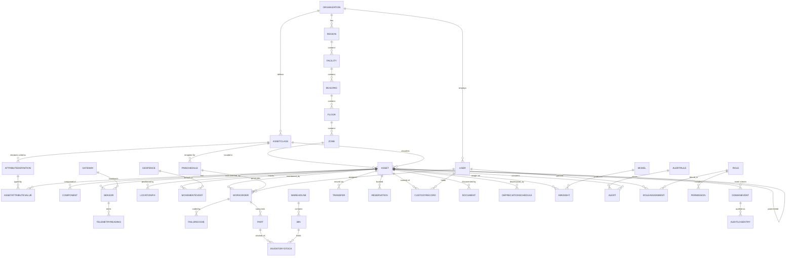

# 12. Database & Data Model Design

**Document type:** Technical design — data model, physical schema strategy, storage engines
**Version:** 1.0 · **Status:** Planning (pre-rebuild) · **Owner:** Data Architecture
**Covers deliverable:** 12 (ERD, entities, PK/FK, indexes, normalization, event/telemetry/audit/history tables + partitioning)

> This document is a projection of the plan in [00-master-blueprint.md](./00-master-blueprint.md) §0.4 (principle 1:
> *one asset graph, one event stream*; principle 3: *multi-tenant + scope-secure to the data layer*). It defines the
> **write model**, the **event store**, the **read/projection models**, and the specialized **time-series, temporal,
> and audit** stores. It coordinates with [11-technical-architecture.md](./11-technical-architecture.md) (services that
> own each store), cross-links [13-api-design.md](./13-api-design.md) (resources exposed over these tables) and
> [16-security-compliance.md](./16-security-compliance.md) (row/field-level security, encryption, retention/legal-hold).

---

## 12.1 Storage strategy — polyglot persistence, single source of truth

The **DomainEvent** append-only log is the **system of record**. Everything else is a *derived, rebuildable*
projection. This is the physical expression of "one event-sourced asset graph" (§0.4). We use **polyglot
persistence**: the right engine per workload, all fed from the one event stream.

| Store | Engine (reference) | Owns | Consistency |
|-------|--------------------|------|-------------|
| **Event store** | PostgreSQL 16 (append-only, per-tenant partitioned) | `DomainEvent` — immutable truth | Strong, ordered per aggregate |
| **Registry / OLTP read model** | PostgreSQL 16 (row-level security) | `Asset`, location tree, RBAC, WO, inventory, custody | Strong within tenant |
| **Asset graph** | PostgreSQL `ltree`/adjacency + optional Neo4j projection | parent/child, component, zone containment traversals | Eventually consistent (projection) |
| **Time-series** | TimescaleDB (hypertables) | `TelemetryReading`, `LocationFix` | Eventual, high-ingest |
| **Geospatial** | PostGIS (on OLTP) | `Geofence`, `LocationFix.geog`, floor overlays | Strong |
| **Search / live registry** | OpenSearch | denormalized asset/WO documents, facets, NL search | Eventual (≤1s lag) |
| **Cache / live map** | Redis (+ streams) | last-known-position, session, hot KPIs | Ephemeral |
| **Documents / media** | S3-compatible object store | `Document` blobs, images, CAD | Object-versioned |
| **Analytics / BI** | Columnar warehouse (Snowflake/BigQuery/Redshift) | historical facts for §17 reporting | Batch/CDC |

Projection lag, rebuild, and replay semantics are defined by the services in
[11-technical-architecture.md](./11-technical-architecture.md); this doc defines the **schemas** each store holds.

**Conventions used in all tables below**
- PK is `id UUID` (v7 — time-ordered, index-friendly) unless noted; app-facing IDs are also exposed as short codes.
- `tenant_id UUID NOT NULL` on **every** tenant-owned table (multi-tenancy, §12.15). It is the **leading column of
  the primary/partition key** and of every secondary index.
- Timestamps are `timestamptz` (UTC); `created_at`, `updated_at` on all mutable rows.
- Soft-delete via `deleted_at timestamptz NULL` + `deleted_by` (§12.14); all default queries filter `deleted_at IS NULL`.
- `version BIGINT` for optimistic concurrency; `_scope` columns (`facility_id`, `building_id`, `floor_id`, `zone_id`)
  are denormalized onto operational rows so row-level security filters without joins (§16).
- Flexible/sparse data is `jsonb` with GIN indexes; strongly-typed hot attributes are promoted to real columns.

---

## 12.2 Core Entity-Relationship Diagram

Core write model (operational subset — telemetry, event, audit, and projection tables are described in §12.4 / §12.11–12.18).

---

## 12.3 Tenancy & Location hierarchy

The scope tree from §0.5 / §3.1 (`Organization ▸ Region ▸ Facility ▸ Building ▸ Floor ▸ Zone ▸ Asset`). Each node
carries a materialized `path ltree` for O(1) subtree scope filtering, and denormalized ancestor IDs on assets.

### Organization (tenant root)
| Column | Type | Key | Notes |
|--------|------|-----|-------|
| id | uuid (v7) | PK | = `tenant_id` for all descendants |
| name | text | | |
| slug | citext | UQ | tenant subdomain |
| plan_tier | text | | billing plan (§L admin) |
| data_residency | text | | region for sharding (§12.15) |
| settings | jsonb | | locale, currency, timezone defaults |
| status | text | IDX | active / suspended / provisioning |
| created_at, updated_at, deleted_at | timestamptz | | |

### Region
| Column | Type | Key | Notes |
|--------|------|-----|-------|
| id | uuid | PK | |
| tenant_id | uuid | FK→Organization, IDX | partition/RLS key |
| name | text | | |
| path | ltree | IDX (GiST) | `org.region` |
| geo_bounds | geography(POLYGON) | | optional |

### Facility
| Column | Type | Key | Notes |
|--------|------|-----|-------|
| id | uuid | PK | |
| tenant_id | uuid | FK, IDX | |
| region_id | uuid | FK→Region | |
| name, code | text | UQ(tenant_id, code) | |
| type | text | | plant/warehouse/hospital/campus |
| address | jsonb | | |
| geog | geography(POINT) | IDX (GiST) | map centroid |
| path | ltree | IDX (GiST) | |
| timezone | text | | |

### Building
| Column | Type | Key | Notes |
|--------|------|-----|-------|
| id | uuid | PK | |
| tenant_id | uuid | FK, IDX | |
| facility_id | uuid | FK→Facility, IDX | |
| name, code | text | | |
| floor_count | int | | |
| footprint | geography(POLYGON) | | twin overlay |
| path | ltree | IDX (GiST) | |

### Floor
| Column | Type | Key | Notes |
|--------|------|-----|-------|
| id | uuid | PK | |
| tenant_id | uuid | FK, IDX | |
| building_id | uuid | FK→Building, IDX | |
| level | int | | ordering |
| floorplan_doc_id | uuid | FK→Document | 2D/CAD for twin (§M15) |
| origin_transform | jsonb | | pixel↔world calibration |
| path | ltree | IDX (GiST) | |

### Zone
| Column | Type | Key | Notes |
|--------|------|-----|-------|
| id | uuid | PK | |
| tenant_id | uuid | FK, IDX | |
| floor_id | uuid | FK→Floor, IDX | |
| name, code | text | | room/aisle/cell |
| kind | text | | storage/production/restricted |
| polygon | geography(POLYGON) | IDX (GiST) | dwell/occupancy analytics |
| path | ltree | IDX (GiST) | full scope path |

---

## 12.4 Asset core (the object graph)

### AssetClass (taxonomy node)
| Column | Type | Key | Notes |
|--------|------|-----|-------|
| id | uuid | PK | |
| tenant_id | uuid | FK, IDX | |
| parent_class_id | uuid | FK→AssetClass | class hierarchy (self-ref) |
| name, code | text | UQ(tenant_id, code) | |
| path | ltree | IDX (GiST) | class tree |
| icon, color | text | | UI |
| default_pm_template_id | uuid | FK→PMSchedule | |
| depreciation_defaults | jsonb | | method/useful-life seed |

### AttributeDefinition (per-class dynamic form schema)
| Column | Type | Key | Notes |
|--------|------|-----|-------|
| id | uuid | PK | |
| tenant_id | uuid | FK, IDX | |
| asset_class_id | uuid | FK→AssetClass, IDX | |
| key | text | UQ(class_id, key) | machine name |
| label | text | | |
| data_type | text | | text/number/bool/date/enum/geo/ref |
| unit | text | | e.g. kWh, °C |
| enum_options | jsonb | | pick-lists |
| validation | jsonb | | regex/min/max/required |
| is_indexed | bool | | promote to search facet |
| pii_class | text | | drives field-level encryption (§16) |

### Asset (aggregate root)
| Column | Type | Key | Notes |
|--------|------|-----|-------|
| id | uuid (v7) | PK | aggregate id in event store |
| tenant_id | uuid | FK, IDX | partition key |
| asset_tag | citext | UQ(tenant_id, asset_tag) | human-friendly, printed on label |
| serial_no | text | IDX | manufacturer serial |
| asset_class_id | uuid | FK→AssetClass, IDX | |
| parent_asset_id | uuid | FK→Asset | parent/child (self-ref) |
| name | text | IDX (trgm) | |
| status | text | IDX | active/in-repair/retired/disposed |
| lifecycle_stage | text | IDX | procurement→…→disposal (§07) |
| criticality | text | | drives risk weighting |
| **facility_id, building_id, floor_id, zone_id** | uuid | FK, **composite IDX** | denormalized scope (RLS + map) |
| current_custodian_id | uuid | FK→User | |
| last_location_fix_id | uuid | FK→LocationFix | live-map fast path |
| health_score | numeric(5,2) | IDX | AI projection (§08), 0–100 |
| risk_score | numeric(5,2) | IDX | AI projection |
| hot_attributes | jsonb | GIN | promoted class attributes |
| acquired_at, warranty_end | timestamptz | | |
| purchase_cost, book_value | numeric(18,2) | | field-level encrypted |
| version | bigint | | optimistic lock |
| created_at, updated_at, deleted_at | timestamptz | IDX(deleted_at) | soft-delete |

**Indexes (registry & live map, see §12.16):** `(tenant_id, facility_id, status)`, `(tenant_id, asset_class_id)`,
GIN on `hot_attributes`, GIN trigram on `name`/`asset_tag`, partial `(tenant_id, health_score) WHERE deleted_at IS NULL`.

### AssetAttributeValue (EAV for sparse/custom attributes)
| Column | Type | Key | Notes |
|--------|------|-----|-------|
| id | uuid | PK | |
| tenant_id | uuid | FK, IDX | |
| asset_id | uuid | FK→Asset, IDX | |
| attribute_def_id | uuid | FK→AttributeDefinition | |
| value_text / value_num / value_bool / value_ts / value_geo | typed cols | | one populated by data_type |
| value_json | jsonb | | complex/ref values |
| — | — | UQ(asset_id, attribute_def_id) | one value per attribute |

> Hot, always-queried attributes are **promoted** to `Asset.hot_attributes` or real columns; the EAV table is the
> tail of rarely-filtered custom fields — a deliberate 3NF/denormalization split (§12.19).

### Component (sub-asset / serviceable part instance)
| Column | Type | Key | Notes |
|--------|------|-----|-------|
| id | uuid | PK | |
| tenant_id | uuid | FK, IDX | |
| asset_id | uuid | FK→Asset, IDX | owning asset |
| part_id | uuid | FK→Part | catalog linkage |
| position | text | | slot/BOM position |
| serial_no | text | | |
| installed_at, removed_at | timestamptz | | lifecycle of the component |

---

## 12.5 Identity, RBAC & scope

Implements the `role + scope` model from §2.3; enforcement layers in [16-security-compliance.md](./16-security-compliance.md).

### User
| Column | Type | Key | Notes |
|--------|------|-----|-------|
| id | uuid | PK | |
| tenant_id | uuid | FK, IDX | null for platform-tier staff |
| email | citext | UQ(tenant_id, email) | |
| external_idp_id | text | IDX | SSO/SCIM subject (§16) |
| display_name | text | | |
| status | text | | active/invited/disabled/locked |
| mfa_enrolled | bool | | |
| preferences | jsonb | | notifications, appearance |
| last_login_at | timestamptz | | |

### Role
| Column | Type | Key | Notes |
|--------|------|-----|-------|
| id | uuid | PK | |
| tenant_id | uuid | FK, IDX | null = system/global role |
| name, code | text | UQ(tenant_id, code) | |
| tier | text | | platform/tenant/mgmt/field/business/external |
| is_system | bool | | non-editable built-ins |

### Permission
| Column | Type | Key | Notes |
|--------|------|-----|-------|
| id | uuid | PK | |
| resource | text | | e.g. `asset`, `workorder`, `finance` |
| action | text | | create/read/update/delete/transfer/close… |
| code | text | UQ | `asset:transfer` (Resource × Action, §2.3) |

`RolePermission` is the join (`role_id`, `permission_id`, optional `field_mask jsonb`, `condition jsonb` for ABAC).

### RoleAssignment (Role × Scope × time-box)
| Column | Type | Key | Notes |
|--------|------|-----|-------|
| id | uuid | PK | |
| tenant_id | uuid | FK, IDX | |
| user_id | uuid | FK→User, IDX | |
| role_id | uuid | FK→Role | |
| scope_type | text | | org/region/facility/building/floor/zone/asset-class |
| scope_id | uuid | IDX | node this assignment binds to |
| scope_path | ltree | IDX (GiST) | enables subtree grant (`org.r1.fac2.*`) |
| valid_from, valid_to | timestamptz | | time-boxed (vendor/break-glass) |
| granted_by | uuid | FK→User | audit |

> RLS session variables (`app.tenant_id`, `app.scope_paths`) are set per request; policies compare `scope_path @>`
> the row's denormalized scope path. Field-level masking uses `RolePermission.field_mask`.

---

## 12.6 Maintenance (EAM)

### WorkOrder
| Column | Type | Key | Notes |
|--------|------|-----|-------|
| id | uuid | PK | aggregate root |
| tenant_id | uuid | FK, IDX | |
| wo_number | text | UQ(tenant_id, wo_number) | |
| asset_id | uuid | FK→Asset, IDX | |
| type | text | IDX | preventive/predictive/corrective/inspection |
| status | text | IDX | draft/open/scheduled/in-progress/on-hold/closed |
| priority | text | | |
| source | text | | manual / pm_schedule / ai_insight |
| source_ref_id | uuid | | PMSchedule or AIInsight origin |
| pm_schedule_id | uuid | FK→PMSchedule | |
| assignee_id | uuid | FK→User, IDX | technician |
| **facility_id, zone_id** | uuid | composite IDX | denormalized scope |
| scheduled_start, due_at, closed_at | timestamptz | IDX(due_at) | SLA |
| labor_minutes | int | | |
| failure_code_id | uuid | FK→FailureCode | |
| checklist | jsonb | | inspection results |
| cost_rollup | numeric(18,2) | | labor+parts |

### PMSchedule (preventive template)
| Column | Type | Key | Notes |
|--------|------|-----|-------|
| id | uuid | PK | |
| tenant_id | uuid | FK, IDX | |
| asset_class_id / asset_id | uuid | FK | class-level or instance-level |
| trigger_type | text | | time / meter / usage / condition |
| interval | jsonb | | e.g. `{"every":"90d"}` or `{"meter_hours":500}` |
| task_template | jsonb | | checklist + parts + labor |
| next_due_at | timestamptz | IDX | scheduler poll |
| active | bool | | |

### FailureCode
| Column | Type | Key | Notes |
|--------|------|-----|-------|
| id | uuid | PK | |
| tenant_id | uuid | FK, IDX | |
| problem, cause, remedy | text | | problem/cause/remedy taxonomy (§M4) |
| code | text | UQ(tenant_id, code) | |
| asset_class_id | uuid | FK→AssetClass | applicability |

---

## 12.7 Inventory & Parts

### Part (catalog SKU)
| Column | Type | Key | Notes |
|--------|------|-----|-------|
| id | uuid | PK | |
| tenant_id | uuid | FK, IDX | |
| sku | text | UQ(tenant_id, sku) | |
| name, description | text | IDX (trgm) | |
| is_serialized | bool | | serialized vs. non-serialized (§M5) |
| uom | text | | unit of measure |
| abc_class | text | | A/B/C valuation |
| unit_cost | numeric(18,4) | | |
| supplier_id | uuid | FK→Supplier | lead time in supplier row |

### Warehouse
| Column | Type | Key | Notes |
|--------|------|-----|-------|
| id | uuid | PK | |
| tenant_id | uuid | FK, IDX | |
| facility_id | uuid | FK→Facility | |
| name, code | text | | |

### Bin
| Column | Type | Key | Notes |
|--------|------|-----|-------|
| id | uuid | PK | |
| tenant_id | uuid | FK, IDX | |
| warehouse_id | uuid | FK→Warehouse, IDX | |
| code | text | UQ(warehouse_id, code) | aisle-rack-shelf |

### InventoryStock (part × bin balance)
| Column | Type | Key | Notes |
|--------|------|-----|-------|
| id | uuid | PK | |
| tenant_id | uuid | FK, IDX | |
| part_id | uuid | FK→Part, IDX | |
| bin_id | uuid | FK→Bin, IDX | |
| qty_on_hand | numeric(18,4) | | |
| qty_reserved | numeric(18,4) | | for open WOs |
| reorder_point, reorder_qty | numeric(18,4) | | auto-reorder rule (§M5) |
| — | — | UQ(part_id, bin_id) | one balance row per part/bin |

> Stock **balances** are a read-model rollup; the truth is the append-only `StockMovement` ledger (issue/receive/
> adjust/count) replayed from events — mirrors the event-sourcing stance (§12.11).

---

## 12.8 Tracking, RTLS & IoT

### Gateway (reader/collector — vendor-neutral, §M13/§09)
| Column | Type | Key | Notes |
|--------|------|-----|-------|
| id | uuid | PK | |
| tenant_id | uuid | FK, IDX | |
| facility_id | uuid | FK→Facility, IDX | |
| vendor, model | text | | Impinj/Zebra/Cisco… abstracted |
| protocols | text[] | | RFID/BLE/UWB/LoRaWAN/WiFi |
| status | text | IDX | online/offline/degraded |
| firmware_version | text | | OTA target |
| last_heartbeat_at | timestamptz | IDX | health |
| geog | geography(POINT) | | placement |

### Sensor (tag/device, may back an Asset or environment)
| Column | Type | Key | Notes |
|--------|------|-----|-------|
| id | uuid | PK | |
| tenant_id | uuid | FK, IDX | |
| asset_id | uuid | FK→Asset, IDX | nullable (fixed env sensor) |
| gateway_id | uuid | FK→Gateway | last backhaul |
| type | text | | RFID/BLE/UWB/GPS/temp/vibration… |
| hw_id | text | UQ(tenant_id, hw_id) | EPC/MAC/DevEUI |
| battery_pct | numeric(5,2) | IDX | low-battery alerting |
| calibration | jsonb | | offsets |
| status | text | | active/lost/retired |

### TelemetryReading  ⏱ *time-series hypertable* (§12.13)
| Column | Type | Key | Notes |
|--------|------|-----|-------|
| time | timestamptz | **PART/PK** | hypertable partition dimension |
| tenant_id | uuid | PK, IDX | space partition |
| sensor_id | uuid | PK, IDX | |
| asset_id | uuid | IDX | denormalized for asset queries |
| metric | text | IDX | temp/humidity/shock/vibration/battery |
| value | double precision | | |
| quality | smallint | | sensor-fusion confidence |
| ingest_id | uuid | | dedup key |

Composite PK `(tenant_id, sensor_id, metric, time)`; compressed after 7d; continuous aggregates for 1m/1h/1d rollups.

### LocationFix  ⏱ *time-series hypertable*
| Column | Type | Key | Notes |
|--------|------|-----|-------|
| time | timestamptz | **PART/PK** | |
| tenant_id | uuid | PK, IDX | |
| asset_id | uuid | PK, IDX | |
| geog | geography(POINT) | IDX (GiST) | resolved position |
| floor_id, zone_id | uuid | IDX | indoor resolution |
| tech | text | | GPS/UWB/BLE/RFID/WiFi — fusion source |
| accuracy_m | real | | confidence radius |
| fix_confidence | numeric(5,2) | | fused |

> **Last-known position** (live map hot path) is kept in Redis and mirrored to `Asset.last_location_fix_id`; the
> full trail lives here for movement history/replay (§M2).

### Geofence
| Column | Type | Key | Notes |
|--------|------|-----|-------|
| id | uuid | PK | |
| tenant_id | uuid | FK, IDX | |
| name | text | | |
| scope_id, scope_type | uuid/text | | facility/floor/zone |
| geom | geography(POLYGON) | IDX (GiST) | breach test |
| rule | jsonb | | enter/exit/dwell + asset filter |
| active | bool | | |

### MovementEvent (derived from LocationFix stream + geofences)
| Column | Type | Key | Notes |
|--------|------|-----|-------|
| id | uuid | PK | |
| tenant_id | uuid | FK, IDX | |
| asset_id | uuid | FK→Asset, IDX | |
| event_type | text | IDX | enter/exit/dwell/geofence-breach/signal-loss |
| geofence_id | uuid | FK→Geofence | if breach |
| from_zone_id, to_zone_id | uuid | | |
| occurred_at | timestamptz | IDX | |
| dwell_seconds | int | | occupancy analytics |

---

## 12.9 Operations & Custody

### Transfer (SoD: requester ≠ approver, §2.3/§M6)
| Column | Type | Key | Notes |
|--------|------|-----|-------|
| id | uuid | PK | |
| tenant_id | uuid | FK, IDX | |
| asset_id | uuid | FK→Asset, IDX | |
| from_scope_id, to_scope_id | uuid | | facility/zone/custodian |
| requested_by, approved_by | uuid | FK→User | SoD enforced (distinct) |
| status | text | IDX | requested/approved/in-transit/received/rejected |
| requested_at, completed_at | timestamptz | | |

### Reservation
| Column | Type | Key | Notes |
|--------|------|-----|-------|
| id | uuid | PK | |
| tenant_id | uuid | FK, IDX | |
| asset_id | uuid | FK→Asset, IDX | |
| reserved_by | uuid | FK→User | |
| start_at, end_at | tstzrange (as `during`) | EXCLUDE | conflict-free via GiST exclusion constraint |
| status | text | | booked/active/returned/cancelled |

> Uses a PostgreSQL **exclusion constraint** `EXCLUDE USING gist (asset_id WITH =, during WITH &&)` to prevent
> double-booking of a shared asset (§M6 conflict handling).

### CustodyRecord (chain-of-custody, append-only, §M6/§M11)
| Column | Type | Key | Notes |
|--------|------|-----|-------|
| id | uuid | PK | |
| tenant_id | uuid | FK, IDX | |
| asset_id | uuid | FK→Asset, IDX | |
| custodian_id | uuid | FK→User | |
| action | text | | check-out/check-in/transfer/dispute |
| occurred_at | timestamptz | IDX | |
| prev_record_id | uuid | FK (self) | hash-linked chain |
| signature_hash | text | | tamper-evident (§12.17) |

---

## 12.10 Documents, Finance, AI & Alerts

### Document (metadata; blob in object store)
| Column | Type | Key | Notes |
|--------|------|-----|-------|
| id | uuid | PK | |
| tenant_id | uuid | FK, IDX | |
| entity_type, entity_id | text/uuid | IDX | polymorphic owner (asset/WO/floor…) |
| kind | text | | manual/image/CAD/cert/invoice |
| storage_key | text | | S3 object key (versioned) |
| mime, size_bytes | text/bigint | | |
| checksum_sha256 | text | | integrity |
| uploaded_by | uuid | FK→User | |

### DepreciationSchedule
| Column | Type | Key | Notes |
|--------|------|-----|-------|
| id | uuid | PK | |
| tenant_id | uuid | FK, IDX | |
| asset_id | uuid | FK→Asset, IDX | |
| method | text | | straight-line/declining-balance/units-of-production |
| useful_life_months | int | | |
| salvage_value | numeric(18,2) | | |
| start_date | date | | |
| schedule_lines | jsonb | | per-period book value (materialized) |
| gl_account, cost_center | text | | ERP sync (§M8) |

### Model (AI model registry, §08)
| Column | Type | Key | Notes |
|--------|------|-----|-------|
| id | uuid | PK | |
| tenant_id | uuid | FK, IDX | null = global model |
| name | text | | health/predictive/anomaly/theft… |
| version | text | UQ(name, version) | |
| task | text | | classification/regression/forecast |
| status | text | | training/staged/production/retired |
| metrics | jsonb | | AUC, MAE, drift baseline |
| feature_spec | jsonb | | feature-store contract |
| artifact_uri | text | | model binary location |

### AIInsight (explainable recommendation feed, §08)
| Column | Type | Key | Notes |
|--------|------|-----|-------|
| id | uuid | PK | |
| tenant_id | uuid | FK, IDX | |
| asset_id | uuid | FK→Asset, IDX | |
| model_id | uuid | FK→Model | provenance |
| type | text | IDX | health/failure/idle/theft/eol/cost |
| score | numeric(6,3) | | |
| confidence | numeric(5,2) | | |
| drivers | jsonb | | explainability: top features + weights |
| dollar_impact | numeric(18,2) | | ranked feed |
| status | text | | new/accepted/dismissed/actioned |
| feedback | jsonb | | HITL loop (§M3-60) |
| generated_at | timestamptz | IDX | |

### AlertRule
| Column | Type | Key | Notes |
|--------|------|-----|-------|
| id | uuid | PK | |
| tenant_id | uuid | FK, IDX | |
| name | text | | |
| condition | jsonb | | condition-builder AST (§M9) |
| severity | text | | |
| channels | text[] | | in-app/email/SMS/Slack/Teams |
| escalation_policy_id | uuid | FK | |
| active | bool | | |

### Alert
| Column | Type | Key | Notes |
|--------|------|-----|-------|
| id | uuid | PK | |
| tenant_id | uuid | FK, IDX | |
| rule_id | uuid | FK→AlertRule, IDX | |
| asset_id | uuid | FK→Asset, IDX | |
| severity | text | IDX | |
| status | text | IDX | open/ack/snoozed/escalated/resolved |
| dedup_key | text | IDX | correlation/dedup (§M9-133) |
| raised_at, ack_at, resolved_at | timestamptz | | |
| context | jsonb | | triggering values |

---

## 12.11 Cross-cutting: Event store (append-only DomainEvent)

The **single source of truth**. Every state change to an aggregate (Asset, WorkOrder, Transfer, …) is an immutable
appended event; read models (§12.12) are projections. Retrofitting this later is a rewrite (§0.10-1), so it is the
foundation.

### DomainEvent
| Column | Type | Key | Notes |
|--------|------|-----|-------|
| global_seq | bigint (identity) | IDX | total order for the tenant partition |
| id | uuid | PK | event id (idempotency) |
| tenant_id | uuid | **PART**, IDX | list-partitioned per tenant/shard |
| aggregate_type | text | IDX | Asset/WorkOrder/Transfer/… |
| aggregate_id | uuid | IDX | stream id |
| aggregate_version | bigint | | UQ(aggregate_id, aggregate_version) — optimistic append |
| event_type | text | IDX | AssetRegistered/AssetMoved/WOClosed… |
| payload | jsonb | | event body |
| metadata | jsonb | | actor, request-id, causation/correlation id |
| occurred_at | timestamptz | IDX | |
| recorded_at | timestamptz | | server append time |

**Rules:** append-only (no UPDATE/DELETE — enforced by trigger + revoked grants); `UNIQUE(aggregate_id,
aggregate_version)` gives optimistic concurrency; `correlation_id`/`causation_id` in metadata reconstruct sagas.
Snapshots (`AggregateSnapshot`: `aggregate_id`, `version`, `state jsonb`) accelerate rehydration of long streams.

---

## 12.12 Cross-cutting: CQRS read models & projections

Write side = event store + normalized aggregates; **read side = denormalized projections** built by projector
services subscribing to the event stream. This separates the 10M-asset write path from the fan-out read path.

| Projection | Shape | Fed by | Serves |
|-----------|-------|--------|--------|
| `asset_registry_read` | wide denormalized asset row (class name, scope names, health, last location) | Asset/Location/AI events | registry grid, filters, exports |
| **OpenSearch `assets` index** | JSON doc + facets + trigram | same | global/NL search (§M18), live registry |
| `live_positions` (Redis hash) | asset_id → {geog, floor, ts} | LocationFix stream | live map hot path (§12.16) |
| `wo_board_read` | WO cards by status lane | WorkOrder events | Kanban board (§M4) |
| `custody_current` | asset_id → current custodian | Custody events | ops screens |
| `kpi_rollups` | per-scope counters (asset counts, WO backlog, alert volume) | multiple | dashboards (§04) |
| BI facts (`fact_asset_daily`, `fact_maintenance`, `fact_utilization`) | star-schema in warehouse | CDC/event ETL | reporting/BI (§17) |

Projections are **rebuildable** by replaying `DomainEvent` from `global_seq` 0; each projector stores its
`checkpoint` (last processed seq) for resumable, at-least-once processing (idempotent upserts keyed by event `id`).

---

## 12.13 Cross-cutting: Time-series telemetry (partition / hypertable / retention)

`TelemetryReading` and `LocationFix` are **TimescaleDB hypertables** — the only tables built for millions of
inserts/sec.

- **Partitioning:** time chunks (e.g. 1-day interval) × space partition on `tenant_id` — bounded index size,
  parallel ingest, cheap chunk drop.
- **Compression:** native columnar compression on chunks older than **7 days** (10–20× typical).
- **Downsampling:** `continuous aggregates` maintain `_1m`, `_1h`, `_1d` rollups (avg/min/max/last + count) so the
  telemetry explorer (§M2-35) and charts read pre-aggregated data, never raw.
- **Retention policy:** raw ≤ **30–90 days** (per tenant plan), 1m ≤ 1y, 1h ≤ 3y, 1d indefinitely; old chunks are
  dropped or tiered to object storage / warehouse (§12.18).
- **Indexes:** default `(tenant_id, sensor_id, time DESC)`; GiST on `LocationFix.geog` for map/geofence queries.

Retention windows and downsample cadence are tenant-configurable and governed by [16-security-compliance.md](./16-security-compliance.md) (legal hold overrides drop).

---

## 12.14 Cross-cutting: Temporal history (field-level change tracking)

Beyond events, mutable master tables carry **system-versioned history** for point-in-time queries and diffs
(who changed which field, when) — powering the Asset 360° **History** tab (§10) and temporal reports.

**Pattern:** each versioned table `X` has a shadow `X_history` with the same columns plus `sys_period tstzrange`.
A trigger (or SQL:2011 system-versioning) closes the prior row's period and inserts a new one on every UPDATE.

### AssetHistory (representative shadow table)
| Column | Type | Key | Notes |
|--------|------|-----|-------|
| id | uuid | IDX | = Asset.id (not unique here) |
| tenant_id | uuid | IDX | |
| (all Asset columns) | … | | snapshot at version |
| changed_fields | text[] | | which columns changed (field-level) |
| changed_by | uuid | | actor |
| sys_period | tstzrange | GiST IDX | validity window `[valid_from, valid_to)` |

Point-in-time: `SELECT … FROM asset_history WHERE id=? AND sys_period @> '2026-01-01T00:00Z'`. History is
derivable from `DomainEvent` too; the shadow tables are a **query-optimized projection** of the same truth.

---

## 12.15 Cross-cutting: Multi-tenancy (row-level + partitioning/sharding)

Defense in depth (§0.4-3, §16), from strongest isolation outward:

1. **Row-level `tenant_id`** on every table + **PostgreSQL RLS policies**: `USING (tenant_id = current_setting
   ('app.tenant_id')::uuid)`. The app sets the session tenant from the validated JWT; no query can cross tenants
   even with a bug. Scope RLS layered on top compares `scope_path @>` grants (§12.5).
2. **List partitioning by `tenant_id`** on the hottest tables (`DomainEvent`, telemetry, `Asset`, `AuditLogEntry`)
   — pruning + per-tenant maintenance, and a fast path to detach/export/delete a whole tenant.
3. **Sharding by tenant** across DB clusters keyed on `Organization.data_residency` (also satisfies data-residency
   / GDPR §16). A tenant→shard directory routes connections; no cross-shard queries in the OLTP path.
4. **Large-tenant isolation:** a 10M-asset tenant can be pinned to a dedicated shard; noisy-neighbor telemetry is
   isolated by the space partition + per-tenant ingest quotas (§M19-230).

Field-level isolation (masking cost/PII by role) is `RolePermission.field_mask` + column encryption (§16).

---

## 12.16 Cross-cutting: Indexing strategy — registry & live map

The two highest-QPS surfaces get purpose-built indexes:

**Asset Registry (§C, filter/sort/facet over up to 10M rows/tenant):**
- Composite btree `(tenant_id, facility_id, status, lifecycle_stage)` — the default filtered list.
- `(tenant_id, asset_class_id)`, `(tenant_id, health_score DESC)`, `(tenant_id, risk_score DESC)` for AI sorts.
- **GIN** on `hot_attributes` (jsonb) for custom-field filters; **GIN trigram** on `name`/`asset_tag`/`serial_no`
  for type-ahead. Heavy facet/full-text search is offloaded to **OpenSearch** (§12.12), kept ≤1s behind via CDC.
- **Partial indexes** `WHERE deleted_at IS NULL` so soft-deleted rows never bloat the hot path.
- Keyset (cursor) pagination on `(tenant_id, id)` — no deep `OFFSET` scans.

**Live Map (§D, thousands of moving dots, sub-second):**
- Last-known position served from **Redis** (`live_positions`), not Postgres.
- Historical/geofence queries use **PostGIS GiST** on `LocationFix.geog` + `MovementEvent(occurred_at)`.
- Map viewport queries are bounded by `zone_id`/`floor_id` btree + `ST_Within` on the GiST index; clustering is
  precomputed per zoom in the projection.

---

## 12.17 Cross-cutting: Immutable audit table

Separate from `DomainEvent` (business truth): `AuditLogEntry` is the **security/compliance record** of *who did
what* (§M11-150, §16), including reads of sensitive data, permission changes, and break-glass access.

### AuditLogEntry (append-only, tamper-evident)
| Column | Type | Key | Notes |
|--------|------|-----|-------|
| id | uuid | PK | |
| tenant_id | uuid | **PART**, IDX | |
| seq | bigint | IDX | per-tenant monotonic |
| actor_id | uuid | IDX | user/service |
| actor_ip, actor_agent | text | | |
| action | text | IDX | login/read/create/update/delete/export/impersonate |
| resource_type, resource_id | text/uuid | IDX | target |
| before, after | jsonb | | field-level diff (redacted per policy) |
| occurred_at | timestamptz | IDX | |
| prev_hash, row_hash | text | | **hash chain**: `row_hash = H(prev_hash ‖ row)` |

**Immutability:** INSERT-only; UPDATE/DELETE revoked at role level + blocked by trigger; the **hash chain** makes
any tampering detectable (a broken link is an alarm). Written on a separate WAL/table space; shipped to WORM
object storage + SIEM (§M16-212). Retention is legally governed, never below statutory minimum (§16).

---

## 12.18 Cross-cutting: Soft-delete, archival & retention

- **Soft-delete/restore** (§M1-16, cross-cutting 244): `deleted_at`/`deleted_by` stamped; default views filter them;
  a restore clears the stamp. Emits `AssetDeleted`/`AssetRestored` events — nothing is truly lost on the event log.
- **Merge:** duplicate/ghost assets (§M1-10) merge via a `MergedInto` event; the loser row is tombstoned with a
  `merged_into_id` pointer so old links resolve.
- **Hard delete / erasure:** GDPR/CCPA subject erasure (§16) crypto-shreds field-level keys and redacts PII in
  projections; the event log keeps a redacted tombstone to preserve the chain.
- **Archival tiers:** hot (Postgres/Timescale) → warm (compressed chunks, warehouse) → cold (object storage/Glacier).
  Closed WOs, retired assets, and aged telemetry tier down on schedule; **legal hold** freezes any tiering/drop.
- **Retention matrix** (per data class: operational, telemetry, financial, audit, PII) lives in
  [16-security-compliance.md](./16-security-compliance.md); this layer enforces it via Timescale retention policies,
  partition drop, and object-lifecycle rules.

---

## 12.19 Normalization stance & justification

**Write side = 3NF; read side = deliberately denormalized.** The two sides are reconciled by the event stream.

| Concern | Choice | Justification |
|---------|--------|---------------|
| **Core master data** (Asset, location tree, RBAC, WO, inventory) | **3NF**, real FKs, constraints | Integrity, no update anomalies, safe concurrent mutation on the transactional path; the location/class trees are naturally hierarchical (ltree). |
| **Custom/sparse attributes** | EAV (`AssetAttributeValue`) + jsonb, **hot attrs promoted** | Unbounded per-class custom fields (§M1-1) can't be columns; but always-filtered attributes are promoted to typed columns/`hot_attributes` for index-ability — a pragmatic 3NF/EAV split. |
| **Read models** (registry grid, search, dashboards, boards) | **Denormalized/duplicated** (scope names, class name, health inlined) | 10M-row filtered reads at sub-second QPS can't afford multi-join fan-out; duplication is safe because projections are **derived & rebuildable** from events, not independently edited. |
| **Ledgers** (stock, custody, telemetry, events, audit) | **Append-only**, immutable | Auditability, replay, tamper-evidence; balances/last-known are rollups over the ledger. |
| **Analytics** | **Star schema** (facts/dims) in warehouse | BI aggregation workloads (§17) want denormalized dimensional models, isolated from OLTP. |

Denormalization never introduces a second source of truth: every derived copy traces back to `DomainEvent` and can
be dropped and rebuilt. Referential integrity on the write side is enforced by FKs; on the read side it is
guaranteed by the projector, not the database.

---

## Summary

Access Genie's data model is an **event-sourced core** (append-only `DomainEvent` as the single source of truth)
projected into a **3NF transactional write model** and purpose-built **denormalized read models** (CQRS: a Postgres
registry, an OpenSearch search index, Redis live-position cache, TimescaleDB telemetry hypertables, and a warehouse
star schema for BI). Multi-tenancy is enforced in the data layer through a mandatory `tenant_id` with PostgreSQL
row-level security, scope-path (`ltree`) grants, and `tenant_id` partitioning/sharding, while immutability and
compliance are served by hash-chained audit and custody tables, system-versioned temporal history for field-level
change tracking, and tenant-configurable retention/archival with legal-hold overrides. Every derived table is
rebuildable by replaying the event log, so aggressive denormalization for the 10M-asset registry and live map never
creates a competing source of truth — integrity lives on the write side, speed on the read side.
