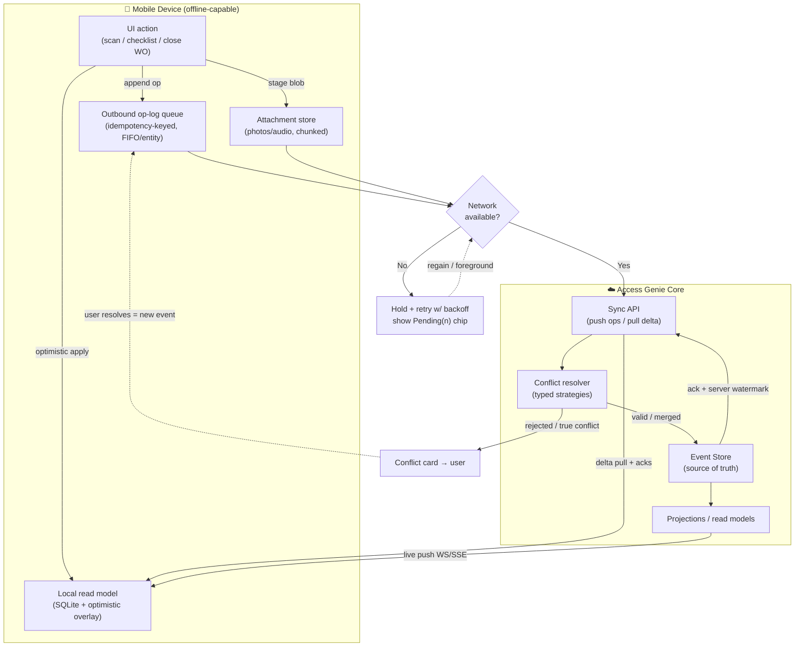

# 14. Mobile & Edge Applications

**Document type:** Product Blueprint — Section 14 (Mobile & Field, module **M14**)
**Covers deliverable:** 14. Mobile Application · **Personas:** Technician, Operator, Security Officer, Maintenance/Facility Manager, Executive → [02-personas.md](./02-personas.md)
**Cross-links:** sensing hardware & sensor-fusion → [09-tracking-technologies.md](./09-tracking-technologies.md) · sync/streaming/auth contracts → [13-api-design.md](./13-api-design.md) · features → [05-feature-matrix.md](./05-feature-matrix.md) §M14

> **Thesis.** The field is where the asset graph is *proven true* — a tag is only trustworthy when a technician
> scans it, a custody chain only holds when a security officer confirms it. Mobile is therefore not a companion
> app but the **primary sensing and mutation surface** for four of our field/management personas. It must work
> at full capability with **zero connectivity** (loading docks, basements, remote sites, tunnels) and reconcile
> deterministically when the network returns. Offline-first is principle #5 of the master plan (→ [00](./00-master-blueprint.md) §0.4).

Legend: 📱 screen · ⚙️ feature · 📴 offline behavior · 📡 scanner/sensor · 📊 KPI · ✨ AI

---

## 14.1 Tech Approach & Justification

### 14.1.1 Platform decision matrix

| Surface | Chosen tech | Why | Rejected alternative |
|---------|-------------|-----|----------------------|
| **Technician / Operator app** | **React Native + Expo (dev/EAS build)**, ejected to bare where needed | One codebase, native perf for lists/camera/maps, huge talent pool, OTA JS updates (EAS Update) for fast field fixes | Full native (2× cost, 2× teams); Flutter (weaker native RFID SDK ecosystem) |
| **Manager app** | **React Native**, shares design-system + data layer with technician app | Approvals/dashboards are UI-light; reuse ≈ 70% of technician modules | Separate native app (no justification) |
| **Security app** | **React Native** with **native map module** (Mapbox/MapLibre native) | Live map + geofence overlays need native GL perf; alert push must be reliable | PWA (background push + BLE unreliable) |
| **Executive app** | **PWA (installable) first**, wrapped in the RN shell for store presence | Read-only KPIs/insights, no scanners, no offline mutation → a responsive PWA fully suffices | Native (over-engineering for read-only) |
| **Handheld/wearable (Zebra TC/MC, Honeywell CT)** | **RN app + device-vendor DataWedge/native RFID SDK bridge** | Rugged Android is the field standard; keypad-trigger scanning demands native intent hooks | Web on device (loses hardware trigger, RFID) |
| **Kiosk / self-service** | **PWA** (locked-down, scoped service account) | Fixed station, always online, single action set → [00](./00-master-blueprint.md) `/kiosk` | Native (no benefit) |

**Decision rule (when a PWA suffices):** *read-mostly, network-assumed, no hardware trigger, no BLE/RFID, no background push criticality* → PWA. The moment an app needs **UHF RFID, background BLE ranging, hardware scan trigger, reliable background push, or full offline mutation**, it must be **React Native with native modules**. Executive + Kiosk clear the PWA bar; Technician/Operator/Security do not.

### 14.1.2 Native modules (the non-negotiable native surface)

| Capability | Native module strategy | Notes / vendor abstraction |
|------------|------------------------|----------------------------|
| **UHF RFID (bulk read)** | Native bridge to Zebra RFID SDK / Impinj / TSL ASCII2 over BLE for sleds | Abstracted behind one `ScannerProvider` interface → device-agnostic; mirrors gateway abstraction in [09](./09-tracking-technologies.md) |
| **NFC read/write** | `react-native-nfc-manager` (bare) — HCE, NDEF, ISO14443 | Tap-to-open asset, custody handoff, encode blank tags |
| **1D/2D barcode & QR** | `VisionCamera` + frame processors (MLKit/ZXing), or DataWedge intent on rugged devices | Batch/rapid-scan mode; offline decode |
| **Camera + annotation** | `react-native-vision-camera` + Skia canvas overlay | On-device redaction, EXIF/geotag strip control |
| **GPS / fused location** | Native fused-location provider; background geofencing | Coalesced sampling to save battery → [09](./09-tracking-technologies.md) GPS section |
| **BLE beacon ranging** | Native CoreLocation/BluetoothLE region monitoring | Proximity "find-my-asset", auto-context on zone entry |
| **Biometric auth** | `expo-local-authentication` (FaceID/TouchID/Android Biometric) | Gates sensitive actions (custody, quarantine, write-off) |
| **Secure offline store** | SQLite (op-log) + OS keystore for encryption key | Encrypted-at-rest local DB (§14.2) |
| **Push** | Native FCM/APNs via `expo-notifications`; critical-alert channel for Security | Category actions (Ack/Escalate from notification) |
| **Voice** | Native speech-to-text (on-device where available) + intent parse via Copilot API | Voice-to-WO (feature 192/301) |

---

## 14.2 Offline-First Architecture

The core engineering bet. Every field mutation is captured as an **event/operation** into a local durable log,
applied optimistically to a local read model, and later synced to the event-sourced core (→ [11](./11-technical-architecture.md), [12](./12-database-design.md)). This is *the same event stream* as the backend — mobile is a lagging replica, not a separate silo.

### 14.2.1 Layers

| Layer | Implementation | Responsibility |
|-------|----------------|----------------|
| **Local store** | SQLite (WatermelonDB / op-log tables), encrypted at rest via OS keystore key | Durable cache of scoped assets, WOs, checklists, custody, reference data + outbound op queue |
| **Read model** | Materialized SQLite views + in-memory cache | Instant, offline-capable UI reads; optimistic overlay of pending ops |
| **Sync engine** | Background task + foreground reconciler; delta pull, batched push | Bi-directional sync against sync API (→ [13](./13-api-design.md)) |
| **Outbound queue** | Append-only op-log (idempotency-key per op) | FIFO-per-entity, at-least-once delivery, ret/backoff |
| **Conflict resolver** | Server-authoritative merge with typed strategies | Deterministic resolution + user prompt for true conflicts |
| **Attachment pipeline** | Local blob store + chunked/resumable upload queue | Photos/audio deferred, compressed, uploaded opportunistically |

### 14.2.2 Sync model

- **Scoped delta sync.** On login the device pulls only the user's **scope** (assigned WOs, assets in their facility/zone, active checklists, custody records) — never the 10M-asset tenant. Pull is a **cursor/`updatedSince` delta** with server-provided watermark.
- **Push = op-log replay.** Queued ops are pushed in order with a stable **idempotency key**; the server applies them to the event store, so a retried op is a no-op. Partial batch failure isolates the failing op without blocking the queue (poison-op quarantine after N retries → surfaced to user).
- **Cadence:** live (WebSocket/SSE) when online + foregrounded; periodic background sync (OS budget permitting); manual "Sync now"; opportunistic on network regain or app foreground.
- **Freshness UI:** every screen shows a sync state chip — `Synced · Pending(n) · Offline · Conflict(n)` — never a silent stale view (matches global state rules → [00](./00-master-blueprint.md) §0.7).

### 14.2.3 Conflict resolution strategy (per entity type)

| Entity / field | Strategy | Rationale |
|----------------|----------|-----------|
| **WO status transition** | Server state machine validates; illegal transition → op rejected, user re-prompted | Can't "close" a WO another actor already cancelled |
| **WO notes / labor / parts lines** | **Append-merge** (additive, per-line idempotent) | Two edits both survive; no lost work |
| **Checklist answers** | **Last-write-wins per field** + timestamp; divergent → flag | Field-granular, rarely truly conflicting |
| **Asset attribute edit** | **Field-level LWW** with author+time; concurrent edit to *same* field → **prompt** (show both) | Preserve intent, surface real conflicts |
| **Custody / quarantine** | **Server-authoritative, no client override** (requires online confirm or signed offline token) | Chain-of-custody must be immutable & ordered → [16](./16-security-compliance.md) |
| **Photos / attachments** | **Never conflict** — immutable, content-addressed, all retained | Evidence is additive |
| **Counts (cycle-count/audit)** | **Additive with reconciliation review** | Two counters merge; discrepancy → review task |

**Golden rule:** *the server event store is the single source of truth; the client proposes, the server disposes.* True conflicts are **surfaced, never silently dropped** — a resolution card lets the user pick a winner and the choice is itself an audited event.

### 14.2.4 Offline sync flow (mermaid)

---

## 14.3 Per-App Specifications

### 14.3.1 Technician App (Field — primary) · features 183, 187–191

The flagship offline app. Persona: Technician (→ [02](./02-personas.md)); "My Work" mobile dashboard (→ [04](./04-dashboards.md) §4.3 source).

| 📱 Screen | ⚙️ Key features | 📴 Offline behavior | 📡 Scanners/sensors |
|-----------|-----------------|---------------------|---------------------|
| **My Work Orders** | Today's queue, priority/SLA sort, filter, pull-to-refresh | Full CRUD offline from cached queue; badge shows Pending(n) | — |
| **WO Detail** | Asset context, history, safety/LOTO, parts, attachments | Fully offline; append-merge notes; status via state machine | NFC/QR tap-to-open asset |
| **Navigate / Route** | Map route to asset location, indoor wayfinding hint | Cached last-known location + offline tiles for facility | GPS/fused location; BLE proximity "getting warmer" |
| **Scan Asset** | Confirm on-site asset identity, batch scan | Offline decode + local lookup; unknown tag → queue register | QR/1D/2D, NFC, UHF RFID (sled) |
| **Checklist / Inspection** | Dynamic per-class forms, pass/fail, conditional branches | Field-level LWW answers; validation local | Camera (evidence), voice fill |
| **Parts & Time** | Add parts (from cached BOM), labor timer, meter reading | Additive lines, offline; reserves against last-known stock | Barcode part scan |
| **Photos / Capture** | Multi-photo, annotate (arrows/text), before/after, geotag | Stored locally, queued resumable upload | Camera + annotation, GPS EXIF |
| **Close / Escalate** | Complete w/ signature, or escalate to manager with reason | Offline close queues; escalate creates notify-op | Biometric confirm on close |
| **Voice-to-WO** | "Create WO: forklift 12, hydraulic leak, high" → draft | On-device STT; intent parse deferred if offline | Microphone |

- 📊 **KPIs:** WOs completed/day · first-time-fix rate · mean time on task · checklist compliance % · scan-confirm rate · offline-op sync success % · photo evidence attach rate.
- ✨ **AI:** next-best-action on WO, suggested parts (from predicted failure → [08](./08-ai-intelligence.md)), voice-to-WO intent, photo auto-classification of asset/defect.

### 14.3.2 Manager App (Management) · feature 184

Personas: Maintenance / Facility / Operations Manager. Approvals-and-oversight, mostly online but approval-capable offline.

| 📱 Screen | ⚙️ Key features | 📴 Offline behavior | 📡 Sensors |
|-----------|-----------------|---------------------|-----------|
| **Approvals Inbox** | Transfers, disposals, write-offs, parts, PO — SoD-enforced | Approve/reject queued offline (requester≠approver checked local + re-verified server) | Biometric to approve |
| **Team Dashboard** | WO pipeline, PM compliance, MTTR/MTBF, technician load, backlog age | Cached snapshot with freshness stamp; live when online | — |
| **Dispatch / Schedule** | Assign & rebalance WOs across technicians, drag-assign, map of crew | Assignment ops queue; conflict = server reconciles load | Location of crew (opt-in) |
| **Alerts & Escalations** | Escalated items, SLA-at-risk, on-call routing | Push-delivered; ack offline | Push |
| **Asset/WO Lookup** | Scan or search any in-scope asset, drill to 360° | Cached scope; live fetch online | QR/NFC/RFID scan-to-open |

- 📊 **KPIs:** approval cycle time · on-time WO % · schedule attainment · escalation resolution time · dispatch balance index.
- ✨ **AI:** rebalancing & dispatch suggestions, backlog-risk forecast, board-ready narrative digest (→ [08](./08-ai-intelligence.md)).

### 14.3.3 Security App (Field) · feature 185

Persona: Security Officer. Real-time-critical; native map + reliable critical push. Source dashboard → [04](./04-dashboards.md) §4.6.

| 📱 Screen | ⚙️ Key features | 📴 Offline behavior | 📡 Scanners/sensors |
|-----------|-----------------|---------------------|---------------------|
| **Live Map** | Restricted zones, breach pins, high-value-off-site, patrol coverage | Last-synced positions + offline tiles; live via WS online | GPS (own position), BLE |
| **Alert Feed** | Geofence breach, tamper, after-hours movement — sev-ranked | Critical-channel push; ack/snooze offline | Push (critical channel) |
| **Custody Verify** | Scan asset → confirm holder, capture handoff signature | **Server-authoritative**; offline uses signed short-TTL token, else queued-pending | QR/NFC/RFID + biometric + camera |
| **Quarantine / Lock** | Flag asset lost/stolen, disable, dispatch response | Requires online confirm OR biometric-signed offline intent (audited) | Biometric confirm |
| **Incident Report** | File incident w/ photos, location, linked asset/alert | Fully offline; queued with evidence | Camera + GPS |
| **Patrol / Sweep** | Scan-based zone sweep, prove presence, exception list | Offline sweep log, additive merge | RFID bulk-read, QR checkpoints |

- 📊 **KPIs:** alert response time · recovered assets · false-positive rate · custody completeness % · patrol coverage · incidents filed/closed.
- ✨ **AI:** theft/tamper likelihood, anomaly correlation (grouping related alerts), predicted breach hot-zones (→ [08](./08-ai-intelligence.md)).

### 14.3.4 Executive App (Business — read-only PWA) · feature 186

Persona: Executive / C-Suite (+ Finance viewer). Read-only, no scanners, no offline mutation → PWA. Source → [04](./04-dashboards.md) §4.1.

| 📱 Screen | ⚙️ Key features | 📴 Offline behavior | 📡 Sensors |
|-----------|-----------------|---------------------|-----------|
| **Portfolio KPIs** | Total value/TCO, utilization %, risk index, AI-realized savings, critical alerts | Cached last snapshot (read-only), freshness stamp | — |
| **AI Insights** | "3 things needing attention", predicted capex, top risks — narrative | Cached digest; refresh online | — |
| **Trends & Drill** | Value trend, risk distribution, facility performance, drill to facility | Cached charts; live refresh online | — |
| **Scenario / What-if** | Read-only what-if sliders (online only) | Disabled offline (requires compute) | — |
| **Share / Export** | Board report PDF, scoped watermarked share link | Cached report view | — |

- 📊 **KPIs (displayed):** total asset value · ROA · risk index · savings realized by AI · portfolio utilization.
- ✨ **AI:** dashboard narration, executive digest, capex-deferral highlights — all read-only, no operational edits (persona constraint → [02](./02-personas.md)).

---

## 14.4 Cross-Cutting Mobile Capabilities

| Capability | Behavior | Personas | Offline | Cross-ref |
|------------|----------|:--------:|:-------:|-----------|
| **QR / 1D-2D barcode** | Scan-to-open, scan-to-search, batch/rapid mode, confirm-on-site | Tech, Sec, Mgr | ✓ (local decode+lookup) | [09](./09-tracking-technologies.md) |
| **UHF RFID** | Bulk read (audit/sweep/receiving), sled or rugged handheld, RSSI proximity | Tech, Sec, Inv | ✓ | [09](./09-tracking-technologies.md) |
| **NFC read/write** | Tap-to-open, custody handoff, encode blank tags, tamper-tag read | Tech, Sec | ✓ | [09](./09-tracking-technologies.md) |
| **GPS / location capture** | Geotag actions, field position, background geofence entry/exit | Tech, Sec | ✓ (queued) | [09](./09-tracking-technologies.md) |
| **Camera + annotation** | Photo/video evidence, arrows/text markup, before/after, redaction | Tech, Sec | ✓ (queued upload) | — |
| **Push notifications** | WO assign, alert, approval, escalation; category actions (Ack/Approve inline); Security critical channel | All | delivered→acted | [13](./13-api-design.md) |
| **Voice commands / voice-to-WO** | On-device STT → Copilot intent → create/update WO, hands-free checklist | Tech | STT ✓, parse deferred | [08](./08-ai-intelligence.md) |
| **Wearables / handheld scanners** | Zebra TC/MC, Honeywell CT, ring scanners, smart glasses (RFID sled via BLE) | Tech, Sec, Inv | ✓ | [09](./09-tracking-technologies.md) |
| **Biometric auth** | FaceID/TouchID/Android Biometric gate on sensitive ops + re-auth | All | ✓ (local) | [16](./16-security-compliance.md) |
| **Deep links / universal links** | `accessgenie://asset/{id}`, `/wo/{id}`, scan-URL open, notification→screen, scope-preserving | All | resolves to cached | [03](./03-information-architecture.md) |
| **App/session security** | MDM/EMM enroll, jailbreak/root detection, remote wipe, offline data TTL, encrypted store | All | enforced | [16](./16-security-compliance.md) |

---

## 14.5 Competitive Comparison — Maximo Mobile & Samsara Field Apps

| Dimension | **IBM Maximo Mobile** | **Samsara (Driver / Fleet)** | **Access Genie AI (this plan)** |
|-----------|-----------------------|------------------------------|----------------------------------|
| **Primary focus** | EAM work execution (technician) | Fleet/telematics, driver ELD, safety cam | Unified: EAM + RTLS + AI + custody, 4 role apps |
| **Offline model** | Offline WO execution (Maximo Anywhere lineage), store-and-forward | Driver app caches trips/DVIR; telematics device buffers | **Event-sourced offline-first**, op-log + typed conflict resolution, server-authoritative core |
| **Tech stack** | Native + MAF/hybrid, tied to Maximo backend | Native apps + proprietary hardware/gateways | RN/Expo + native modules; **vendor-neutral** scanner/gateway abstraction |
| **Scanning** | Barcode/RFID via device, WO-centric | Minimal (VIN/QR); hardware-centric telemetry | Full QR/RFID/NFC/barcode + camera-vision + voice, batch mode |
| **AI on device** | Add-on (Maximo Health/Predict, mostly server) | Safety AI in dashcam (edge) | **Explainable** next-best-action, voice-to-WO, photo-classify, predicted parts (native to graph → [08](./08-ai-intelligence.md)) |
| **Custody / security app** | Limited | N/A (fleet safety, not asset custody) | Dedicated **Security app**: live map, custody, quarantine, patrol |
| **Executive surface** | Reports/portal (heavy) | Fleet dashboards | Lightweight read-only **PWA** with AI narrative |
| **Lock-in** | Deep Maximo coupling, licensing weight | Proprietary hardware lock-in | **Open**: API/webhook/event, BYO-tag/BYO-gateway → [13](./13-api-design.md), master §0.10 |
| **Conflict handling** | Store-and-forward, coarse | Device-buffered, telematics-simple | **Per-entity typed strategies**, surfaced not silently dropped |

**Positioning:** Maximo Mobile owns technician work execution but is heavy, native-coupled, and single-persona; Samsara owns fleet telematics via proprietary hardware but has no asset-custody/EAM depth. Access Genie **fuses both** — technician execution *and* security custody *and* manager approvals *and* exec insight — on **one offline-first event graph** with a **vendor-neutral** sensing layer, so the field app writes to the *same asset object* as the tracking dot and the depreciation line (master §0.1).

---

## 14.6 Design & Delivery Notes

- **One design system, mobile tokens.** Shares tokens/components with web (→ [15](./15-design-system.md)); large touch targets, glove-mode hit areas, one-hand reach, high-contrast outdoor mode, dark mode.
- **All standard states apply** (loading/empty/error/**offline**/permission) — offline is a first-class state, never an error (master §0.7).
- **Accessibility:** WCAG 2.1 AA, voice control, large-text, screen-reader labels on scan/camera flows.
- **Battery & data discipline:** coalesced GPS, chunked uploads on Wi-Fi preferred, delta-only sync, backpressure on op queue.
- **Build order (→ [20](./20-implementation-plan.md)):** Technician app first (highest field value + hardest offline), then Security, then Manager (reuse), then Executive PWA (thinnest). Offline sync engine is a **shared library** built once, consumed by all RN apps.
- **Rollout:** EAS Update OTA for JS fixes; MDM/EMM (Intune/Workspace ONE) for rugged fleet distribution; staged store releases for BYOD.

---

### Summary (3 sentences)

Access Genie's mobile layer is four role-shaped apps — a full offline-first **Technician** app, an approvals/dispatch **Manager** app, a real-time custody **Security** app (all React Native with native RFID/NFC/barcode/biometric modules), and a read-only **Executive** PWA — all writing to the *same* event-sourced asset graph rather than a separate mobile silo. The engineering core is an **offline-first** architecture: an idempotency-keyed op-log queue, optimistic local read models over encrypted SQLite, delta sync, and **per-entity typed conflict resolution** where the server event store is authoritative and true conflicts are surfaced, never silently dropped. Versus Maximo Mobile (heavy, single-persona, backend-coupled) and Samsara (hardware-locked telematics), we win on **multi-persona breadth, vendor-neutral sensing, native explainable AI, and a rigorous offline sync contract** (→ [09](./09-tracking-technologies.md), [13](./13-api-design.md)).
