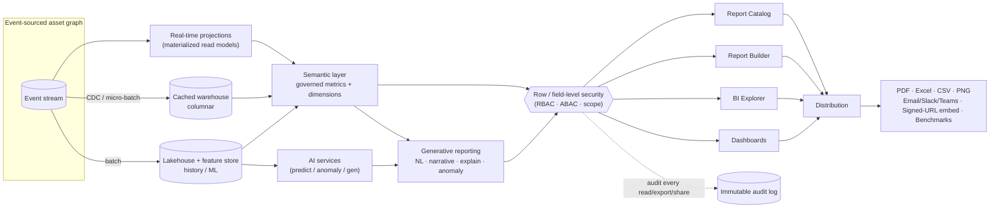

# 17. Reporting & Business Intelligence

**Module:** M10 · Analytics, Reporting & BI · **Covers deliverable:** 17 · **Status:** Planning (pre-rebuild)
**Primary routes:** `/reports` `/reports/[id]` `/reports/builder` `/bi` `/financials` `/depreciation`
`/compliance-reports` `/subscriptions` `/exports` (see [00-master-blueprint.md §0.6-I](./00-master-blueprint.md)).

> BI is **not a bolt-on warehouse** — it is a **projection over the one event-sourced asset graph** (principle
> 0.4.1). Every report, KPI, and export reads from the same governed **semantic layer**, so the number a CFO
> sees in a board PDF, the number a technician sees on a dashboard tile ([04-dashboards.md](./04-dashboards.md)),
> and the number an auditor exports are *the same metric definition* — computed once, reused everywhere.
> Row/field-level security ([16-security-compliance.md](./16-security-compliance.md)) is applied **in the query
> plan**, not the UI, so a shared or scheduled report can never leak out-of-scope rows.

Legend: 📊 chart · 📈 trend · 🍩 donut · 🔥 heatmap · 🗺️ map · 📋 table · 🧭 funnel · 🎯 gauge · 💧 waterfall · ✨ AI narrative

---

## 17.1 Reporting stack at a glance

| Layer | What it is | Consumes | Feeds | Doc |
|-------|-----------|----------|-------|-----|
| **Report Catalog** | Governed, versioned library of prebuilt reports per persona/domain | Semantic layer | Viewers, subscriptions, exports | §17.2 |
| **Report Builder** | No-code drag-drop report authoring (dims/measures/filters/calc fields/format) | Semantic layer | Catalog (publish) | §17.3 |
| **BI Explorer** | Ad-hoc pivot + chart exploration, drill anywhere | Semantic layer + warehouse | Saved views, "pin to dashboard" | §17.4 |
| **Semantic Layer** | Governed metric & dimension definitions (single source of truth) | Projections / warehouse / lakehouse | All of the above | §17.5 |
| **Generative Reporting** | NL→report, board narratives, "explain this", anomaly call-outs | Semantic layer + AI services | Catalog, subscriptions | §17.10, [08](./08-ai-intelligence.md) |
| **Distribution** | Scheduling, subscriptions, exports, embedded/white-label, benchmarking | Any published artifact | Email/Slack/Teams/signed URL/S3 | §17.6–17.9 |
| **Analytics Pipeline** | Projections (real-time) + warehouse (cached) + lakehouse (history/ML) | Event stream ([11](./11-technical-architecture.md)) | Semantic layer | §17.11 |
| **Report Governance** | Row/field-level security, freshness, retention, watermarking, audit | RBAC/ABAC scope ([16](./16-security-compliance.md)) | Every read/export/share | §17.12 |

---

## 17.2 Report catalog — by persona & domain

Every row is a **prebuilt, parameterized report** (feature M10.135). `audience` binds default scope + RBAC visibility;
`cadence` is the recommended subscription default (all are also on-demand); `drill-through` names the deepest target a
row/segment click navigates to. Metrics resolve through the **semantic layer** (§17.5), never raw SQL.

### 17.2.1 Executive / Board

| Report | Audience | Key metrics | Visuals | Cadence | Drill-through |
|--------|----------|-------------|---------|---------|---------------|
| **Board Asset Portfolio Review** | Executive/C-Suite, Org Admin | Portfolio value (TCO), ROA, Utilization %, Risk Index, AI-realized savings, Critical alerts | 💧 savings waterfall · 📈 value trend · 🍩 value by category · ✨ narrative | Monthly/Quarterly | → Facility scorecard → Asset 360° ([10](./10-asset-360-profile.md)) |
| **Facility Performance Scorecard** | Executive, Facility Mgr | Availability, on-time WO %, shrinkage, safety incidents, cost/asset — ranked by facility | 📋 league table · 🔥 facility×KPI heatmap | Monthly | → Ops dashboard (facility) |
| **Portfolio Risk & Exposure** | Executive, Security Admin | Composite risk, high-risk asset count, insured vs. book exposure, geographic concentration | 📊 stacked risk bars · 🗺️ exposure choropleth | Monthly | → AI risk explainability ([08](./08-ai-intelligence.md)) |
| **AI Value Realization** | Executive, Org Admin | Savings identified vs. captured, deferred capex, downtime avoided, recommendations acted-on rate | 💧 waterfall · 📈 cumulative savings | Quarterly | → Recommendation feed |

### 17.2.2 Financial · Depreciation · TCO

| Report | Audience | Key metrics | Visuals | Cadence | Drill-through |
|--------|----------|-------------|---------|---------|---------------|
| **Depreciation Schedule & Roll-forward** | Finance/Controller | Opening/closing NBV, period depreciation, accum. depreciation, method (SL/DB/UoP) | 📈 schedule projection · 📋 roll-forward grid | Monthly (period-close) | → Asset finance tab |
| **Book vs. Market Valuation** | Finance, Executive | Book value, fair/market value, impairment gap, revaluation candidates | 📊 book-vs-market bars · 📋 gap list | Quarterly | → Impairment workflow |
| **Total Cost of Ownership (TCO)** | Finance, Asset Mgr | Acquisition + maintenance + parts + energy + downtime cost, cost/operating-hour, cost/use | 🍩 cost breakdown · 📋 TCO by category · 📈 cost-per-hour trend | Monthly | → Asset cost ledger |
| **Capex / Opex Forecast** | Finance, Executive | Planned capex, replacement-driven capex, opex run-rate, budget vs. actual by cost center | 📊 capex vs opex · 📈 forecast band | Quarterly | → Replacement plan ([07](./07-asset-lifecycle.md)) |
| **Write-off & Disposal Register** | Finance, Compliance | Write-off value YTD, gain/loss on disposal, disposal method mix, GL sync status | 📋 register · 🍩 disposal method | Monthly | → Disposal certificate |
| **Warranty & Lease Exposure** | Finance, Asset Mgr | Warranty-expiry cost exposure, lease-end schedule, lease-vs-buy delta | 📈 expiry timeline · 📋 exposure list | Monthly | → Warranty/lease tab |

> Financial reports honor **field-level security** (§17.12): cost/valuation columns are masked for non-finance roles
> even inside a shared report or export. GL-mapped figures reconcile to the ERP sync (M8.122).

### 17.2.3 Maintenance (Reliability)

| Report | Audience | Key metrics | Visuals | Cadence | Drill-through |
|--------|----------|-------------|---------|---------|---------------|
| **Reliability Scorecard (MTTR/MTBF)** | Maintenance Mgr | MTTR, MTBF, failure rate, availability, reliability trend by asset class | 📈 MTTR/MTBF trend · 📊 Failure Pareto | Weekly | → WO detail ([00.6-F](./00-master-blueprint.md)) |
| **PM Compliance & Attainment** | Maintenance Mgr, Facility Mgr | PM compliance %, schedule attainment, overdue PM count, PM-vs-corrective ratio | 🎯 compliance gauge · 📊 PM vs corrective | Weekly | → PM schedule |
| **WO Backlog & Aging** | Maintenance Mgr | Open/overdue WOs, backlog age buckets, backlog $ value, SLA breach count | 📊 backlog age · 🧭 WO pipeline funnel | Daily | → WO board |
| **Technician Productivity** | Maintenance Mgr | Wrench-time %, WOs closed, first-time-fix rate, mean time on task, load balance | 📊 tech load · 📋 productivity table | Weekly | → Technician profile |
| **Cost of Maintenance** | Maintenance Mgr, Finance | Labor + parts cost per WO / per asset, corrective-vs-preventive cost, top cost drivers | 🍩 labor/parts split · 📋 top-cost assets | Monthly | → Asset service log |
| **Predictive Maintenance Impact** | Maintenance Mgr | Predicted failures, WOs auto-generated, downtime avoided, prediction precision/recall | ✨ narrative · 📈 avoided-downtime trend | Weekly | → Predictive WO ([08](./08-ai-intelligence.md)) |

### 17.2.4 Utilization & Performance

| Report | Audience | Key metrics | Visuals | Cadence | Drill-through |
|--------|----------|-------------|---------|---------|---------------|
| **Asset Utilization** | Operations Mgr, Asset Mgr | Utilization %, idle time, active/idle/down hours, over-utilization flags | 🔥 utilization heatmap (zone×time) · 📊 idle by category | Weekly | → Asset timeline |
| **Fleet / Group Performance** | Operations Mgr, Dept Head | Throughput, OEE (avail×perf×quality), cycle time, group ranking | 📈 OEE trend · 📋 group league | Weekly | → Group detail |
| **Rebalancing Opportunities** | Operations Mgr | Under/over-utilized pairs, transfer candidates, projected utilization uplift | ✨ AI suggestions · 🗺️ flow map | Weekly | → Initiate transfer ([00.6-H](./00-master-blueprint.md)) |
| **Zone Occupancy & Dwell** | Facility Mgr, Ops Mgr | Dwell time, occupancy %, congestion zones, movement volume | 🔥 dwell heatmap · 🗺️ movement flow | Weekly | → Twin / heatmaps |

### 17.2.5 Inventory & Parts

| Report | Audience | Key metrics | Visuals | Cadence | Drill-through |
|--------|----------|-------------|---------|---------|---------------|
| **Stock Health & Reorder** | Inventory Mgr | On-hand vs. reorder point, stockouts, below-reorder SKUs, fill rate | 📊 stock vs reorder · 📋 reorder queue | Daily | → SKU detail ([00.6-G](./00-master-blueprint.md)) |
| **ABC & Inventory Valuation** | Inventory Mgr, Finance | ABC class mix, stock value, carrying cost, turnover ratio | 🍩 ABC mix · 📈 turnover trend | Monthly | → SKU valuation |
| **Consumption & Demand** | Inventory Mgr | Parts consumption trend, demand forecast, slow/dead stock, pre-staging vs predicted failures | 📈 consumption · ✨ demand forecast | Weekly | → Consumption log |
| **Supplier & Lead-Time** | Inventory Mgr | Lead-time actual vs. quoted, on-time delivery %, PO cycle time, cost variance | 📊 lead-time · 📋 supplier scorecard | Monthly | → PO detail |

### 17.2.6 Audit & Compliance

| Report | Audience | Key metrics | Visuals | Cadence | Drill-through |
|--------|----------|-------------|---------|---------|---------------|
| **Audit Status & Accuracy** | Compliance Officer, Asset Mgr | Audit pass rate, found/missing/misplaced, accuracy %, exceptions open | 🧭 audit funnel · 📋 exception list | Per-cycle | → Cycle count / audit ([00.6-K](./00-master-blueprint.md)) |
| **Chain-of-Custody Completeness** | Compliance Officer, Security | Custody completeness %, custody gaps, unauthorized handoffs, dispute count | 📋 custody gaps · 📈 completeness trend | Weekly | → Custody log (immutable) |
| **Certification & Calibration Expiry** | Compliance, Maintenance Mgr | Expiring certs/calibrations (30/60/90d), overdue, coverage % | 📈 expiry timeline · 🎯 coverage gauge | Weekly | → Certification record |
| **Regulatory Evidence Pack** | Compliance Officer, Auditor | Retention adherence, legal holds, findings closed, evidence coverage — HIPAA/Joint Commission/ISO | 📋 evidence index · ✨ narrative | On-demand / Annual | → Immutable audit log |
| **Data Retention & Legal Hold** | Compliance, Org Admin | Records past retention, active holds, disposition due, GDPR/CCPA requests | 📋 retention register | Monthly | → Retention policy ([16](./16-security-compliance.md)) |

> **Immutability & signing:** compliance reports and evidence packs are generated against the **immutable audit
> log** (M11.150), hash-chained, and exports are digitally signed + watermarked (§17.7, §17.12) so an evidence
> pack is defensible in an audit or court.

### 17.2.7 Security & Loss Prevention

| Report | Audience | Key metrics | Visuals | Cadence | Drill-through |
|--------|----------|-------------|---------|---------|---------------|
| **Loss & Recovery** | Security Officer, Security Admin | Missing assets, recovered count/value, shrinkage %, loss $ trend | 📈 loss trend · 🗺️ last-seen map | Weekly | → Incident record |
| **Alert & Incident Response** | Security Officer | Alerts by type, mean response time, escalations, false-positive rate | 📊 alerts by type · 📈 response-time trend | Daily | → Alert detail ([00.6-J](./00-master-blueprint.md)) |
| **Geofence & After-Hours Activity** | Security Officer, Facility Mgr | Breaches (24h/7d), after-hours movement, tamper events, out-of-bounds assets | 🗺️ breach map · 📊 breaches by zone | Daily | → Movement replay |
| **High-Value Asset Watch** | Security Admin, Finance | High-value assets off-site, custody status, tamper/geofence risk score | 📋 watchlist · ✨ risk call-out | Daily | → Asset 360° tracking tab |

### 17.2.8 AI / Prediction

| Report | Audience | Key metrics | Visuals | Cadence | Drill-through |
|--------|----------|-------------|---------|---------|---------------|
| **Predictive Failure Outlook (30/60/90d)** | Maintenance Mgr, Ops Mgr | Predicted failures, confidence bands, $ impact, recommended actions | ✨ ranked feed · 📈 confidence bands | Weekly | → Explainability ([08](./08-ai-intelligence.md)) |
| **Asset Health & RUL** | Asset Mgr, Maintenance Mgr | Health score distribution, RUL estimates, health decline velocity, drivers | 📊 health distribution · 📈 RUL curve | Weekly | → Asset health tab |
| **Anomaly Digest** | Ops Mgr, Security | Anomalies (24h/7d), category, severity, correlated events, resolution status | ✨ anomaly call-outs · 📈 anomaly timeline | Daily | → Anomaly detail |
| **Model Health & Drift** | Org Admin, Platform | Model accuracy, drift %, data-quality inputs, retraining-due, prediction volume | 🎯 drift gauge · 📋 model registry | Weekly | → Model registry ([08](./08-ai-intelligence.md)) |
| **Optimization Opportunities** | Executive, Ops Mgr, Finance | Idle/rebalance/capex-deferral/EOL opportunities ranked by $ impact & confidence | ✨ narrative · 💧 opportunity waterfall | Monthly | → Act on insight |

### 17.2.9 Custom

| Report | Audience | Key metrics | Visuals | Cadence | Drill-through |
|--------|----------|-------------|---------|---------|---------------|
| **User-authored (Report Builder)** | Author + granted scopes | Any semantic-layer measure × dimension | Any (author-selected) | Author-set | Author-configured |
| **Saved BI Explorations** | Author + shared users | Ad-hoc pivot/chart pinned from BI Explorer | Pivot/chart | On-demand | Cross-filter → source |
| **NL-generated report** | Requester | Metrics inferred from prompt (§17.10) | AI-selected, editable | On-demand → schedulable | As built |
| **Industry-pack templates** | Per vertical (M20.235) | Vertical KPI sets (Healthcare/Gov/Mfg/Logistics/Retail) | Preconfigured | Template default | Template-defined |

---

## 17.3 Report Builder (`/reports/builder`)

No-code authoring surface (feature M10.136). Follows the **Builder** body pattern (drag-drop) from the global page
anatomy ([00.7](./00-master-blueprint.md)).

| Capability | Detail |
|-----------|--------|
| **Data scope** | Pick a governed **dataset** from the semantic layer (Assets, Work Orders, Movements, Financials, Inventory, Audit, Telemetry). No raw table access — datasets are pre-joined & permission-aware. |
| **Dimensions** | Drag to Rows/Columns: facility, zone, category, custodian, lifecycle stage, time (auto date hierarchy Y→Q→M→W→D), asset class, supplier, technician. |
| **Measures** | Drag governed metrics (count, sum, avg, MTTR, MTBF, utilization %, TCO, NBV…) — additive/semi-additive/non-additive flags handled by the semantic layer so totals never double-count. |
| **Filters** | Attribute filters, relative date ranges (last 7/30/90d, MTD/QTD/YTD, fiscal period), top-N, threshold, scope chips. Filters are **deep-linkable** and become report parameters. |
| **Calculated fields** | Row-level & measure-level expressions (ratios, deltas, %-of-total, YoY, running totals, CASE bucketing) with type-safe functions; validated against the semantic model. |
| **Visualization** | Table, pivot, line/area/bar/stacked/combo, donut/pie, gauge, funnel, waterfall, heatmap, map, scorecard, KPI tile; conditional formatting, thresholds, sparklines. |
| **Formatting** | Number/currency/%/date formats, units, locale (M12.165), grouping, subtotals, sort, column freeze, brand theme, page layout for PDF. |
| **Governance** | Publish → versioned catalog entry; requires publish permission; RBAC visibility set at publish; preview always runs under **author's scope** to prevent over-broad publishing. |
| **Lifecycle** | Draft → Preview → Publish → Version (diff & rollback) → Deprecate. Clone any catalog report as a starting point. |

---

## 17.4 BI Explorer (`/bi`)

Ad-hoc, exploratory analysis (feature M10.137) — the *Analytics* body pattern for power users (Asset/Ops/Maintenance
Mgrs, Finance, analysts).

- **Pivot engine** — drag dimensions/measures onto rows/columns/values; expand/collapse hierarchies; swap measures live.
- **Drill anywhere** — drill-down (Q→M→D), drill-through (segment → underlying asset/WO rows), drill-across (jump dimension).
- **Cross-filtering** — click a chart segment to filter the whole exploration (mirrors dashboard cross-filter, [04.9](./04-dashboards.md)).
- **Chart-on-the-fly** — one-click chart type switching; small multiples; dual-axis; reference/target lines.
- **Compare mode** — period-over-period, facility-vs-facility, cohort compare, benchmark overlay (§17.9).
- **Data source toggle** — choose **Live** (projection, real-time) or **Cached** (warehouse, faster/deep-history) with a visible freshness badge (§17.11).
- **Save & promote** — save exploration as a personal view, share (scoped), or **pin to a dashboard** / **promote to Report Builder** to formalize.
- **Ask in NL** — inline "ask a question" box (§17.10) generates the pivot/chart, which the user can then refine by hand.

---

## 17.5 Semantic layer (governed metrics)

The **single source of truth** for every metric. Prevents "your MTTR ≠ my MTTR" drift across dashboards, reports,
exports, and the Copilot.

| Concept | Definition |
|--------|-----------|
| **Metric** | Named, governed calculation (e.g., `mttr`, `pm_compliance_pct`, `utilization_pct`, `tco`, `nbv`) with formula, grain, additivity, unit, format, and owner. |
| **Dimension** | Governed attribute with hierarchy (facility→building→floor→zone; date Y→Q→M→W→D; taxonomy class→subclass). |
| **Dataset / model** | Curated, pre-joined entity model exposing dimensions + metrics for a domain (Maintenance, Finance, Tracking…). |
| **Metric lineage** | Each metric records its source projection/warehouse fields → traceable to the event stream ([12](./12-database-design.md)). "Where did this number come from?" is answerable. |
| **Certification** | Metrics are marked *Certified* (governed, board-safe) vs. *Draft* (author sandbox). Certified metrics carry an owner + change history. |
| **Security binding** | Row/field-level rules attach to datasets & metrics (§17.12), so every consumer inherits the same enforcement. |
| **Consumers** | Report Catalog, Report Builder, BI Explorer, Dashboards ([04](./04-dashboards.md)), Generative reporting, Copilot & NL search ([08](./08-ai-intelligence.md)), Public API/GraphQL ([13](./13-api-design.md)). |

> Because the semantic layer is upstream of *both* the UI and the Copilot, a natural-language question and a
> hand-built report **cannot** disagree — they resolve the identical metric definition.

---

## 17.6 Scheduling & subscriptions (`/subscriptions`)

| Aspect | Detail |
|-------|--------|
| **Schedules** | Cron-style or friendly (daily 07:00, every Monday, first business day, period-close, fiscal-quarter-end); timezone-aware (M12.166); business-day/holiday calendars. |
| **Triggers** | Time-based **or** event-based (e.g., "email the loss report when shrinkage > threshold", "send PM-compliance report on cycle close"). |
| **Subscriptions** | Any user can subscribe to a catalog report; managers can subscribe **roles/teams** (e.g., all Facility Mgrs). Per-recipient scope is applied at render (§17.12) — one schedule, many personalized outputs ("bursting"). |
| **Channels** | Email, in-app inbox, Slack/Teams, SMS (summary + link), webhook, SFTP/S3 drop for downstream systems. |
| **Payload** | Inline summary + attachment (PDF/Excel/CSV/PNG) + deep link; ✨ optional AI narrative preface (§17.10). |
| **Controls** | Pause/resume, snooze, delivery history & failures, retry, unsubscribe, digest-batching to reduce noise (M17.217). |

---

## 17.7 Export formats (`/exports`)

| Format | Use | Notes |
|--------|-----|-------|
| **PDF** | Board/compliance/print | Paginated, branded, header/footer, page numbers, ✨ narrative cover, digital signature + hash for evidence packs. |
| **Excel (XLSX)** | Analyst hand-off | Native types, multiple sheets, pivot-ready, formulas preserved where safe, formatting retained. |
| **CSV** | Data pipelines / re-import | UTF-8, delimiter/locale options, raw governed rows (still scope-filtered). |
| **PNG** | Chat/embed/slide | Per-chart or full-dashboard image render for Slack/Teams/decks. |
| **Signed link** | Embedded/white-label | Time-boxed signed URL (§17.8), no attachment. |

**Governance on export:** field-level masks and row scope are applied *before* the file is produced — an export can
never contain data the requester can't see. Every export is logged (who/what/when/scope) in the audit log; sensitive
exports are watermarked with viewer identity + timestamp. Large exports run async → notify + `/exports` history.

---

## 17.8 Embedded & white-label analytics

Feature M10.145 — surface Access Genie analytics inside customer/partner apps or portals.

| Capability | Detail |
|-----------|--------|
| **Signed-URL embedding** | Host app requests a **signed, time-boxed, scope-encoded URL**; the embed inherits exactly that scope + RBAC — no session sharing, no over-fetch. |
| **White-label theming** | Tenant branding, colors, logo, fonts, domain (M12.166); "Powered by" toggle per plan; hide chrome/nav for iframe/SDK embeds. |
| **Embed targets** | Single report, dashboard, single chart/KPI tile, or BI Explorer (locked or interactive) — each with its own signed grant. |
| **Row/field passthrough** | The signing service stamps tenant + scope + field-mask into the token; the query plane enforces it (§17.12). Guest/Viewer external tier (see [02.2](./02-personas.md)) gets watermarked, time-limited access. |
| **APIs** | Embed + data via REST/GraphQL/streaming ([13](./13-api-design.md)); webhooks for "report ready". |

---

## 17.9 Benchmarking (feature M10.146)

| Type | Compares | Example | Privacy |
|------|----------|---------|---------|
| **Cross-facility (internal)** | Facilities/regions within the tenant | PM compliance, MTTR, utilization, cost/asset league tables | In-tenant scope rules apply |
| **Cross-cohort (internal)** | Asset classes, departments, shifts, custodians | Reliability by class; utilization by shift | Field masks respected |
| **Industry (external)** | Tenant vs. anonymized peer benchmark by vertical (Healthcare/Gov/Mfg/Logistics/Retail — [01.6](./01-product-vision.md)) | "Your MTTR is 18% above healthcare median" | **k-anonymized, opt-in, aggregated** — never raw peer data; differential-privacy floor |
| **Target vs. actual** | Metric vs. KPI target (M10.144) | PM compliance vs. 95% target gauge | — |

Benchmarks render as overlays in BI Explorer, KPI tiles, and executive reports, with ✨ narrative context
("top-quartile on availability, bottom-quartile on parts cost").

---

## 17.10 Generative / AI reporting

Ties directly to the AI services in [08-ai-intelligence.md](./08-ai-intelligence.md) — all four capabilities read the
**same semantic metrics** and inherit the requester's scope, so generated text is grounded and non-leaky.

| Capability | What it does | Grounding & guardrails | Feature |
|-----------|--------------|------------------------|---------|
| **NL report generation** | "Show maintenance cost by facility for Q2 vs Q1 as a bar chart" → builds a real, editable report/pivot | Resolves to certified metrics; renders an actual query (no hallucinated numbers); user can open in Builder | M10.140, M3.55 |
| **Board-narrative summaries** | Auto-writes the executive narrative ("3 things needing attention", drivers, $ impact) atop board reports/dashboards | Sourced from metric deltas + AI insight feed; every claim cites the metric/segment; confidence shown | M4.55, [04.1](./04-dashboards.md) |
| **"Explain this dashboard/report"** | One-click plain-language explanation of what changed and why on any view | Reads visible metrics + period deltas + anomalies; scope-bound; links to drill-through | Cross-cut 264, [04.9](./04-dashboards.md) |
| **Anomaly call-outs** | Inline flags on charts/tables where a value is a statistical outlier, with cause hypothesis | From anomaly-detection service ([08](./08-ai-intelligence.md)); labeled AI, dismissible, feeds HITL loop (M3.60) | M3.42, M9.133 |

**Trust rules:** generated artifacts are **labeled AI-generated**, show **confidence + data freshness**, cite the
metrics/rows behind each statement, are **read-only-safe** (numbers come from the query engine, prose from the model),
and are subject to the same export/share governance (§17.12). Feedback (👍/👎) trains the summarization loop (M3.60).

---

## 17.11 Analytics data pipeline

Reports draw from **three tiers of the one asset graph**, chosen per metric by freshness need ([11](./11-technical-architecture.md), [12](./12-database-design.md)):

| Tier | Source | Latency / freshness | Serves | Freshness indicator |
|------|--------|---------------------|--------|---------------------|
| **Real-time projections** | Materialized read models updated from the event stream | Seconds (live/stream, ≤1 min) | Live dashboards, alerting reports, ops KPIs, `/bi` **Live** mode | 🟢 "Live · updated 12s ago" |
| **Cached warehouse** | Columnar warehouse, incremental micro-batch from projections/CDC | Minutes → 15 min (configurable) | Standard catalog reports, pivots, cross-filter, most subscriptions | 🟡 "Cached · as of 09:15" |
| **Lakehouse (history/ML)** | Long-horizon event & telemetry history, feature store | Hourly/daily batch | Deep trends, YoY, benchmarking, model training/backtests | ⚪ "Snapshot · 2026-07-22" |

Every report, tile, and export **stamps its freshness tier + as-of timestamp**; the UI surfaces a badge and a
"refresh" affordance where live is available. Cached artifacts note next-refresh time. Metric *definitions* are
identical across tiers (semantic layer, §17.5) — only latency/depth differs.

---

## 17.12 Report governance (row/field-level security on reports)

Enforcement lives in the **query plane**, upstream of every consumer — menu-hiding is never the control
(principle [0.4.3](./00-master-blueprint.md); full model in [16-security-compliance.md](./16-security-compliance.md)).

| Control | How it applies to reports |
|--------|---------------------------|
| **Row-level security** | Every query is rewritten with `tenant + scope` predicates (Org▸Region▸Facility▸Building▸Floor▸Zone). A report author cannot publish, and a subscriber cannot receive, rows outside their scope. |
| **Field-level security** | Sensitive columns (cost, valuation, custodian PII) are masked per role/attribute *inside* the result set — masked in view, export, embed, and AI narrative alike. |
| **ABAC overlays** | Context rules (after-hours, restricted classification, break-glass) further constrain what a report can surface. |
| **Per-recipient rendering** | Scheduled/subscribed reports render **once per recipient scope** (bursting) so a single schedule never fan-outs out-of-scope data. |
| **Signed-URL scope** | Embeds carry scope + field-mask in the signed token; expiry + revocation supported (§17.8). |
| **Watermarking** | Sensitive PDFs/PNGs watermark viewer identity + timestamp; Guest/Viewer exports always watermarked + time-limited. |
| **Immutability & audit** | Every report view, export, share, and subscription delivery is written to the immutable audit log (M11.150); compliance packs are hash-chained + signed. |
| **Retention** | Generated artifacts/exports honor data-retention + legal-hold policies (M11.154); stale artifacts auto-expire. |
| **Certified metrics only for board** | Executive/board reports may be restricted to *Certified* semantic metrics (§17.5) to guarantee governed numbers. |

---

## 17.13 Coverage check

| Deliverable (this doc) | Where |
|------------------------|-------|
| Report catalog by persona/domain (Exec, Financial/Depr/TCO, Maintenance, Utilization, Inventory, Audit/Compliance, Security/Loss, AI/Prediction, Custom) | §17.2.1–17.2.9 |
| Report Builder (dims/measures/filters/calc fields/formatting) | §17.3 |
| BI Explorer (ad-hoc pivot/charts) | §17.4 |
| Semantic layer (governed metrics) | §17.5 |
| Scheduling & subscriptions | §17.6 |
| Export formats (PDF/Excel/CSV/PNG) | §17.7 |
| Embedded / white-label analytics (signed URLs) | §17.8 |
| Benchmarking (cross-facility / industry) | §17.9 |
| Generative/AI reporting (NL, board narrative, explain, anomaly) → [08](./08-ai-intelligence.md) | §17.10 |
| Data pipeline (projections/warehouse/lakehouse, real-time vs cached, freshness) + mermaid | §17.11 |
| Governance (row/field-level security on reports) → [16](./16-security-compliance.md) | §17.12 |

**Cross-links:** [00](./00-master-blueprint.md) · [02](./02-personas.md) · [04](./04-dashboards.md) ·
[05 §M10](./05-feature-matrix.md) · [08](./08-ai-intelligence.md) · [11](./11-technical-architecture.md) ·
[12](./12-database-design.md) · [13](./13-api-design.md) · [16](./16-security-compliance.md).
