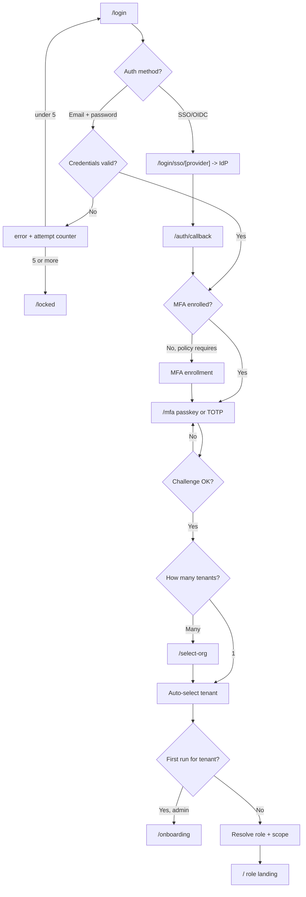
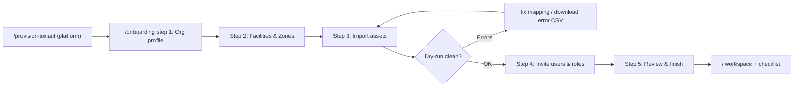
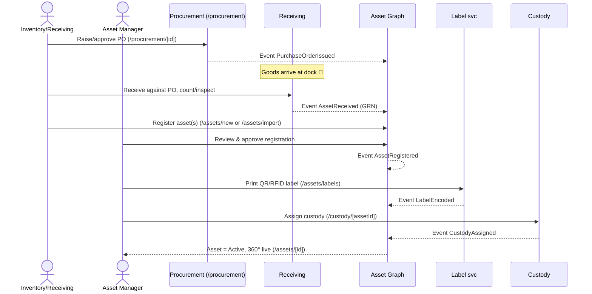
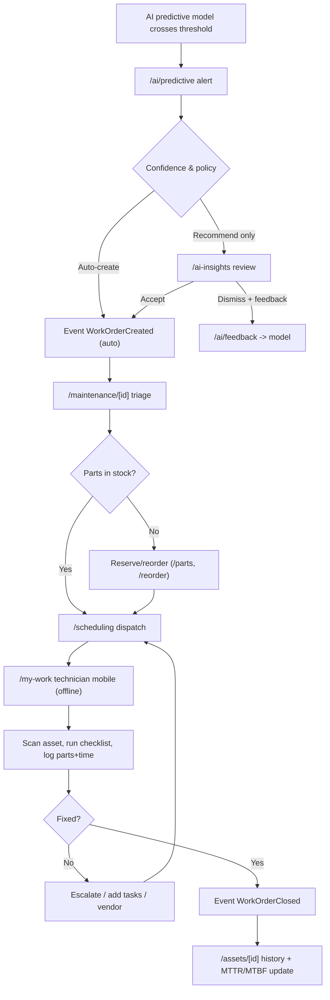
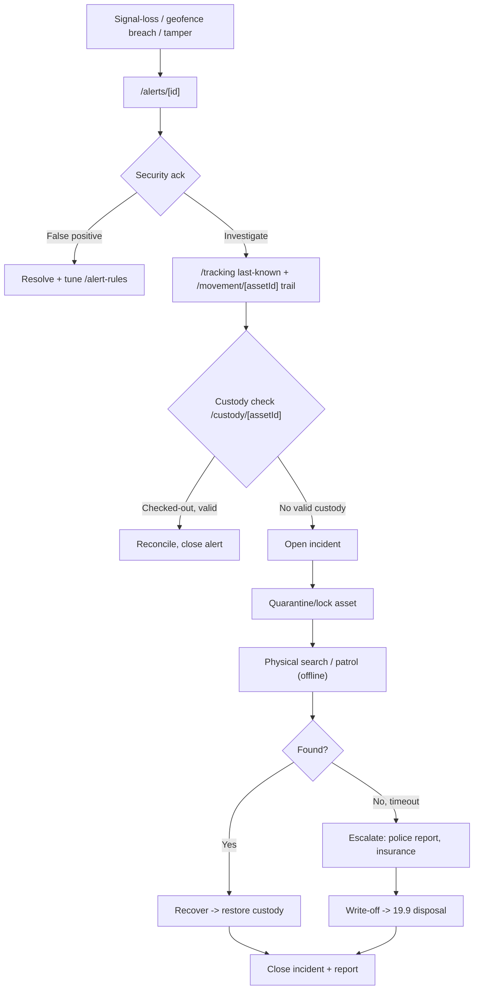
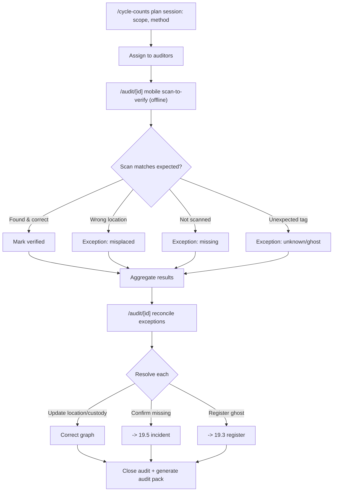
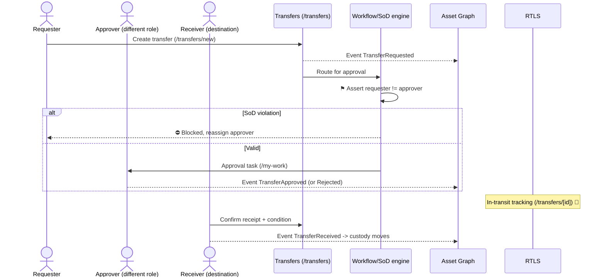
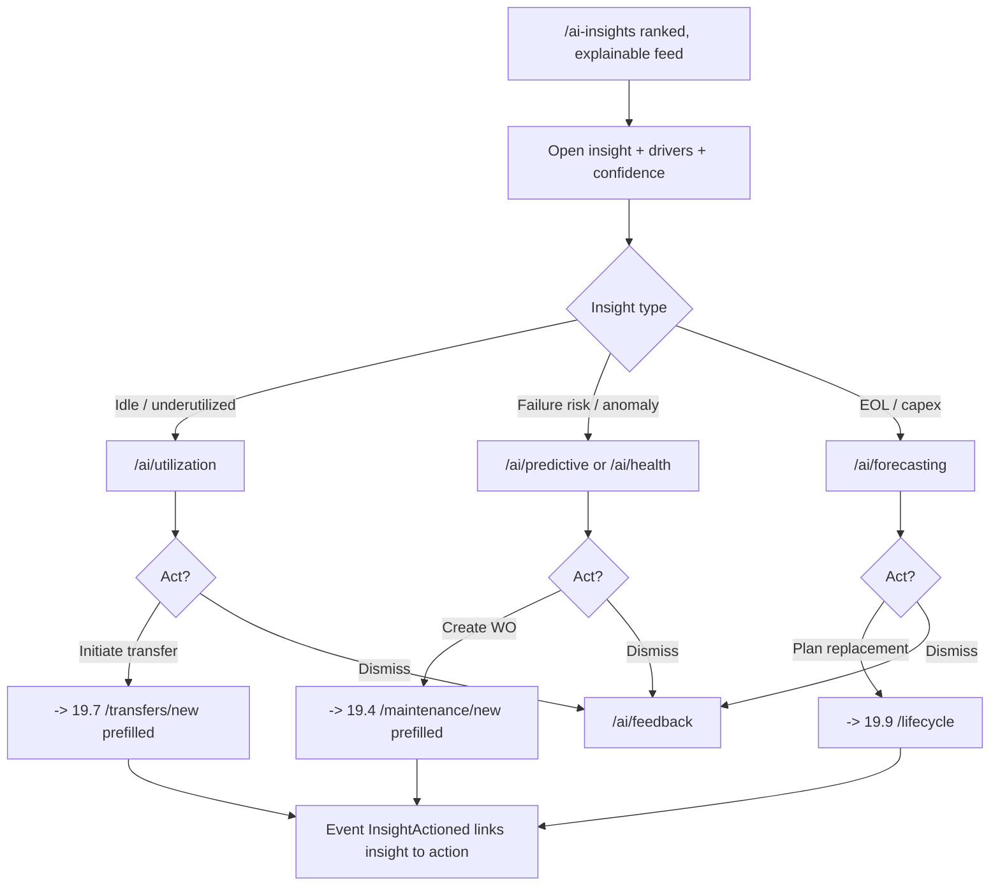
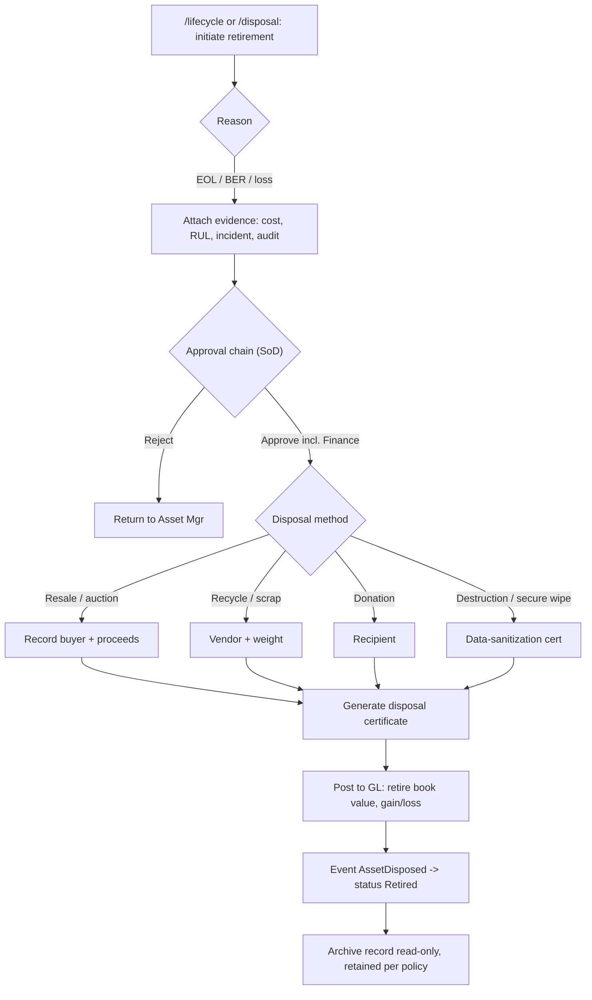
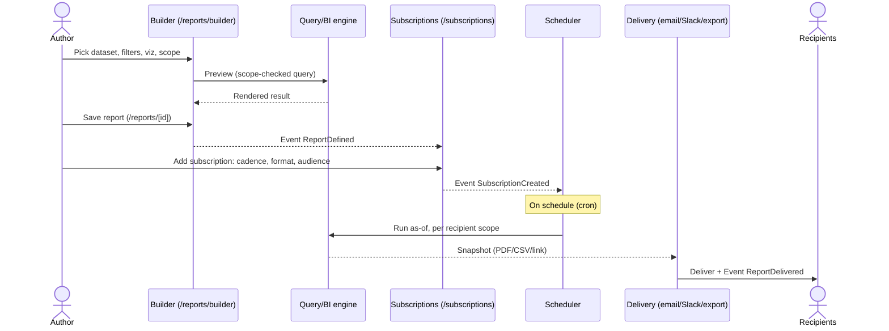

# 19. Key User Flows

**Document type:** End-to-end interaction flows (cross-cutting).
**Covers deliverables:** 2 (personas in motion), 6 (pages/routes touched), 7 (lifecycle in action).
**Read alongside:** [02-personas.md](./02-personas.md) (roles), [03-information-architecture.md](./03-information-architecture.md) (routes/scope), [06-page-catalog.md](./06-page-catalog.md) (per-page spec), [07-asset-lifecycle.md](./07-asset-lifecycle.md) (state machine), [08-ai-intelligence.md](./08-ai-intelligence.md) (AI modules), [16-security-compliance.md](./16-security-compliance.md) (RBAC/SoD/MFA).

> This doc turns the static page inventory (§0.6) and lifecycle (07) into **motion**: who acts, what triggers
> it, which pages/routes are traversed, which events land on the event-sourced graph, and how the flow
> succeeds, fails, or branches. Every flow is a *projection walk* over the same object graph — the tracking
> dot, the work order, and the depreciation line are the same asset. Diagrams are **mermaid** (flowchart or
> sequenceDiagram) and render inline.

---

## 19.0 Conventions & legend

| Symbol | Meaning |
|--------|---------|
| `Route` | A page/route from [06-page-catalog.md](./06-page-catalog.md) (inventory in §0.6). |
| **Event** | An immutable fact appended to the event store (event-sourced core → 11/12). PascalCase. |
| ◇ Decision | Branch / gate (permission, SoD, validation, AI confidence). |
| ⚑ SoD | Segregation-of-duties gate: requester ≠ approver, enforced at data layer (16). |
| ⛔ Failure | Unhappy path with defined recovery. |
| 📶 Offline | Step that must work disconnected (offline-first edge → 14). |

**Actor tiers** (→ 02): Platform · Tenant Admin · Management · Field/Operational · Business · External.
**Standard systems referenced across flows:** IdP/SSO (OIDC), MFA service, Auth/Session svc, Tenant svc,
**Event Store + Asset Graph**, IoT Gateway + RTLS engine, AI/ML svc (health/predict/anomaly), Notification svc,
GL/ERP connector, Label svc, Report/BI engine, Mobile Sync svc. Every mutation is scope-checked (row/field-level)
and written as an event first; projections (registry, twin, BI, audit) rebuild from it.

**Flow index**

| # | Flow | Primary actor(s) | Entry route |
|---|------|------------------|-------------|
| 19.1 | Login → MFA → org select → role landing | Any authenticated user | `/login` |
| 19.2 | New-tenant onboarding wizard | Org Admin (post-provision) | `/onboarding` |
| 19.3 | Asset onboarding (PO → receive → register → label → custody) | Inventory/Receiving, Asset Mgr | `/procurement` |
| 19.4 | Work-order lifecycle (predictive → dispatch → mobile → close) | AI, Maint Mgr, Technician | `/ai-insights` |
| 19.5 | Missing/stolen asset incident | Security Officer | `/alerts` |
| 19.6 | Physical audit / cycle count | Auditor / Asset Mgr | `/cycle-counts` |
| 19.7 | Transfer with SoD approval | Requester + different approver | `/transfers/new` |
| 19.8 | AI insight → action | Ops/Maint Mgr | `/ai-insights` |
| 19.9 | Asset disposal / retirement | Asset Mgr + Finance | `/lifecycle` |
| 19.10 | Report build & subscribe | Analyst / Manager | `/reports/builder` |

---

## 19.1 Login → MFA → Org/Tenant select → Role landing

**Actor:** Any user (all tiers). **Trigger:** User opens the app unauthenticated or with an expired session.
**Goal:** Establish an authenticated, scoped session and land on the role-personalized workspace.

| Step | Route | Actor/System | Notes & decision points |
|------|-------|--------------|-------------------------|
| 1 | `/login` | User | Choose SSO or credentials. SSO buttons per configured IdP. |
| 2a | `/login/sso/[provider]` → `/auth/callback` | IdP (OIDC) | Redirect handshake; JIT user provisioning if enabled. |
| 2b | `/login` | Auth svc | ◇ Credential check. ⛔ 5 fails → `/locked` + Security Admin alert. |
| 3 | `/mfa` | MFA svc | Passkey/WebAuthn preferred; TOTP/SMS fallback. ◇ Step-up if ABAC risk (new device, off-network). |
| 4 | `/select-org` | Tenant svc | ◇ Only shown to multi-tenant users; single-tenant auto-selects. |
| 5 | — | RBAC engine | Resolve **Role × Scope**; compute role-adaptive sidebar (03 §3.5). |
| 6 | `/` (or `/onboarding`) | App shell | ◇ First-run tenant with admin → wizard (19.2); else workspace. |

**Systems/events:** IdP, MFA svc, Auth/Session svc, Tenant svc, Audit log. **Events:** `UserAuthenticated`,
`MfaChallengePassed`, `TenantContextSelected`, `SessionStarted` (all to immutable audit log → 16).
**Role landing map:** Executive→`/dashboards/executive`, Facility/Ops Mgr→`/dashboards/operations`,
Maint Mgr→`/dashboards/maintenance`, Asset Mgr→`/dashboards/asset`, Security→`/dashboards/security`,
Technician→`/my-work` (mobile), Finance→`/dashboards/financial`, Inventory→`/dashboards/inventory`.

| Outcome | Result |
|---------|--------|
| ✅ Success | Scoped session issued; user lands on role dashboard; scope switcher primed to default facility. |
| ⛔ Bad credentials | Inline error, attempt counter; lockout → `/locked` + email + Security Admin notification. |
| ⛔ MFA fail / device lost | Retry, then recovery codes or admin-assisted reset; never bypass policy. |
| ⛔ Session expired mid-use | `/session-expired` re-auth modal; deep link preserved and resumed after re-auth. |
| Edge | SSO account with no tenant mapping → `/403` "request access"; break-glass (platform) logs + alerts (16). |

---

## 19.2 New-tenant onboarding wizard

**Actor:** Organization Admin (Tenant Admin tier), immediately after platform provisioning (`/provision-tenant`, PL).
**Trigger:** First admin login to a freshly provisioned, empty tenant. **Goal:** A usable tenant — org tree,
facilities/zones, seed assets, invited users — reached in one guided stepper (Wizard body pattern, §0.7).

| Step | Route | Writes to | Decision / detail |
|------|-------|-----------|-------------------|
| 0 | `/provision-tenant` | Tenant svc | Platform creates tenant shell, plan, first admin. **Event** `TenantProvisioned`. |
| 1 · Org profile | `/onboarding` | Org record | Name, industry, timezone, units, branding, retention defaults. **Event** `OrganizationConfigured`. |
| 2 · Facilities & zones | `/onboarding` → seeds `/admin/facilities` | Scope tree | Build Region▸Facility▸Building▸Floor▸Zone (03 §3.1); map upload optional. **Event** `FacilityCreated` (×n). |
| 3 · Import assets | `/onboarding` → `/assets/import` | Asset Graph | CSV/API with **dry-run + validation** (M1 #7). ◇ Errors → downloadable error file, re-upload. **Event** `AssetRegistered` (×n, batch). |
| 4 · Invite users | `/onboarding` → `/admin/users` | Identity | Assign **Role × Scope**; bulk invite. Triggers 19.1 `/accept-invite`. **Event** `UserInvited` (×n). |
| 5 · Review & finish | `/onboarding` | — | Summary counts; enable modules; **Event** `TenantOnboardingCompleted`. |

**Systems/events:** Tenant svc, Import pipeline (validation/dedupe), Identity svc, Notification svc (invite
emails), Event Store. **Post-finish:** land on `/` with a persistent **setup-completion checklist** (connect
integrations, print labels, define first geofence) so onboarding degrades gracefully into ongoing setup.

| Outcome | Result |
|---------|--------|
| ✅ Success | Tenant has org tree + facilities + seed assets + invited users; role dashboards render real data. |
| ⛔ Import errors | Row-level error report; partial commit optional (valid rows in, bad rows queued); idempotent re-run. |
| ⛔ Abandoned mid-wizard | Progress saved per step; resumes at last step on next login. |
| Edge | Large import (>100k rows) runs async; wizard proceeds, banner shows ingestion progress + completion notice. |

---

## 19.3 Asset onboarding — Procure → Receive → Register → Label → Custody

**Actors:** Inventory Manager / Receiving Clerk (receive), Asset Manager (register/approve), custody owner (assign to).
**Trigger:** A purchase order is raised or goods arrive at the dock. **Goal:** A physical asset becomes a fully
registered, labeled, tracked, custody-assigned object on the graph. Aligns with lifecycle stages 1–4 → [07-asset-lifecycle.md](./07-asset-lifecycle.md).

| Step | Route | Decision / detail | Event |
|------|-------|-------------------|-------|
| 1 Procure | `/procurement`, `/procurement/[id]` | Create PO; ◇ approval threshold may route to Finance. | `PurchaseOrderIssued` |
| 2 Receive | (receiving view) 📶 | Match to PO line; count, inspect, capture serials/photos; over/short handling. | `AssetReceived` (GRN) |
| 3 Register | `/assets/new` (single) or `/assets/import` (bulk) | Class → dynamic attribute template (M1 #3); serial, cost, warranty, location. ◇ **Data-quality gate**: completeness score must clear threshold. | `AssetRegistered` |
| 4 Approve | `/assets/[id]` | ◇ Asset Manager approves registration (may be auto for trusted classes). Duplicate/ghost check (AI, M1 #10). | `AssetRegistrationApproved` |
| 5 Label | `/assets/labels` | Print QR/barcode + **encode RFID** (M1 #9); bind tag ID ↔ asset ID for tracking. | `LabelEncoded` |
| 6 Custody | `/custody/[assetId]` (also from `/checkinout`) | Assign owner/department/location; opens chain of custody (K module). | `CustodyAssigned` |

**Systems/events:** Procurement, Receiving, Asset Graph, AI dedupe svc, Label svc (ZPL/printer + RFID encoder),
Custody svc, IoT Gateway (tag binding activates live tracking → 19.5 signals). Finance may capitalize on
`AssetRegistered` (→ 19.9/depreciation start).

| Outcome | Result |
|---------|--------|
| ✅ Success | Asset **Active**, labeled, tag-bound, custody-owned, visible on registry, 360°, and live map. |
| ⛔ Receiving mismatch | Short/over/damaged → exception; PO stays open, quarantine flag, notify buyer + supplier. |
| ⛔ Data-quality fail | Registration blocked with field prompts; saved as **Draft** until completeness threshold met. |
| ⛔ Duplicate detected | AI flags likely duplicate/ghost; merge or confirm-distinct before activation (M1 #16 merge). |
| Edge 📶 | Dock scan offline → queued locally, syncs on reconnect; label reprint if encoding fails. |

---

## 19.4 Work-order lifecycle — Predictive AI alert → auto-WO → triage → dispatch → mobile execute → close

**Actors:** AI/ML svc (originator), Maintenance Manager (triage/dispatch), Technician (execute, mobile/offline),
Inventory (parts). **Trigger:** Predictive model crosses a failure-probability threshold, or a sensor anomaly fires.
**Goal:** Prevent failure — from AI signal to closed WO with full parts/time history. Lifecycle stage: Maintenance → 07.

| Step | Route | Actor/System | Decision / detail | Event |
|------|-------|--------------|-------------------|-------|
| 1 Signal | `/ai/predictive`, `/ai-insights` | AI/ML svc | RUL/failure forecast + **explainable drivers + confidence** (08). | `FailurePredicted` |
| 2 Create | `/maintenance/new` (auto) | Rules engine | ◇ Confidence ≥ policy → auto-WO; else recommend on feed. Dismiss writes model feedback (`/ai/feedback`). | `WorkOrderCreated` |
| 3 Triage | `/maintenance/[id]` | Maint Mgr | Priority, SLA, asset criticality, safety; attach checklist/PM template. | `WorkOrderTriaged` |
| 4 Parts | `/parts`, `/inventory`, `/reorder` | Inventory | ◇ Stock check → reserve or reorder; blocks dispatch if critical part missing. | `PartsReserved` |
| 5 Dispatch | `/scheduling` | Maint Mgr | Load-balance by skill/location/availability; assign technician. | `WorkOrderAssigned` |
| 6 Execute 📶 | `/my-work`, `/maintenance/[id]` (mobile 14) | Technician | Scan asset (QR/RFID) to confirm, run inspection checklist, capture photos, **log parts + time**; all offline-capable. | `WorkOrderStarted`, `PartsConsumed`, `TimeLogged` |
| 7 Resolve | `/maintenance/[id]` | Technician | ◇ Fixed? No → escalate/add tasks/route to vendor (external WO). | — |
| 8 Close | `/maintenance/[id]` | Technician/Mgr | Failure code, resolution notes, sign-off; ◇ QA review for critical assets. | `WorkOrderClosed` |
| 9 History | `/assets/[id]` (History/Maint tabs) | Asset Graph | Updates MTTR/MTBF, health score, cost-to-date; feeds model retraining. | `MaintenanceRecorded` |

**Systems/events:** AI/ML svc, Rules/Workflow engine, Maintenance svc, Inventory svc, Mobile Sync svc (offline
queue + conflict resolution), Notification svc, Asset Graph. Closed-loop: outcomes feed `/ai/feedback` and model
retraining (08 governance).

| Outcome | Result |
|---------|--------|
| ✅ Success | Failure prevented; WO closed with parts/time/failure-code; health score recovers; history complete. |
| ⛔ No parts | WO parked "awaiting parts"; reorder raised (→ 19.3 procurement); SLA clock paused per policy. |
| ⛔ Not fixed on site | Escalate to specialist or **vendor WO** (external, time-boxed access → 02 Vendor); parent WO stays open. |
| 📶 Offline execution | Technician completes fully offline; queue syncs on reconnect; server resolves conflicts (last-writer + audit). |
| Edge | False positive → technician dismisses with reason → `/ai/feedback` lowers future sensitivity for that class. |

---

## 19.5 Missing / stolen asset incident — Signal-loss/geofence alert → locate → custody check → incident → recover/write-off

**Actor:** Security Officer (Field); Asset Manager / Finance for write-off. **Trigger:** Signal-loss timeout,
geofence breach, tamper, or after-hours movement detected by the RTLS/anomaly engine (M2 #30, M3 #45).
**Goal:** Locate and recover the asset, or convert to a governed write-off with full evidence.

| Step | Route | Actor/System | Decision / detail | Event |
|------|-------|--------------|-------------------|-------|
| 1 Detect | — | RTLS/Anomaly engine | Signal-loss timeout / geofence breach / tamper / after-hours move. | `SignalLost` / `GeofenceBreached` / `TamperDetected` |
| 2 Alert | `/alerts`, `/alerts/[id]` | Notification svc | Routed to Security by escalation policy (J module). ◇ Ack vs auto-escalate on timeout. | `AlertRaised`, `AlertAcknowledged` |
| 3 Locate | `/tracking`, `/movement/[assetId]` | Security | Last-known position, dwell, trail/replay; identify exit point (heatmaps). | — |
| 4 Custody check | `/custody/[assetId]`, `/checkinout` | Security | ◇ Valid checkout/reservation? Yes → benign, reconcile. No → theft-suspect. | — |
| 5 Incident | `/alerts/[id]` → incident record | Security | Open incident, **quarantine/lock** asset (blocks further custody), notify Facility Mgr. | `IncidentOpened`, `AssetQuarantined` |
| 6 Recover / escalate | patrol 📶 / `/movement` | Security | ◇ Found → restore custody; Not found by SLA → police/insurance evidence pack. | `AssetRecovered` or `IncidentEscalated` |
| 7 Resolve | `/alerts/[id]`; write-off → `/disposal` | Security + Finance | Recover-close, or **write-off** hands to disposal flow (19.9) with incident as evidence. | `IncidentClosed` / `AssetWrittenOff` |

**Systems/events:** RTLS engine, Anomaly/Theft AI (M3 #45), Geofence svc, Notification/Escalation svc, Custody
svc, Incident svc, Finance/GL (write-off). Evidence pack (trail, custody log, photos, alert timeline) is exportable
for police/insurance/audit.

| Outcome | Result |
|---------|--------|
| ✅ Recovered | Custody restored, asset un-quarantined, incident closed with root cause; alert-rule tuned if noisy. |
| ✅ Governed write-off | Asset retired via 19.9 with SoD approval + insurance/police evidence; GL updated. |
| ⛔ False positive | Ack + resolve; feed `/alert-rules` / `/ai/feedback` to cut future noise (reduce false-positive KPI). |
| Edge | Recurring breaches on one asset/zone → propose geofence/rule change; correlate as pattern (M9 correlation). |

---

## 19.6 Physical audit / cycle count — Scan-to-verify → exceptions → reconcile → audit pack

**Actors:** Auditor / Asset Manager (plan & reconcile), Field staff (scan). **Trigger:** Scheduled cycle count,
ad-hoc spot audit, or regulatory audit window. **Goal:** Verify physical reality against the graph, reconcile
exceptions, and produce an immutable audit pack. Lifecycle stage: Audit → 07; Compliance module (K).

| Step | Route | Actor/System | Decision / detail | Event |
|------|-------|--------------|-------------------|-------|
| 1 Plan | `/cycle-counts` | Auditor/Asset Mgr | Scope (zone/class/ABC), method (blind/guided), schedule; freeze expected set. | `AuditPlanned` |
| 2 Scan 📶 | `/audit/[id]` (mobile 14) | Field | Scan-to-verify QR/RFID; capture condition/photo; **fully offline**, batched. | `AssetScanned` (×n) |
| 3 Classify | `/audit/[id]` | System | ◇ Match / misplaced / missing / unknown-tag (ghost) auto-classified. | — |
| 4 Reconcile | `/audit/[id]` | Auditor | Per-exception disposition: correct location/custody, confirm missing, register ghost. | `LocationCorrected`, `CustodyUpdated` |
| 5 Branch | → `/alerts` (19.5) / `/assets/new` (19.3) | Auditor | Missing → **incident**; ghost → **register**; damaged → **WO** (19.4). | (per branch) |
| 6 Close + pack | `/audit/[id]`, `/compliance-reports` | Auditor | Sign-off; generate **immutable audit pack** (results, exceptions, evidence, signatures). | `AuditCompleted` |

**Systems/events:** Audit svc, Mobile Sync svc (offline batch), Asset Graph, Custody svc, Report/BI engine
(audit pack), Immutable audit log (K `/audit-log`). Findings update the Asset Manager's **audit-accuracy** and
**data-completeness** KPIs (02).

| Outcome | Result |
|---------|--------|
| ✅ Success | Verified count reconciled; graph corrected; audit pack sealed and exportable for regulators. |
| ⛔ Exceptions unresolved | Session cannot close "clean"; open exceptions tracked with owners + due dates. |
| ⛔ Confirmed missing | Routes to incident (19.5); may end in write-off (19.9) with audit as evidence. |
| 📶 Offline | Entire count runs disconnected; server dedupes on sync (idempotent by tag+session). |
| Edge | Duplicate/ambiguous tag scans flagged for AI dedupe (M1 #10) before reconcile. |

---

## 19.7 Transfer with Segregation-of-Duties approval — Request → approve (different role) → track → receive

**Actors:** Requester (Dept Head / Manager), **different** Approver (Facility/Ops Manager), Receiver at destination.
**Trigger:** Need to move an asset across department/facility/zone. **Goal:** A governed transfer where
**requester ≠ approver** (⚑ SoD, 16), tracked in transit, confirmed on receipt. Lifecycle stage: Transfer → 07.

| Step | Route | Actor/System | Decision / detail | Event |
|------|-------|--------------|-------------------|-------|
| 1 Request | `/transfers/new` | Requester | Select asset(s), destination scope, reason, need-by. | `TransferRequested` |
| 2 Route | `/admin/workflows` config → task | Workflow engine | ◇ **⚑ SoD gate**: approver must differ from requester (and role-authorized for dest scope). ⛔ else blocked. | — |
| 3 Approve | `/my-work`, `/transfers/[id]` | Approver | ◇ Approve / reject (reason). High-value may add Finance/2nd approval. | `TransferApproved` / `TransferRejected` |
| 4 Track 📶 | `/transfers/[id]`, `/tracking`, `/movement/[assetId]` | RTLS | In-transit status; geofence enter/exit; ETA; loss-in-transit alerts (→ 19.5). | `AssetInTransit` |
| 5 Receive | `/transfers/[id]`, `/checkinout` | Receiver | Scan-confirm arrival + condition; ◇ discrepancy → exception. | `TransferReceived`, `CustodyAssigned` |
| 6 Settle | `/assets/[id]` | Asset Graph | Location + custody + (optionally) cost center updated; timeline entry. | `CustodyUpdated` |

**Systems/events:** Workflow/SoD engine, Custody svc, RTLS, Notification svc, Asset Graph, GL (cost-center move).
SoD is enforced at the **data layer**, not the UI (16) — an API caller cannot self-approve.

| Outcome | Result |
|---------|--------|
| ✅ Success | Custody + location move on receipt; full request→approve→transit→receive audit trail. |
| ⛔ SoD violation | Approval blocked; system requires a distinct, authorized approver; attempt logged. |
| ⛔ Rejected | Asset stays put; requester notified with reason; can revise & resubmit. |
| ⛔ Lost in transit | RTLS raises signal-loss → incident (19.5); transfer flagged, receiver + security notified. |
| Edge | Receipt discrepancy (wrong asset/damaged) → partial receive + exception; opens WO (19.4) or dispute. |

---

## 19.8 AI insight → Action — Utilization insight → transfer, or failure insight → work order

**Actor:** Operations / Maintenance / Asset Manager. **Trigger:** An explainable recommendation surfaces on the
AI Insights feed (idle/over-use, failure risk, EOL, capex-deferral). **Goal:** Turn an insight into a governed
action in one or two clicks — the "explainable AI → act" loop that differentiates the product (00 §0.4).

| Step | Route | Actor/System | Decision / detail | Event |
|------|-------|--------------|-------------------|-------|
| 1 Surface | `/ai-insights` | AI/ML svc | Ranked, **explainable** cards (drivers + confidence + est. impact); "Explain this" everywhere (§0.7). | `InsightGenerated` |
| 2 Inspect | `/ai/utilization` · `/ai/predictive` · `/ai/health` · `/ai/forecasting` | User | Drill into evidence; ◇ trust the recommendation? | — |
| 3a Act — transfer | `/transfers/new` (prefilled) | Ops Mgr | Idle asset → propose destination that needs it → hands to **19.7** (SoD applies). | `TransferRequested` |
| 3b Act — WO | `/maintenance/new` (prefilled) | Maint Mgr | Failure/anomaly → create WO → hands to **19.4**. | `WorkOrderCreated` |
| 3c Act — replace | `/lifecycle`, `/disposal` | Asset Mgr | EOL/capex → plan replacement → **19.9**. | `ReplacementPlanned` |
| 4 Feedback | `/ai/feedback` | User | ◇ Dismiss/accept writes labeled feedback → model governance + retraining (08). | `InsightActioned` / `InsightDismissed` |

**Systems/events:** AI/ML svc + explainability, Feedback/label store, target module (Transfers/Maintenance/
Lifecycle), Event Store. Every action links back to the originating insight (traceability: "why did this WO
exist?" → the insight + its drivers). Realized savings roll up to Executive KPI "savings realized by AI" (02).

| Outcome | Result |
|---------|--------|
| ✅ Acted | Insight → concrete governed action; both linked; downstream flow (19.4/19.7/19.9) enforces its own gates. |
| ⛔ Dismissed | Labeled feedback improves precision; insight suppressed per policy window. |
| Edge | Copilot (`/copilot`, ⌘K) can execute the same action via natural language ("transfer the 3 idle forklifts in Bldg A to Bldg C"). |

---

## 19.9 Asset disposal / retirement — Retire → approval → disposal method → certificate → GL update

**Actors:** Asset Manager (initiate), **different** approver + **Finance/Controller** (write-off approval, ⚑ SoD),
Compliance (evidence). **Trigger:** EOL reached, beyond-economic-repair, confirmed loss/theft (from 19.5), or
audit write-off (19.6). **Goal:** Retire the asset with governed approval, a compliant disposal method,
certificate/evidence, and a clean GL/depreciation close. Lifecycle stage: Dispose (final) → 07.

| Step | Route | Actor/System | Decision / detail | Event |
|------|-------|--------------|-------------------|-------|
| 1 Initiate | `/lifecycle`, `/disposal` | Asset Mgr | Select asset, reason (EOL/BER/loss); attach evidence (health, RUL, incident, audit). | `RetirementRequested` |
| 2 Approve | `/my-work`, `/admin/workflows` | Approver + Finance | ◇ **⚑ SoD**: initiator ≠ approver; **Finance approves write-off** of book value. ⛔ reject → return. | `DisposalApproved` |
| 3 Method | `/disposal` | Asset Mgr | ◇ Resale / recycle / donation / destruction; each captures method-specific data (proceeds, vendor, secure-wipe cert). | `DisposalMethodSelected` |
| 4 Certificate | `/disposal` → `/compliance-reports` | System | Generate disposal/data-sanitization **certificate**; chain-of-custody sealed. | `DisposalCertificateIssued` |
| 5 GL close | `/financials`, `/depreciation` | Finance/GL | Stop depreciation, retire book value, post **gain/loss**; sync to ERP. | `AssetDisposed`, `GLPosted` |
| 6 Archive | `/assets/[id]` (read-only) | Asset Graph | Status → **Retired**; record retained per retention policy (K `/retention`), removed from active tracking. | `AssetArchived` |

**Systems/events:** Lifecycle svc, Workflow/SoD engine, Finance/GL/ERP connector, Compliance/Certificate svc,
Retention policy, IoT Gateway (deactivate tag). Book-value and gain/loss flow to Finance KPIs (write-off value → 02).

| Outcome | Result |
|---------|--------|
| ✅ Success | Asset retired with SoD-approved write-off, compliant certificate, GL posted, tag deactivated, record archived. |
| ⛔ Rejected | Returns to Asset Mgr with reason; asset stays Active or re-evaluated for repair (19.4). |
| ⛔ Certificate/GL fail | Disposal held "pending finance"; retry GL post; certificate regenerated; no orphaned state. |
| Edge — data-bearing | IT assets require verified **secure wipe** before destruction; certificate blocks close until confirmed. |
| Edge — from incident | Loss/theft write-off (19.5) carries police/insurance evidence into the approval pack. |

---

## 19.10 Report build & subscribe — Build → schedule → deliver

**Actors:** Analyst / Manager / Executive (build & consume), any recipient (subscribe). **Trigger:** Need a
recurring or shareable view (executive, financial, maintenance, utilization, audit, compliance). **Goal:**
Compose a report once, schedule it, and deliver it reliably to the right people/channels. Reporting module → [17-reporting-bi.md](./17-reporting-bi.md).

| Step | Route | Actor/System | Decision / detail | Event |
|------|-------|--------------|-------------------|-------|
| 1 Build | `/reports/builder`, `/bi` | Author | Drag-drop dataset/filters/viz; ◇ ad-hoc explore (`/bi`) vs saved report. Scope-aware. | — |
| 2 Preview | `/reports/builder` | BI engine | **Scope-checked** query (row/field-level); respects each viewer's permissions. | — |
| 3 Save | `/reports/[id]`, `/reports` (library) | Author | Name, category, share scope; prebuilt templates (exec/financial/maint/audit). | `ReportDefined` |
| 4 Subscribe | `/subscriptions` | Author/Recipient | ◇ Cadence (cron), format (PDF/CSV/link), channels (email/Slack/portal), audience. | `SubscriptionCreated` |
| 5 Run | `/exports` | Scheduler + BI engine | Rendered **per-recipient scope** at run-time (a facility mgr sees only their facility). | `ReportRun` |
| 6 Deliver | (channel) | Delivery svc | Deliver + receipt; ◇ failure → retry + notify owner. | `ReportDelivered` |

**Systems/events:** Report/BI engine, Query engine (scope-aware), Scheduler, Delivery svc (email/Slack/webhook),
Export store. Governance: subscriptions honor **field-level masking** (e.g., cost hidden from technicians, 02/16);
delivered snapshots are watermarked for external/guest recipients.

| Outcome | Result |
|---------|--------|
| ✅ Success | Report saved, scheduled, and delivered on cadence to correctly-scoped recipients. |
| ⛔ Delivery fail | Retry with backoff; failure notice to owner; last-good snapshot linkable in `/exports`. |
| ⛔ Permission change | Recipient who lost scope stops receiving; masked fields drop silently — never leak. |
| Edge | Large/slow report runs async; recipients get a link when ready instead of a blocked inbox. |

---

## 19.11 Cross-cutting flow notes

| Concern | How it applies to every flow above |
|---------|-------------------------------------|
| **Event-sourced** | Every mutation is an event first (11/12); registry, twin, BI, and audit are projections — flows never write "current state" directly. |
| **Scope security** | Each step is row/field-level checked (16). A flow the user can start but not complete on a given scope fails closed at the data layer, not the button. |
| **Standard states** | Every page in a flow ships Loading / Empty / Error / Permission-denied / Offline / No-results (§0.7) — flows must handle each, not only the happy path. |
| **Offline-first 📶** | Receiving (19.3), technician execute (19.4), search/patrol (19.5), audit scan (19.6), in-transit (19.7) all queue locally and sync with conflict resolution (14). |
| **SoD ⚑** | Transfers (19.7), disposals/write-offs (19.9), and high-value procurement (19.3) enforce requester ≠ approver at the data layer (16). |
| **Copilot** | `/copilot` (⌘K) can initiate, filter, or complete most flows via natural language; it routes through the same events + gates, never around them. |
| **Traceability** | AI-originated actions (19.4, 19.8) link action → insight → drivers, so any WO/transfer answers "why does this exist?". |
| **Notifications** | Every state transition can raise a notification/escalation (J module) per user preferences and on-call policy. |

---

**Summary.** This section converts the static page inventory (§0.6) and asset lifecycle (07) into ten
end-to-end, mermaid-diagrammed flows — login/MFA, tenant onboarding, asset onboarding, the predictive
work-order lifecycle, missing/stolen incidents, physical audits, SoD-gated transfers, AI-insight-to-action,
disposal, and report build/subscribe — each with its actor, trigger, exact routes touched, event-store writes,
and success/failure/edge outcomes. Together they show the platform's defining loop: every action is an event on
one asset graph, every gate (scope, SoD, MFA, AI confidence) is enforced at the data layer, and every screen
degrades gracefully through the standard states and offline queues. Read with [06-page-catalog.md](./06-page-catalog.md)
for per-page detail and [07-asset-lifecycle.md](./07-asset-lifecycle.md) for the underlying state machine.
