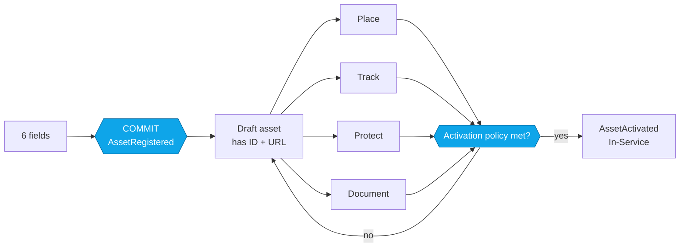
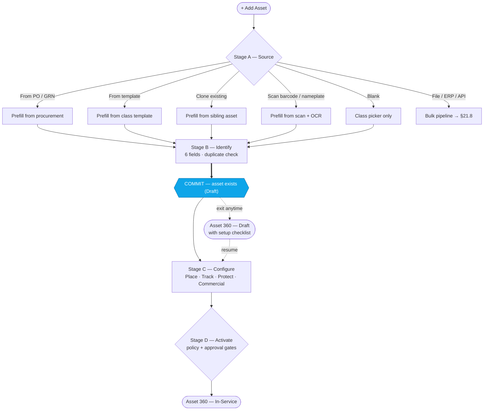
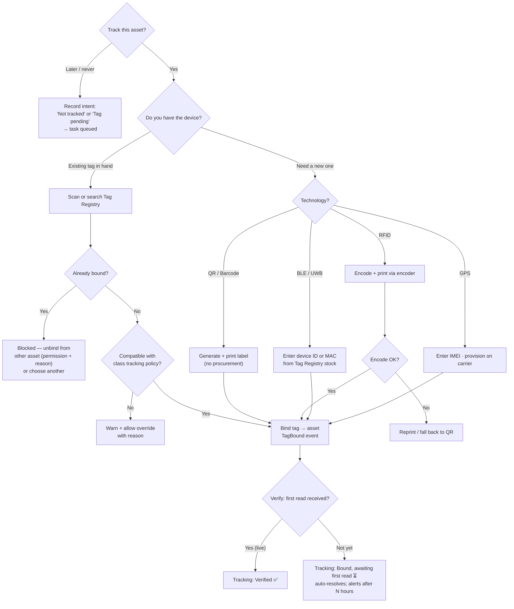
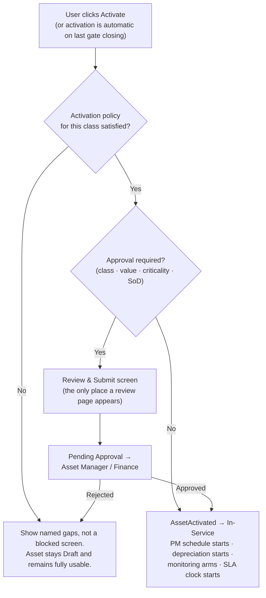
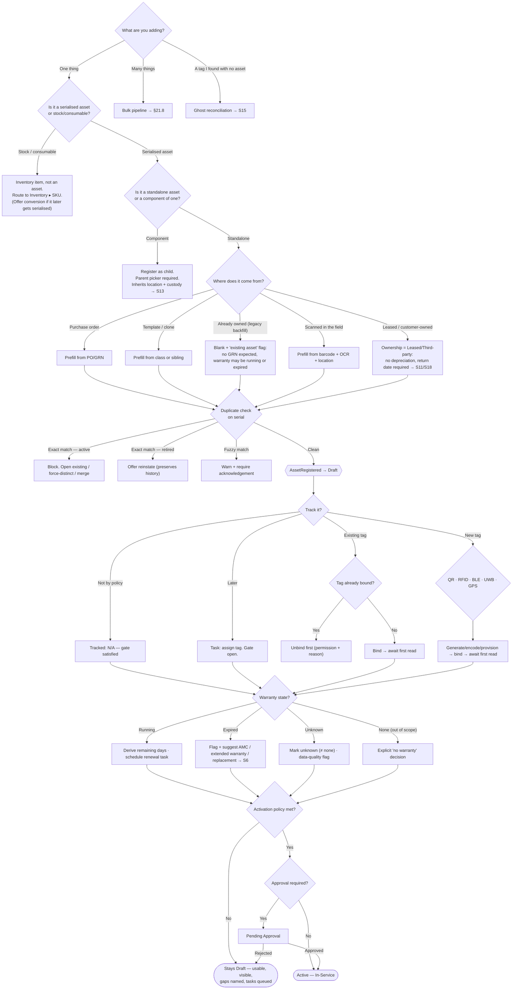

# 21. Asset Onboarding — UX Architecture & Flow Redesign

**Document type:** UX architecture — flow design, decision model, IA & navigation (pre-UI)
**Version:** 1.0 · **Status:** Proposed · **Owner:** Product / UX Architecture
**Audience:** Product, Design, Engineering (FE + API), Data, QA
**Scope:** Everything between *"I need to add an asset"* and *"the asset is operational in Asset 360"*.

> **Thesis.** The current problem is described as *too many modules*. It isn't. The real problem is that
> **the asset does not exist until every module has been satisfied.** Registration is modelled as one large
> atomic transaction across Registry → Tag → Documents → Lifecycle → Monitoring, so the user must hold the
> whole enterprise in their head before the system will hold anything for them.
>
> Collapsing seven modules into one seven-step wizard does not fix that — it re-skins it. A wizard with 40
> required fields is still one atomic transaction; it just has a progress bar.
>
> **The fix is to move the commit point.** Create the asset after ~6 fields, give it an ID and a URL, then let
> every remaining module *complete* it in place, guided, resumable, and inheriting its defaults from the asset
> class. Guided onboarding stays. The all-or-nothing contract goes.

Related: [03-information-architecture.md](./03-information-architecture.md) (tenancy tree, sidebar) ·
[07-asset-lifecycle.md](./07-asset-lifecycle.md) (state machine) · [09-tracking-technologies.md](./09-tracking-technologies.md)
(RFID/BLE/GPS/QR/UWB) · [10-asset-360-profile.md](./10-asset-360-profile.md) (object page) ·
[19-user-flows.md §19.3](./19-user-flows.md) (procure → receive → register) · [02-personas.md](./02-personas.md) (RBAC).

---

## 21.0 TL;DR — what changes

| Dimension | Proposed 6-step wizard | This design |
|---|---|---|
| Commit point | End of step 6 | **End of step 1** (asset is real, has ID + URL) |
| Required fields before an asset exists | ~35–40 | **6** |
| Screens | 6 sequential, mandatory | **1 required + 4 optional cards + 1 conditional review** |
| Entry point | Blank form | **Source picker** — PO/GRN, template, clone, scan, file, ERP, blank |
| Monitoring | Configure 7 rule types per asset | **Inherit a Monitoring Profile from the class**; override is the exception |
| Location | 8 cascading dropdowns | **1 hierarchy typeahead + owner**; org/facility pre-filled from session scope |
| Warranty maths | Entered/reviewed | **Derived — never an input field** |
| Interruption | Loses work | **Draft asset persists; resume from Asset 360 or a task** |
| Bulk | "Scenario 4" | **A first-class mode, and the primary path above ~1,000 assets** |
| Duplicate control | AI check after registration | **Identification check at the moment of typing the serial** |
| "Done" | Wizard finishes | **Two events: `AssetRegistered` (identity) → `AssetActivated` (fit for service)** |

Net effect: time-to-first-asset drops from a multi-screen commitment to roughly a minute, while *more* data
gets captured overall — because enrichment is no longer competing with the user's urgency to finish.

---

## 21.1 Review of the proposed workflow

### 21.1.1 What is genuinely good — keep these

| # | Decision | Why it's right |
|---|---|---|
| 1 | **Task framing over module framing** | Correct diagnosis. Users hold verbs ("add an asset"), not nouns ("Tag Registry"). Every mature platform has a global create/task launcher for exactly this reason. |
| 2 | **Tracking is never mandatory** | The single most important call in the brief. Mandatory tag binding is the #1 cause of shadow spreadsheets in EAM rollouts — assets arrive weeks before tags do. |
| 3 | **Asset 360 as the post-registration home** | Right. One object, one URL, one truth. It matches the event-sourced projection model already specified in [10](./10-asset-360-profile.md). |
| 4 | **Explicit multi-scenario thinking** | Nine named scenarios up front is unusually disciplined. Most teams design the happy path and discover scenarios 3, 6 and 7 in production. |
| 5 | **Warranty maths owned by the system** | Correct instinct — see the caveat in §21.1.4 about RUL. |
| 6 | **Retire = archive, never delete** | Non-negotiable for audit, depreciation and warranty-claim history. Correctly identified. |
| 7 | **Ordering of steps** | Identity → Location → Tracking → Commercial → Monitoring is the right *dependency* order. It is kept below — only its mandatory-ness changes. |

### 21.1.2 What is unnecessary — cut, collapse, or demote

**① The linear 6-step wizard as the primary primitive.**
Wizards optimise for *novice users on infrequent, unfamiliar tasks*. Asset registration is the opposite: an
Asset Administrator performs it hundreds of times and knows the fields better than the designer does. Forcing
an expert through six sequential screens with no field-level jumping is a productivity tax that grows linearly
with volume. **Keep the guided rail for the first-run and occasional user; make the whole thing skippable and
resumable for the expert.** The wizard should be a *scaffold*, not a *gate*.

**② Step 5 — per-asset monitoring rule configuration.**
As specified, the registrant defines threshold + recipients + escalation + priority across seven rule types
(movement, battery, temperature, humidity, tamper, geofence, idle) **for every individual asset**. At 10,000
assets this produces 70,000 hand-configured rules, no two alike, and an alert-fatigue crisis by month three.
It also asks the wrong person: whoever is registering a chiller at the receiving dock is not the person who
should decide its temperature escalation policy.

> **Replace with:** monitoring rules are authored **once per asset class** as a named **Monitoring Profile**
> (`HVAC — Critical`, `IT Laptop — Standard`, `Cold Chain — Regulated`). Step 5 collapses to a single control:
> `Monitoring profile: [HVAC — Critical (inherited) ▾]` plus a "Customise for this asset" escape hatch that
> opens the rule editor only when someone genuinely needs it. Per-asset deviation becomes visible and auditable
> rather than being the default.

**③ Step 2 — eight cascading location dropdowns.**
Organization, Region, Facility, Building, Floor, Zone, Department, Owner is eight controls where two will do:
- Org / Region / Facility are already in the session's **scope chip** ([03 §3.1](./03-information-architecture.md)) — pre-fill, don't ask.
- Building / Floor / Zone are one **path typeahead**: type `B3` → `Plant 2 ▸ B-Block ▸ Floor 3 ▸ Zone A`.
- If a tag is bound and has reported, **infer the zone from the last read** and offer it as a confirm-not-type default.
- On mobile, infer from the scan location / gateway proximity.
- Department is usually **derivable from Owner**; ask for owner, derive department, allow override.

Eight fields → one typeahead + one person picker, with a two-field fallback when inference is unavailable.

**④ "Review & Register" as an unconditional step.**
A review screen that every user clicks through every time is theatre — it trains people to skim. Reviews earn
their place only when something irreversible or externally consequential happens.

> **Replace with:** show a **persistent readiness summary** (a completeness ring with named gates) instead of a
> terminal review page, and require an explicit review/confirm screen **only when** the registration triggers
> (a) capitalisation above the finance threshold, (b) an approval workflow, or (c) a bulk commit. Otherwise the
> Identify step's inline validation is sufficient and the user goes straight to Asset 360.

**⑤ Merging "Documents & Warranty" into one step.**
These are different obligations with different owners and different urgency. Warranty/purchase data is
**structured, financially material, and usually already exists on the PO**. Documents are **attachments** that
arrive whenever they arrive. Merging them makes the attachment feel mandatory and the financial data feel
optional — exactly backwards.

> **Replace with:** *Commercial* (purchase date, cost, vendor, warranty start/end, AMC, capitalisation) is a
> structured card that **auto-populates from the linked PO/GRN**. *Documents* is a persistent drop zone on the
> asset that is never a step and never blocks anything.

**⑥ "Add Asset" starting from a blank form.**
In a real enterprise roughly 60–80% of new assets arrive through procurement. Starting blank throws away
manufacturer, model, cost, vendor, warranty terms, PO number, quantity and GL code that the system already
holds. See §21.3.2.

### 21.1.3 What is missing — must be added

| # | Gap | Consequence if ignored | Where it lands |
|---|---|---|---|
| **M1** | **Identification & duplicate control at write time** | Same physical asset registered twice via desk + mobile + ERP. At 100k assets this is the #1 data-quality failure. | §21.3.3 |
| **M2** | **Asset Class → Template inheritance** | Every registration re-enters attributes, depreciation method, PM plan, monitoring, tracking policy by hand. | §21.2 P2 |
| **M3** | **Draft state + save & resume** | Interrupted registrations are lost; users batch them into spreadsheets "for later". | §21.2 P1 |
| **M4** | **Registered ≠ Active** — a commissioning gate | Half-configured assets appear operational; SLAs and PM plans fire against assets nobody has installed. | §21.3.5 |
| **M5** | **Approval / segregation of duties** | Capitalised assets created without Finance sign-off; SoD is already required by [16](./16-security-compliance.md). | §21.3.5 |
| **M6** | **Multiple concurrent tag bindings** | The design implies one tag per asset. Reality: a QR label *and* a BLE beacon *and* a GPS unit on the same forklift. | §21.3.4 |
| **M7** | **Tag *verification*** — first successful read | Tags get bound in software and never actually read. "Assigned" is not "working". | §21.3.4 |
| **M8** | **Mobile / scan-first registration** | The dock and the field are where assets actually appear. Desktop-only onboarding guarantees a backlog. | §21.5 S10 |
| **M9** | **Parent–child components & hierarchy** | A UPS's battery, a truck's telematics unit. Without it, maintenance history attaches to the wrong object. | §21.5 S13 |
| **M10** | **Asset vs. inventory item fork** | Serialised asset or stock consumable? Different object, different lifecycle. Must be decided at step 1. | §21.4 |
| **M11** | **Ghost-asset reconciliation** | A tag is read in Zone A with no asset behind it. Needs a first-class "adopt this into the registry" path. | §21.5 S15 |
| **M12** | **Leased / customer-owned / loaner assets** | Not everything is owned. No depreciation, has a return date, may belong to a third party. | §21.5 S11, S18 |
| **M13** | **Field-level change control after activation** | Serial number and class must not be freely editable once the asset is capitalised and audited. | §21.3.7 |
| **M14** | **Undo** | Registration mistakes are common and reversal is currently undefined. Void-within-window beats a confirm dialog. | §21.10 |

### 21.1.4 Three conceptual errors worth naming explicitly

**① Remaining Useful Life is not warranty arithmetic.**
The brief lists RUL alongside "warranty remaining / warranty expired / asset age" as something "the system
automatically calculates" in Step 4. Asset age and warranty remaining are date subtraction. **RUL is a model
output** — it needs runtime hours, duty cycle, telemetry and failure history, and it belongs to the AI layer
([08-ai-intelligence.md](./08-ai-intelligence.md)), not the registration form. Shipping a date-derived "RUL"
would put a number in front of a Maintenance Manager that looks like a prediction and isn't. Show RUL on the
Intelligence tab once telemetry exists, with a confidence band and an explicit "insufficient data" state.

**② "Tracking Configuration" conflates three different acts.**
*Procuring/provisioning a device*, *binding a device to an asset*, and *verifying the binding works* are three
distinct operations with different actors, different failure modes, and different timing. Zebra and Samsara
separate them deliberately. Collapsing them into one step means a failed encode or an unread beacon looks
identical to success. See §21.3.4.

**③ "History" and "Activity" are not two things.**
Two of the ten proposed Asset 360 tabs are the same projection with different facets. Users will never learn
which one holds what. One **Timeline** with facet filters, and the immutable audit view as a filtered export
rather than a peer tab. See §21.6.

---

## 21.2 Four design principles

Everything below derives from these. They are the arguable part — agree on them and the rest follows.

### P1 · Minimum Viable Asset — commit early, enrich forever

An asset becomes real the moment the system knows **what it is** and **which physical unit it is**. That is
class + name + serial (or an internal ID when there is no serial) + manufacturer/model + criticality — six
fields. Commit there. Mint the Global Asset ID. Give it a URL. Everything after is enrichment on a real object,
not data trapped in a form.



**Why this is the whole redesign in one move:** it converts a fragile atomic transaction into a durable object
plus a work list. Interruption stops being data loss. A dock clerk with a phone can create 40 assets in ten
minutes and let the Asset Administrator complete them from a queue. And the "too many modules" complaint
dissolves — the modules are still there, but the user never has to *visit* them; the asset's own page brings
the work to them.

### P2 · Inherit, don't enter — the Asset Class is the highest-leverage object in the system

Choosing an Asset Class should decide, by default: the dynamic attribute set, required-for-activation fields,
tracking policy (which technologies are valid, whether a tag is expected), monitoring profile, depreciation
method and useful life, default PM plan, criticality baseline, document checklist, retention class, and
approval threshold.

This is Maximo's Asset Template, SAP's Asset Class, and ServiceNow's CI class model. It is the difference
between a 40-field form and a 6-field form. **A class library is not a settings page — it is the product.**

> Practical consequence for the current build: `/taxonomy` ("Digital Asset Passports") should be promoted,
> renamed **Asset Classes & Templates**, and treated as the configuration surface the whole onboarding
> experience reads from.

### P3 · Computed, never captured

If the system can derive it, it must not have an input. Warranty remaining, warranty status, asset age,
depreciation to date, book value, health, risk, next PM date, completeness score, time-since-last-read — all
derived, all read-only, all recomputed on read. Any of these appearing as a form field is a bug: it creates two
sources of truth and guarantees they will diverge.

### P4 · Scope-aware defaults, one-tap confirm

The session already carries Org ▸ Facility ▸ Building ▸ Zone. The mobile scan already carries a gateway and a
GPS fix. The PO already carries vendor, cost and warranty terms. The class already carries everything in P2.
**The form's job is to confirm inferences and capture the irreducible remainder** — not to interrogate the user
for facts the system already has.

---

## 21.3 Final registration workflow

### 21.3.1 Stage map



Four stages, one hard commit, one soft gate. The dotted path is the point: **leaving is always safe.**

### 21.3.2 Stage A — Source *(1 click, often 0)*

"Add Asset" opens a source picker, not a form. Options are ranked by the tenant's actual mix and remember the
user's last choice.

| Source | Prefills | Primary persona | Notes |
|---|---|---|---|
| **From Purchase Order / Goods Receipt** | Manufacturer, model, cost, vendor, PO/GRN ref, warranty terms, GL code, quantity, expected facility | Receiving Clerk, Inventory Manager | Quantity *n* on a PO line spawns *n* draft assets in one action, each needing only a serial. This is the single biggest data-entry saving available. |
| **From Template** | Everything the class defines (§21.2 P2) | Asset Administrator | "New Dell Latitude 5450" as a one-click starting point. |
| **Clone existing asset** | Every field except serial, tag, and location | Facility Manager | For the 12th identical pump. |
| **Scan** (mobile/handheld) | Serial from barcode/DataMatrix, make/model from nameplate OCR, location from gateway/GPS, photo | Technician | 30-second path. See §21.5 S10. |
| **Blank** | Class only | Anyone | The honest fallback, not the default. |
| **File import (CSV/XLSX)** | — | Asset Administrator | → §21.8 bulk pipeline |
| **ERP / API sync** | — | IT Administrator | → §21.8; UI role becomes exception handling |
| **Adopt an unknown tag** | Tag ID, last-seen zone | Security Officer, Technician | → §21.5 S15 ghost reconciliation |

> **Why a source picker beats a blank form:** it converts the first interaction from *"what do I type?"* into
> *"where is this coming from?"* — a question every user can answer instantly, and whose answer eliminates most
> of the typing. Oracle's Mass Additions from Payables and Maximo's PO-driven asset creation exist for this reason.

### 21.3.3 Stage B — Identify *(the commit point — 6 fields)*

This is the only mandatory screen in the entire flow.

| Field | Required | Behaviour |
|---|---|---|
| **Asset Class** | ✔ | Drives everything downstream (P2). Typeahead over the class tree, recents first. Selecting it re-renders the rest of the form. |
| **Asset Name / description** | ✔ | Auto-suggested as `{Manufacturer} {Model} — {Serial suffix}`; editable. Never force naming creativity on a dock clerk. |
| **Serial number** *or* **Internal ID** | ✔ (one of) | **Live identification check runs as they type** — see below. Assets without a serial (fabricated, legacy, bulk-identical) get a minted internal ID. |
| **Manufacturer + Model** | ✔ | Typeahead over the manufacturer catalogue; new values require `catalog:write` so the list doesn't rot. |
| **Criticality** | ✔ | Defaults from class; drives SLA, alert routing, approval threshold, activation policy. |
| Image | — | Encouraged, never required. Mobile capture inline. |
| Description / notes | — | Free text. |
| Class-specific attributes | per class | Rendered from the class template; the class decides which are required *for activation*, not for creation. |

**Identification & duplicate control (M1) — the important part.** As the serial is typed, the system runs an
identification query scoped to the tenant:

| Match | Response |
|---|---|
| Exact `manufacturer + serial` already registered | **Block create.** Show the existing asset inline (name, location, custodian, status) with three actions: *Open existing* · *This is a genuinely different unit* (requires reason, logged) · *Merge/replace*. |
| Fuzzy match (serial edit-distance ≤ 2, or same model + same PO + same day) | **Warn, don't block.** Show candidates; require an explicit "not a duplicate" acknowledgement, recorded on the event. |
| Serial matches a **retired/disposed** asset | Offer *Reinstate* — this is a real scenario (asset returns from write-off) and creating a second record destroys its history. |
| Serial matches a tag/label already printed but unbound | Offer *Bind on create*. |
| No match | Proceed. |

> **Why at write time rather than as a cleanup job:** this is ServiceNow's Identification & Reconciliation
> Engine principle. Duplicates are cheap to prevent at the keystroke and enormously expensive to reconcile
> later — once two records exist, work orders, custody events, telemetry and depreciation attach to both, and
> merging becomes a data-migration project rather than a click.

**On submit:** `AssetRegistered` is appended. The asset gets its Global Asset ID, a canonical URL, a QR
shortlink (`/a/[shortId]`), status **Draft**, and appears in the registry with a *Setup incomplete* chip. The
user lands on Stage C — but they could close the tab and lose nothing.

### 21.3.4 Stage C — Configure *(four independent cards, all skippable, all resumable)*

Presented as a guided rail immediately after commit **and** rendered identically as a checklist on the Asset 360
Overview while the asset is Draft. Same component, two contexts — a user who abandons the wizard finds the exact
same four cards waiting on the asset's page. Order is a suggestion; any card can be done in any order or by a
different person.

---

#### Card 1 · **Place** — where it lives and who answers for it

| Control | Behaviour |
|---|---|
| **Location** | Single typeahead over the full path (`Plant 2 ▸ B-Block ▸ Floor 3 ▸ Zone A`). Pre-filled from session scope; from GRN dock if PO-sourced; from gateway/GPS if scan-sourced; from last tag read if a tag is bound. |
| **Owner / custodian** | Person or team picker. **Department is derived** from the owner's org unit, shown as a confirmable chip. |
| **Cost centre** | Derived from department; editable with `finance:write`. |
| *Skip →* | Location defaults to a system `Unassigned / Receiving` node. Asset is `Locatable: false`; a task lands in the Asset Administrator's queue. |

> **Why "Unassigned" is a legitimate location rather than an error:** an asset physically sitting on a dock has
> a true location that the hierarchy should be able to express. Refusing to store the truth is what pushes
> people into fake values like "Zone A" for everything.

---

#### Card 2 · **Track** — bind the physical world to the record

The card first asks the class's tracking policy: *does this class expect tracking?* A conference-room chair
doesn't; a €400k CT scanner does. That single inherited answer changes the card's tone from "optional extra" to
"expected step" without ever making it a hard block.



Three states, not two — **Not tracked · Bound · Verified** (M7). "Bound but never read" is the most common
real-world failure and it must be visible, not silently counted as success.

**Multiple bindings (M6).** A tag binding is a *row*, not a field. Each carries a **role**:

| Role | Example | Constraint |
|---|---|---|
| `identity` | QR label, RFID tag | Exactly one primary; used for scan-to-open |
| `location` | BLE beacon, UWB, GPS | 0..n; the location projection resolves by precedence |
| `telemetry` | Temperature/vibration sensor | 0..n; feeds monitoring rules |

**Skip is a first-class outcome, and it is recorded as an intent, not an absence.** "Not tracked (by policy)"
and "Tag pending" are different states with different follow-ups — the first is done, the second is a task.

---

#### Card 3 · **Protect** — monitoring, in one control

```
Monitoring profile:  [ HVAC — Critical  (inherited from class) ▾ ]
                       ↳ 6 rules · escalates to Facility Ops · P1 after 15 min

                     [ Customise for this asset ]   ← opens rule editor, logs a deviation
```

The profile is authored once in Asset Classes & Templates and reused across thousands of assets. Recipients
resolve **by role and scope** (`Facility Manager @ Plant 2`), never by named individual — otherwise every staff
change orphans a thousand alert rules.

Rules only activate when their inputs exist: a temperature rule on an asset with no temperature sensor shows as
*Dormant — no sensor* rather than silently never firing. Geofence rules bind to zones, not coordinates.

> **Why profiles rather than per-asset rules:** consistency is the entire point of monitoring. If two identical
> chillers have different thresholds because two people registered them on different days, the alert stream
> becomes noise and operators stop trusting it. Samsara applies alert configurations to *groups*; ServiceNow
> binds notification policies to *CI classes*. Per-asset customisation should be rare, visible, and reviewable —
> which it becomes once it's a deliberate deviation from a named profile.

---

#### Card 4 · **Commercial** — purchase, warranty, contracts *(documents ride along, never block)*

| Captured | Derived — read-only, never an input |
|---|---|
| Purchase date · Commission date | Asset age (from commission date, falling back to purchase date) |
| Purchase cost · Currency · GL / cost centre | Depreciation to date · Net book value |
| Vendor / supplier | Warranty remaining (days) · Warranty status chip |
| Warranty start · Warranty end (or term in months) | Warranty coverage gap vs. AMC |
| AMC / service contract · coverage dates | Next contract renewal date |
| Lease details (if leased): lessor, return date, terms | Total cost of ownership to date |
| Depreciation method + useful life *(defaults from class)* | *(Remaining Useful Life lives on Intelligence — §21.1.4)* |

If the asset came from a PO/GRN, **this card is already filled** — the user confirms rather than types.

**Warranty edge handling is automatic:**
- `warranty_end < today` at entry → asset is created with a **Warranty expired** chip and an inline suggestion
  block: *Request AMC quote · Add extended warranty · Flag for replacement planning* (Scenario 6).
- `warranty_end` within the class's renewal window → a renewal task is scheduled, not an immediate alert.
- Only the term is known, not the end date → derive `end = start + term`.
- Nothing is known → **Warranty: unknown** is a valid, visible state that appears in the data-quality report.
  It is not the same as "no warranty", and conflating them hides real coverage.

**Documents** are a persistent drop zone with a class-driven *suggested* checklist (invoice, warranty
certificate, manual, PO, compliance certs, photos). Each upload is typed and dated; expiry-bearing documents
(calibration certs, insurance) create renewal tasks automatically. Nothing here ever blocks activation unless
the class's activation policy explicitly demands a document — which is correct for a regulated pressure vessel
and absurd for a keyboard.

---

### 21.3.5 Stage D — Activate *(the gate that replaces "Review & Register")*



**Activation Policy — per class, not global.** This is the enterprise-grade answer to "which fields are
mandatory": mandatory-ness is a property of the *class*, configured by the Asset Administrator, expressed as a
set of named gates rather than a field list.

| Gate | Meaning | Typical policy |
|---|---|---|
| `Identified` | Class, name, serial/ID, make/model | Always required (it's the commit condition) |
| `Located` | Real location node, not `Unassigned` | Required for most classes |
| `Accountable` | Owner + department resolved | Required for anything assignable |
| `Tracked` | ≥1 binding in `Verified` state | Required only where class policy demands tracking |
| `Financial` | Purchase date + cost + vendor | Required above the capitalisation threshold |
| `Maintainable` | PM plan attached *or* explicitly marked run-to-failure | Required for Critical/High criticality |
| `Documented` | Class's required document types present | Regulated classes only |
| `Monitored` | A profile selected (including "None — by policy") | Required as a *decision*, not as a configuration |

Note that several gates are satisfied by an explicit *decision* rather than data — "run to failure", "not
tracked by policy", "monitoring: none". **Deliberate absence is a complete answer; silent absence is not.** This
is what lets the system be strict without being obstructive.

**What Activate actually triggers** (the reason it deserves to be a distinct event from registration): PM
schedule generation, depreciation start, monitoring rule arming, SLA clock start, inclusion in utilisation
denominators, appearance on the live map as an operational asset, and capitalisation posting. Firing all of
that at `AssetRegistered` — as a single-commit wizard must — means half-configured assets start generating work
orders and alerts. That is the failure mode of "Registered = Active" and it is why Maximo distinguishes
*Not Ready* from *Operating* and SAP has *Assets under Construction*.

### 21.3.6 The readiness model (what replaces the progress bar)

While Draft, Asset 360's Overview leads with a **Setup** panel: a completeness ring plus the class's gates as
named, actionable rows.

```
Setup — 4 of 7 complete                                   [ Activate ]  ← enabled when policy met
✅ Identified        Dell Latitude 5450 · SN 8HJ4K2L
✅ Located           Plant 2 ▸ B-Block ▸ Floor 3 ▸ Zone A
✅ Accountable       R. Menon · IT Operations
⏳ Tracked           QR label bound — awaiting first scan          [ Scan to verify ]
⬜ Financial         Purchase cost and vendor missing              [ Add · Import from PO-4471 ]
⬜ Maintainable      No PM plan                                    [ Apply class default · Run to failure ]
✅ Monitored         IT Laptop — Standard (inherited)
```

The same rows drive: the registry's *Setup incomplete* filter, the Asset Administrator's work queue, the
data-quality score in [17-reporting-bi.md](./17-reporting-bi.md), and bulk remediation ("apply class default PM
plan to all 340 assets missing one"). One model, four surfaces.

### 21.3.7 Field taxonomy — the rule that keeps the form small

Every field in the system belongs to exactly one tier. This is the governance mechanism that stops the form
growing back to 40 fields within two quarters.

| Tier | Definition | Rule | Post-activation editability |
|---|---|---|---|
| **T1 Identity** | Establishes *which physical unit this is* | Required at commit. Max 6 fields — adding a 7th requires an explicit product decision. | **Change-controlled** (M13): serial, class, Global ID need `asset:reclassify`, a reason, and an audit event. Silent edits forbidden. |
| **T2 Governance** | Required for the asset to be *fit for service* | Required for **activation**, per class policy — never for creation. | Editable with permission; every change is an event. |
| **T3 Enrichment** | Useful, never blocking | Optional forever. Surfaced by completeness score, never by a red asterisk. | Freely editable. |
| **T4 Derived** | Computed from other data | **Never rendered as an input.** (P3) | N/A — read-only everywhere. |

### 21.3.8 Who does what — persona map

| Stage | Facility Manager | Technician | Asset Administrator | IT Administrator | Operations Manager | Enterprise Admin |
|---|---|---|---|---|---|---|
| Class library & templates | Consulted | — | **Owns** | Consulted (IT classes) | — | Approves governance |
| Source: PO/GRN | Informed | — | **Performs** | — | — | — |
| Source: scan at dock | — | **Performs** | Informed | — | — | — |
| Stage B Identify | Performs | **Performs (mobile)** | **Performs** | Performs (IT assets) | — | — |
| Card 1 Place | **Owns location tree** | Confirms via scan | Performs | — | Consulted (rebalancing) | — |
| Card 2 Track | Consulted | **Performs binding** | Performs | **Owns device/tag fleet** | — | — |
| Card 3 Protect | **Owns thresholds** | — | Applies profile | Owns integration/routing | Consulted | — |
| Card 4 Commercial | Consulted | — | **Performs** | — | — | Finance approves |
| Stage D Activate | Approves in-facility | — | **Approves** | — | Informed | Approves above threshold |
| Bulk import | Consulted | — | **Performs** | **Performs (ERP sync)** | — | Approves |
| Exception queue | Reviews facility queue | — | **Owns** | Owns sync failures | Reviews utilisation gaps | — |

Two things fall out of this table. First, the Technician's entire involvement is *scan + confirm* — so the
mobile path must be capable of completing Stage B and Card 2 alone, and nothing else should be asked of them.
Second, nobody performs all six steps of the original wizard, which is the strongest argument against requiring
one person to complete it in one sitting.

---

## 21.4 Decision tree — every path

### 21.4.1 Master tree



### 21.4.2 Branch resolution table

| Decision point | Condition | Outcome | Reversible? |
|---|---|---|---|
| Asset vs. inventory | Serialised & individually tracked | Asset record | Conversion path exists both ways |
| Standalone vs. component | Has a parent asset | Child asset; location/custody inherit from parent; own maintenance history | Yes — detach/reattach, logged |
| Duplicate — exact, active | Same manufacturer + serial | **Blocked** | Force-distinct with reason is available and audited |
| Duplicate — exact, retired | Serial matches disposed asset | Reinstate offered | Reinstate preserves the original stream |
| Duplicate — fuzzy | Edit distance ≤2, or same model+PO+day | Warn, proceed on acknowledgement | Acknowledgement stored on event |
| Tag already bound | Target tag has an active binding | Blocked until unbound (`tag:unbind` + reason) | Old binding archived, never deleted |
| Tag incompatible with class | e.g. BLE on a class whose policy is RFID-only | Warn + override with reason | Yes |
| Tag bound, never read | No read within class SLA | State = *Bound, unverified*; alert to IT Admin | Auto-resolves on first read |
| Warranty expired at entry | `end < today` | Chip + AMC/extension/replacement suggestions | — |
| Cost ≥ capitalisation threshold | Class + value | Financial gate + Finance approval required | — |
| Criticality = Critical | Class or manual | Maintainable gate required; approval required; monitoring cannot be "None" | — |
| Location unknown | User skipped | `Unassigned/Receiving`; `Located` gate open; task queued | Yes |
| Registration mistake | Within undo window, pre-activation | **Void** (soft, reversible, stream preserved) | Yes — see §21.10 |
| Registration mistake | Post-activation | Retire with reason `RegisteredInError`; never hard-delete | History retained |

---

## 21.5 Alternative business scenarios

The nine in the brief, plus nine that enterprise deployments hit within the first year.

| # | Scenario | Path | Key design requirement |
|---|---|---|---|
| **S1** | New asset + new tag | A(PO) → B → Card 2 *Register new tag* → encode/print → bind → verify → D | Encoding failure must be recoverable without losing the asset; QR fallback always available. |
| **S2** | New asset + existing tag | A → B → Card 2 *Assign existing* → scan/search Tag Registry → bind → verify → D | Tag search must be scannable, not just typeable; binding conflict resolution is inline. |
| **S3** | Existing company asset, no tracking device | A(*Existing asset* source) → B → Card 2 *Later* → activate without `Tracked` gate | "Registered but untracked" must be a healthy, reportable, non-nagging state with a queued task. |
| **S4** | Bulk import (Excel / CSV / ERP) | Bulk pipeline: upload → **profile & map** → validate → **partial commit** → error file → tag assignment later | Partial commit is essential — never reject 5,000 rows because 12 are bad. See §21.8. |
| **S5** | Warranty already running | Card 4: purchase date + warranty end → derived remaining | Accept term-in-months as an alternative to an end date. |
| **S6** | Warranty expired | Detected at entry or by scheduled job → chip + suggestion block | Suggestions must be actions (raise AMC quote, create replacement plan), not just a warning colour. |
| **S7** | Replace damaged tag | Asset 360 ▸ Tracking ▸ *Replace tag* → new tag → old binding → `Retired` with reason | Both bindings persist. Movement history must stitch across the swap so the trail isn't severed. |
| **S8** | Transfer asset | Asset 360 ▸ *Transfer* → new owner/facility/dept/zone → SoD approval → in-transit → receive | In-transit is a real state; monitoring rules must suspend, not fire geofence alerts during a sanctioned move. |
| **S9** | Retire asset | Asset 360 ▸ *Retire* → reason + method + certificate → approval → Archived | Never deleted. Tag auto-unbinds and returns to the tag pool. Depreciation closes; write-off posts. |
| **S10** | **Mobile scan-first (dock/field)** | Scan barcode → OCR nameplate → photo → confirm class → commit | Must complete Stage B + Card 2 in under 45 seconds, fully offline, syncing on reconnect. This is the highest-volume real-world path. |
| **S11** | **Leased / rented asset** | Ownership = Leased → lessor, lease end, return terms; no depreciation schedule | Return date drives a renewal/return task chain; TCO uses lease cost, not book value. |
| **S12** | **ERP / legacy migration** | API or bulk with `legacy_id` preserved as an alternate identifier | Alternate-ID index is mandatory or every subsequent sync creates duplicates. |
| **S13** | **Component / child asset** | Parent picker at Stage B; inherits location + custody | Maintenance and cost roll up to parent; the child has its own warranty and its own serial. |
| **S14** | **Pool / loaner asset** | No fixed custodian; custody is per check-out | `Accountable` gate satisfied by "pool-owned"; reservation and check-in/out become the primary lifecycle. |
| **S15** | **Ghost asset — unknown tag read** | Tag reads in Zone A with no asset → *Adopt* → prefilled Stage B with tag pre-bound and location pre-filled | Turns a data-integrity alert into a one-click registration. Silent unknown reads are how registries rot. |
| **S16** | **Merge duplicates** | Registry ▸ select 2 → *Merge* → choose surviving ID, field-by-field resolution | Both event streams graft onto the survivor; the merged ID becomes a permanent alias so old links resolve. |
| **S17** | **Split a bulk-registered record** | One record created for a quantity that was actually *n* units → *Split* → *n* records with serials | Common consequence of PO-quantity registration; must be a supported operation, not a delete-and-retype. |
| **S18** | **Customer-owned / third-party asset on site** | Ownership = Third-party + owning organisation → no capitalisation, restricted visibility | Needed for service providers, hospitals with vendor equipment, and 3PL warehouses. Data-sharing scope must be explicit. |

---

## 21.6 Asset 360 — information architecture

### 21.6.1 The governing rule

> **Sidebar = many assets. Asset 360 = one asset.**
> Any view that answers a question about *a single asset* belongs in Asset 360 and must not have a sidebar entry.
> Any view that answers a question about *a population* belongs in the sidebar and must not be duplicated per-asset.

Checkable corollary for the current codebase: **any route carrying an `[id]` / `[assetId]` parameter must not
appear in `nav-config.ts`.** Today `/movement` and `/custody` violate this — their primary content is
`/movement/[assetId]` and `/custody/[assetId]`.

### 21.6.2 On the proposed 10 tabs

Ten tabs (and the 16 in [10-asset-360-profile.md](./10-asset-360-profile.md)) moves the navigation problem
rather than solving it — the user stops hunting modules and starts hunting tabs. Specific critiques:

| Proposed tab | Verdict |
|---|---|
| Overview | **Keep — and make it the destination, not the doorway.** If most users leave Overview to find things, the tab set has failed. It should surface the top 3 items from every other projection with drill-in. |
| Tracking | Keep. |
| Documents | Keep — users genuinely hunt for "the manual". |
| Maintenance | Keep. |
| **Warranty** | **Cut as a tab.** It is six fields and two derived values. Merge into **Commercial**. |
| Financials | Keep, renamed **Commercial** (purchase · warranty · contracts · depreciation · TCO). |
| **History** + **Activity** | **Merge into one Timeline.** Users will never reliably distinguish them (§21.1.4 ③). Faceted by Changes / Movement / People / Work / System / AI. Immutable audit is a facet + export, not a peer tab. |
| AI Insights | Keep, renamed **Intelligence** — but AI must *also* appear inline in each tab. A dedicated tab answers "what does AI think?"; inline chips answer "should I trust this reading?" Both are needed. |
| **Settings** | **Cut as a tab.** "Settings" on an object page means Edit. Move to the header (`Edit` + `⋯ More`). A tab that is really a form is a navigation trap. |
| *(missing)* | **Ownership & Custody**, **Components & Hierarchy**, **Monitoring** — all three have no home in the proposal. |

### 21.6.3 Recommended projection set

Eleven canonical projections; **at most 7 render for any given role**, the rest live behind `⋯ More`. The
default visible set is role-adaptive — this is how you keep breadth without the tab bar becoming a maze.

| # | Projection | Contains | Sourced from |
|---|---|---|---|
| 1 | **Overview** | Identity, status, health/risk, live location, open work, warranty chip, top AI insight, **Setup checklist while Draft** | All projections |
| 2 | **Tracking** | Live position, movement trail, dwell, tag bindings (+ replace/unbind), geofence membership, telemetry channels, signal health | Tracking pillar, `/movement/[assetId]` |
| 3 | **Maintenance** | Work orders, PM schedule, inspections, checklists, parts consumed, downtime, MTBF/MTTR | Maintenance pillar |
| 4 | **Commercial** | Purchase, vendor, **warranty**, AMC/contracts, depreciation schedule, book value, TCO, lease terms | `/financials`, `/depreciation` |
| 5 | **Documents** | Typed attachments, expiry tracking, version history, class checklist | Documents |
| 6 | **Ownership & Custody** | Current custodian, custody chain, check-in/out log, transfer history, reservations | `/custody/[assetId]`, `/checkinout` |
| 7 | **Timeline** | Every event, faceted; immutable audit as a facet + evidence export | Event stream |
| 8 | **Intelligence** | Health drivers, risk, **RUL**, anomalies, failure predictions, utilisation, recommendations, explainability | AI pillar |
| 9 | **Monitoring** | Active rules, profile + deviations, alert history, mute/suppression windows | `/alert-rules` |
| 10 | **Components** | Parent, children, BOM, spare-part compatibility | Hierarchy |
| 11 | **Compliance** | Certifications, calibration, regulatory obligations, inspection evidence | Compliance pillar |

**Role-adaptive default tab sets:**

| Role | Visible tabs |
|---|---|
| Technician (mobile) | Overview · Maintenance · Documents · Timeline |
| Facility Manager | Overview · Tracking · Maintenance · Ownership · Monitoring · Timeline |
| Asset Administrator | All 11 |
| IT Administrator | Overview · Tracking · Monitoring · Components · Timeline |
| Operations Manager | Overview · Tracking · Intelligence · Ownership · Timeline |
| Finance / Controller | Overview · Commercial · Documents · Timeline |
| Auditor / Compliance | Overview · Compliance · Documents · Timeline (audit facet) |

**Persistent across all tabs** (never a tab itself): header identity block, status + health + risk + criticality
chips, live location breadcrumb with freshness, custodian, and the primary action bar (Create WO · Locate ·
Transfer · Check-in/out · Print label · Edit · ⋯).

**Not tabs — actions or drawers:** Edit, Transfer, Retire, Clone, Merge, Split, Replace tag, Print label,
Reserve, Add component, Share. Each opens a focused drawer over the current tab so context is never lost.

---

## 21.7 Navigation recommendation

### 21.7.1 The structural change: add a task layer

The sidebar is a good **browsing** structure and a poor **doing** structure. Rather than restructuring ten
sections, add the missing layer:

```
┌────────────────────────────────────────────────────────────┐
│  [ + Create ▾ ]         ⌘K search & command       scope ▾  │   ← task layer (verbs)
├────────────┬───────────────────────────────────────────────┤
│  SIDEBAR   │                                               │
│  (nouns —  │   Content                                     │
│   places   │                                               │
│   to       │                                               │
│   browse)  │                                               │
└────────────┴───────────────────────────────────────────────┘
```

**`+ Create` menu** (role-filtered, frequency-ordered): Add asset · Import assets · Register from PO · Assign
tag · Create work order · Transfer asset · Start cycle count · Reserve asset · Add user.

**Why this and not a sidebar reorganisation:** the brief's own diagnosis — "users think in tasks" — is a
statement about *verbs*, and verbs don't belong in a hierarchy of nouns. Salesforce's global create,
ServiceNow's `+ New`, and Jira's `Create` all exist because the alternative is putting actions in the tree,
which is exactly what "Register Asset" as a sidebar item is today. The sidebar keeps doing what it's good at.

### 21.7.2 Page-by-page disposition

Applying the §21.6.1 rule to the current `nav-config.ts`:

| Current sidebar item | Disposition | Rationale |
|---|---|---|
| `/assets` IT Asset Registry | **Stay** — becomes the onboarding hub (list + `+ Add Asset` + Setup-incomplete filter) | Population view |
| `/assets/new` **Register Asset** | **Remove from sidebar** → `+ Create` menu + registry button | It's a verb, not a place. Removing it is the brief's own principle applied literally. |
| `/assets/import` Bulk Import | **Remove from sidebar** → a source in the Add Asset picker; route retained | Same reason; still deserves a full-page route. |
| `/assets/labels` Label & Tag Printing | **Stay** (batch tool) + also a per-asset action | Genuinely a population tool. |
| `/taxonomy` Digital Asset Passports | **Stay, promoted + renamed → Asset Classes & Templates** | Now the config surface the entire flow inherits from (P2). Under-named today. |
| `/lifecycle` Lifecycle Management | **Stay** (portfolio funnel/board) | Per-asset state is the header chip + Timeline. |
| `/groups`, `/kits` | Stay | Population views. |
| `/financials`, `/depreciation` | **Stay** (portfolio) · per-asset → **Commercial** tab | Both scopes are real; don't duplicate. |
| `/movement` Movement History | **Stay as fleet analytics** (dwell, flows, heatmaps) · `/movement/[assetId]` → **Tracking** tab | Currently the section is really a per-asset viewer with a sidebar entry — the exact violation. |
| `/custody` Chain of Custody | **Stay as an exceptions/gaps queue** · `/custody/[assetId]` → **Ownership** tab | Same violation. |
| `/sensors` Tag & Device Registry | **Stay — and gets more important** | It's the search target for "assign existing tag" and the home of unbound/unverified tags. |
| `/alert-rules`, `/escalations` | **Stay — reframed as Monitoring Profiles** | Where Step 5's real work now lives (once, per class). |
| `/checkinout`, `/reservations`, `/operations/transfers` | Stay as queues · per-asset → header actions | Queue vs. object. |
| `/cycle-counts`, `/inspections` | Stay | Population workflows. |
| `/admin/*` | Stay | Configuration. |

**Net:** two items leave the sidebar (`Register Asset`, `Bulk Import` → the `+ Create` menu), two sections get
re-scoped from per-asset to population (`Movement`, `Custody`), and one gets promoted (`Taxonomy` → Asset
Classes & Templates). The information architecture barely moves; the *task* architecture is what changes.

### 21.7.3 The onboarding hub

`/assets` becomes the answer to "where do I go to add assets" — a registry with first-class onboarding state:

```
Asset Registry                          [ + Add Asset ▾ ]  [ Import ]

Views:  All (12,480) │ ⚠ Setup incomplete (214) │ ⏳ Awaiting approval (18)
        │ 🏷 Untracked (1,092) │ 📅 Warranty expiring (63) │ 👤 Unassigned (41)
```

Those saved views are the exception queues that Asset Administrators actually live in, and they are generated
directly from the readiness gates in §21.3.6 — no separate machinery.

---

## 21.8 Scalability

### 21.8.1 The ratio that matters

As volume grows, the dominant onboarding path inverts. Designing only for the form is designing for the small
tenant.

| Scale | Dominant path | What the UI is *for* | Design focus |
|---|---|---|---|
| **~100 assets** | Manual form | Data entry | Speed and forgiveness. Ship 5–10 seeded classes so templates deliver value on day one; skip approvals entirely. |
| **~1,000** | Bulk backfill, then manual | Entry + correction | Class library becomes mandatory. Saved views. Basic dedupe. |
| **~10,000** | Mobile scan + bulk | Entry + **exception handling** | Class governance, activation policies per class, tag fleet lifecycle, server-side list virtualisation and faceting, background import jobs, data-quality dashboards. |
| **~100,000** | **API / ERP sync** | **Almost entirely exception handling** | The form becomes a minority path. Streaming import, idempotency keys, async validation queues, partitioned IDs, sampling-based audits (full physical counts stop being feasible), per-facility read replicas or shards. |

> **The design conclusion for 100k:** invest in the **exception queue**, not the wizard. At that scale the
> Asset Administrator's job is not *creating* assets — it is resolving the 0.5% of automated creations that
> failed validation, deduplicating cross-system records, and chasing the `Bound-but-unverified` tag backlog.
> That queue deserves the same design effort as the registration flow itself, and it should be built from the
> same readiness-gate model (§21.3.6) rather than a parallel system.

### 21.8.2 Mechanisms

| Concern | Mechanism |
|---|---|
| **Bulk pipeline** | Upload → auto-profile columns → **saved mapping templates per source** → dry-run validation with a row-level report → **partial commit** (good rows land, bad rows return as an annotated file) → re-upload corrections. Never all-or-nothing. |
| **Idempotency** | Every import row and API create carries an idempotency key (`tenant + source + legacy_id/serial`). Re-running an import updates rather than duplicates — the difference between a safe retry and a disaster. |
| **Alternate identifiers** | First-class index of `legacy_id`, `erp_id`, `barcode`, `serial`, `tag_id`. Required for S12 migration and every subsequent sync. |
| **ID strategy** | Global Asset ID is opaque, immutable and tenant-namespaced; human-readable tags (`PL2-HVAC-0042`) are a separate, optionally class-templated, mutable field. Never make the primary key human-meaningful — reorganisations will demand it change. |
| **Class inheritance across orgs** | Global class library → org overrides → facility overrides. Multi-org tenants define a chiller once. Overrides are visible as deviations. |
| **Scope isolation** | Row-level security by tenant + scope on every query (already specified in [16](./16-security-compliance.md)); the registration form only offers classes, locations, tags and profiles inside the actor's scope. |
| **Cross-org transfer** | Explicit protocol: retire-in-source + register-in-target with a linked lineage event, or a sanctioned move preserving the ID. Never an ad-hoc field edit. |
| **Offline** | Mobile registration queues locally with a client-generated ID; server reconciles on sync, surfacing conflicts to the exception queue rather than silently picking a winner. |
| **List performance** | Server-side pagination + faceting + a search index; saved views resolve to indexed queries. No client-side filtering of a 100k list. |
| **Governance** | Who may create classes, edit activation policies, or override monitoring profiles is itself an RBAC-controlled decision — otherwise the class library fragments and P2's leverage evaporates. |

---

## 21.9 Benchmark recommendations — and why each one helps

| Source | Practice | Adopt as | **Why it improves usability** |
|---|---|---|---|
| **IBM Maximo** | Asset Templates + classification hierarchy with inherited attributes | §21.2 P2, Asset Classes & Templates | Defining a chiller's 30 attributes once instead of 10,000 times is the difference between a 6-field form and a 40-field form. Every field you inherit is a field the user doesn't read, doesn't decide, and can't get wrong. |
| **IBM Maximo** | `Not Ready` vs `Operating` status | Draft → Active (§21.3.5) | Prevents half-configured assets from firing PM schedules and SLAs. Users can create freely because creating doesn't commit the organisation to anything operational. |
| **IBM Maximo** | Rotating assets (a class with many identical instances) | Registration from a PO quantity (§21.3.2) | Registering 50 identical laptops becomes 50 serial numbers, not 50 forms. |
| **SAP EAM** | Technical object (equipment) vs. financial asset, separately maintained | T1–T4 field taxonomy + Commercial tab | Engineering data and book data have different owners, cadences, and approvals. Forcing them into one form means the dock clerk is blocked by a GL code they've never seen. |
| **SAP EAM** | Asset under Construction | Draft state (§21.2 P1) | Formal recognition that a not-yet-operational asset is a legitimate, reportable object rather than an incomplete form. |
| **SAP EAM** | Functional locations independent of the equipment installed in them | Location tree separate from asset (§21.3.4 Card 1) | Swapping a pump doesn't rewrite the location's history — and "what has been installed at this position?" becomes answerable. |
| **ServiceNow** | Identification & Reconciliation Engine — identity rules applied at write time | Duplicate control in Stage B (§21.3.3) | Catching a duplicate at the keystroke costs one dialog. Catching it after six months costs a merge of two event streams, two sets of work orders, and two depreciation lines. |
| **ServiceNow** | Guided Setup with resumable, independently-owned tasks | Stage C cards + Setup checklist (§21.3.6) | Different people own different cards. A single-sitting wizard requires one person to hold all the knowledge — which nobody does (see §21.3.8). |
| **ServiceNow** | Form layouts and views vary by role | Role-adaptive tab sets (§21.6.3) | Solves "too many tabs" without deleting capability: a Technician sees 4, an Administrator sees 11. |
| **Oracle EAM** | Mass Additions — assets flow from Payables/PO into the register | "From Purchase Order" source (§21.3.2) | Procurement already holds manufacturer, model, cost, vendor and warranty. Re-typing them is both slower and less accurate than the invoice. |
| **Oracle** | Operational vs. financial asset views over one record | Commercial tab + field-level security | Finance sees book value; the Technician doesn't. One record, different lenses, no shadow spreadsheet. |
| **Microsoft Dynamics 365** | Functional location hierarchy + asset types with attribute inheritance | Location typeahead + class attributes | Cascading dropdowns are slow to use and slow to load. A single path typeahead over a pre-resolved tree is faster to type and shows the full context in one line. |
| **Microsoft Dynamics** | Maintenance plans attached to asset *types*, applied on creation | `Maintainable` gate with class default | The PM plan is decided once by the person qualified to decide it, then applied automatically — instead of asked of whoever happens to be registering. |
| **Samsara** | Onboarding measured in seconds; scan/serial-first; defaults everywhere | Mobile scan path (S10), P4 | Field adoption is decided by the first 60 seconds. If a Technician can't register from a phone at the dock, the data enters a spreadsheet and never enters the platform. |
| **Samsara** | Alert configurations applied to *groups*, not individual devices | Monitoring Profiles (§21.3.4 Card 3) | Consistency is what makes alerts trustworthy. Per-asset thresholds guarantee drift, drift guarantees noise, and noise guarantees operators mute the channel. |
| **Zebra MotionWorks** | Tag commissioning as a distinct, lightweight act separate from asset creation | Bind vs. Verify states (§21.3.4) | Decouples physical work (encode, stick, provision) from data work (register). Either can happen first, and a failed encode never blocks the record. |
| **Zebra MotionWorks** | Zone-driven automatic location — the infrastructure reports position | Location inference from tag reads (§21.1.2 ③) | The most accurate location field is the one nobody types. Manual location is stale the moment it's saved. |
| **Cross-industry** | Progressive disclosure + optimistic commit + undo window | P1, §21.10 | Confirmation dialogs are dismissed reflexively and protect nothing. A reversible action with a visible undo protects genuinely, and lets the common path stay fast. |

---

## 21.10 Anti-patterns to avoid

| Anti-pattern | Why it fails | Do instead |
|---|---|---|
| Required fields as the data-quality strategy | Users type `NA`, `.`, `asdf`. You get 100% completeness and 0% accuracy. | Activation gates + completeness scoring + exception queues. Let it be incomplete and *visible*. |
| A wizard the expert cannot skip | Registration #400 takes as long as #1. | Guided rail for novices, jump-anywhere + keyboard for experts, same underlying model. |
| Per-asset monitoring configuration | 70,000 inconsistent rules, alert fatigue, muted channels. | Profiles per class; deviations are explicit and reviewable. |
| Terminal review screen on every path | Reflexive clicking; the screen stops being read within a week. | Review only where approval or capitalisation is triggered. |
| Hard delete for mistakes | Destroys audit trail; a mis-typed serial becomes an unauditable gap. | Void within window (pre-activation) or retire with reason `RegisteredInError`. |
| Confirmation dialogs everywhere | Dismissed reflexively; provides the feeling of safety without the fact. | Undo window with a visible toast; reserve dialogs for genuinely irreversible acts. |
| Derived values stored as editable fields | Two sources of truth that silently diverge. | P3 — computed, never captured. |
| Tab proliferation on Asset 360 | Trades module-hunting for tab-hunting. | ≤7 per role, overflow menu, Overview that surfaces the rest. |
| Named individuals as alert recipients | Every staff change orphans thousands of rules. | Role + scope resolution (`Facility Manager @ Plant 2`). |
| Treating bulk import as a settings page | It's the primary path above 1,000 assets. | First-class pipeline with mapping templates, dry runs, partial commit. |
| "Assigned tag" counted as "tracking works" | Bound-but-never-read assets look healthy and aren't. | Three states: Not tracked · Bound · Verified. |

---

## 21.11 Success metrics

Instrument these before the redesign so the change is measurable rather than asserted.

| Metric | Today (measure first) | Target |
|---|---|---|
| Time to first commit (desktop) | — | **< 90 s** |
| Time to first commit (mobile scan) | — | **< 45 s** |
| Required fields before an asset exists | ~35–40 | **≤ 7** |
| Registration abandonment rate | — | **< 10%** |
| % of Drafts reaching Active within 72 h | — | **> 85%** |
| % of assets with a **Verified** tag within 7 days | — | **> 90%** *(of classes whose policy requires tracking)* |
| Duplicate rate per 1,000 registrations | — | **< 2** |
| % of registrations originating from PO / template / clone / scan (vs. blank) | — | **> 70%** |
| Median completeness score by class | — | **> 90%** |
| Monitoring rules deviating from their class profile | — | **< 5%** |
| Support tickets tagged "how do I add an asset" | — | **↓ 80%** |

---

## 21.12 Open decisions

These need a product call before UI design starts; each changes the shape of the flow.

1. **Capitalisation threshold and approver.** Does a €500 monitor need Finance approval, or only assets above a
   threshold? This determines how often Stage D shows a review screen — and whether the common path has one at all.
2. **Can an asset be activated without a location?** Recommendation: no for physical assets, yes for
   software/licence classes. It is a per-class activation policy either way — confirm the defaults.
3. **Who owns the class library?** Recommendation: Asset Administrator authors, Enterprise Admin approves.
   Without a named owner, P2's leverage decays within two quarters.
4. **Serial number mutability after activation.** Recommendation: change-controlled with reason + audit event,
   not free-text. Confirm this satisfies your audit requirements.
5. **Undo window length for voiding a registration.** Recommendation: 24 hours or until activation, whichever
   comes first.
6. **Does bulk import auto-activate?** Recommendation: no — imported assets land as Draft and activate in bulk
   after review. Auto-activating 5,000 assets arms 5,000 sets of monitoring rules simultaneously.
7. **Third-party / customer-owned assets** (S18) — in scope for v1? It affects the data model (owning
   organisation) and visibility rules, so it is cheaper to decide now than to retrofit.
